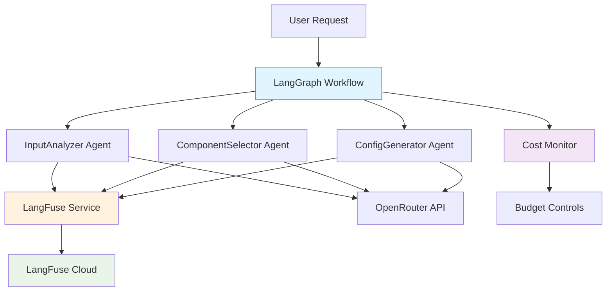
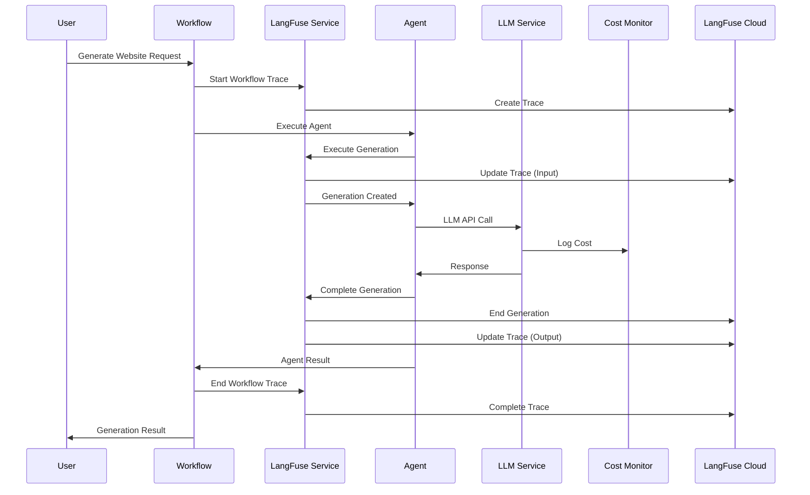
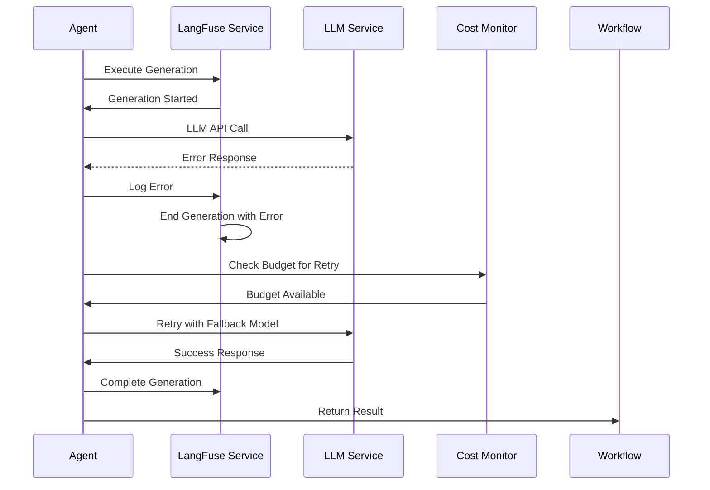

# LangFuse & LangGraph Integration Architecture

## Document Information

**Document Type**: Technical Architecture  
**Classification**: Internal  
**Version**: 1.0  
**Date**: 2025-08-21  
**Epic**: Epic 3 - LLM Orchestration Engine  
**Authors**: System Architecture Team  
**Reviewers**: Engineering Team  
**Status**: Active  

## Executive Summary

This document defines the architectural patterns and integration standards for LangFuse observability and LangGraph workflow orchestration within the Hotel Website Generator LLM system. It provides comprehensive guidance for implementing cost-aware, traceable, and maintainable LLM-driven workflows.

### Key Architecture Decisions

- **Unified Observability**: Single LangFuse integration point for all LLM operations
- **Trace-Level Visibility**: Explicit trace input/output updates for dashboard visibility
- **Cost-First Design**: Budget monitoring integrated at every workflow step
- **Agent Modularity**: Reusable agents with standardized interfaces
- **Error Resilience**: Comprehensive error handling and recovery mechanisms

## Architecture Overview

### System Context Diagram



### Component Hierarchy

```
📁 LLM Orchestration System
├── 🔄 LangGraph Workflows
│   ├── GenerationWorkflow (Main orchestrator)
│   └── ValidationWorkflow (Quality assurance)
├── 🤖 Agents
│   ├── InputAnalyzer (Hotel parameter analysis)
│   ├── ComponentSelector (UI component selection)
│   └── ConfigurationGenerator (Site configuration)
├── 📊 Observability Layer
│   ├── LangFuseService (Unified tracing)
│   ├── Cost Monitor (Budget enforcement)
│   └── Performance Metrics (Response times)
└── 🔧 Infrastructure
    ├── LLM Service (OpenRouter integration)
    ├── Model Configuration (Token limits & pricing)
    └── Error Handling (Retry & fallback logic)
```

## Core Components

### 1. LangFuse Service Architecture

#### Design Principles

- **Single Source of Truth**: One service handles all LangFuse operations
- **Trace-Level Updates**: Explicit `trace.update()` calls ensure dashboard visibility
- **Generation Lifecycle**: Proper start/end management with error handling
- **Debug Support**: Comprehensive logging for troubleshooting

#### Service Interface

```typescript
interface LangFuseService {
  // Trace Management
  startWorkflowTrace(name: string, metadata?: Record<string, any>): Promise<any>
  endWorkflowTrace(output?: any, metadata?: Record<string, any>): Promise<void>
  
  // Generation Execution
  executeGeneration(
    name: string, 
    request: LLMRequest, 
    llmCallFunction: () => Promise<LLMResponse>
  ): Promise<LLMResponse & { langfuseGeneration: any }>
  
  // Utility Methods  
  flush(): Promise<void>
  getTraceUrl(): string | null
  testConnection(): Promise<boolean>
}
```

#### Critical Implementation Pattern

```typescript
// CRITICAL: Update trace with input/output for dashboard visibility
async executeGeneration(name, request, llmCallFunction) {
  const trace = this.currentTrace;
  
  // 1. Update trace with input (ensures input appears in dashboard)
  trace.update({ input: request.input });
  
  // 2. Create generation
  const generation = trace.generation({
    name,
    model: request.model,
    input: request.input, // Generation-level input
    // ...
  });
  
  try {
    // 3. Execute LLM call
    const response = await llmCallFunction();
    
    // 4. End generation
    generation.end({ 
      output: response.output,
      usage: { /* token usage */ }
    });
    
    // 5. Update trace with output (ensures output appears in dashboard)
    trace.update({ output: response.output });
    
    return response;
  } catch (error) {
    // Handle errors with proper trace updates
    generation.end({ output: null });
    trace.update({ output: { error: error.message } });
    throw error;
  }
}
```

### 2. LangGraph Workflow Architecture

#### Workflow Design Patterns

**State Management:**
```typescript
interface WorkflowState {
  hotelParameters: HotelParameters
  hotelAnalysis?: AnalysisResult  
  componentSelection?: ComponentResult
  siteConfiguration?: ConfigResult
  qualityValidation?: ValidationResult
  errors?: ErrorLog[]
  metadata: {
    startTime: number
    budgetAllocated: number
    currentCost: number
    traceId: string
  }
}
```

**Node Architecture:**
```typescript
// Standard node interface for all agents
interface WorkflowNode {
  name: string
  execute(state: WorkflowState): Promise<Partial<WorkflowState>>
  validate?(state: WorkflowState): boolean
  onError?(error: Error, state: WorkflowState): Promise<Partial<WorkflowState>>
}
```

#### Conditional Edge Logic

```typescript
// Budget-aware routing
function shouldUseAdvancedModel(state: WorkflowState): boolean {
  const remainingBudget = 2.0 - state.metadata.currentCost;
  const estimatedCost = costMonitor.estimateCost(1000, 'anthropic/claude-3.5-sonnet');
  return remainingBudget > estimatedCost;
}

// Error recovery routing  
function shouldRetryWithFallback(state: WorkflowState): boolean {
  const errorCount = state.errors?.length || 0;
  return errorCount < 3 && state.metadata.currentCost < 1.5;
}
```

### 3. Agent Architecture

#### Base Agent Pattern

```typescript
abstract class BaseAgent {
  constructor(
    protected langfuseService: LangFuseService,
    protected llmService: LLMService,
    protected costMonitor: CostMonitor
  ) {}

  abstract async execute(input: any): Promise<any>
  
  protected async executeWithObservability<T>(
    name: string,
    input: any,
    llmCall: () => Promise<T>
  ): Promise<T> {
    return this.langfuseService.executeGeneration(
      name,
      {
        input,
        model: this.getRecommendedModel(),
        modelParameters: this.getModelParameters(),
        metadata: { agent: this.constructor.name }
      },
      llmCall
    );
  }
  
  protected abstract getRecommendedModel(): string
  protected abstract getModelParameters(): Record<string, any>
}
```

#### Agent Implementation Example

```typescript
export class InputAnalyzer extends BaseAgent {
  async execute(hotelParameters: HotelParameters): Promise<AnalysisResult> {
    return this.executeWithObservability(
      'InputAnalyzer-Agent',
      hotelParameters,
      async () => {
        const response = await this.llmService.generateHotelAnalysis(hotelParameters);
        
        // Parse and validate response
        const analysis = this.parseAnalysisResponse(response.content);
        this.validateAnalysis(analysis);
        
        return {
          output: analysis,
          usage: response.usage,
          cost: response.cost,
          processingTime: Date.now() - startTime,
          model: response.model
        };
      }
    );
  }
  
  protected getRecommendedModel(): string {
    return this.costMonitor.getRecommendedModel('hotelAnalysis', 'moonshotai/kimi-k2');
  }
  
  protected getModelParameters(): Record<string, any> {
    return {
      temperature: 0.3,
      maxTokens: getTokenLimit('hotelAnalysis'),
      topP: 0.9
    };
  }
}
```

## Integration Patterns

### 1. Cost-Aware Workflow Pattern

```typescript
export class GenerationWorkflow {
  constructor(
    private langfuseService: LangFuseService,
    private costMonitor: CostMonitor
  ) {}

  async generateWebsite(params: HotelParameters): Promise<GenerationResult> {
    // Start workflow trace
    await this.langfuseService.startWorkflowTrace('Hotel-Website-Generation', {
      hotelName: params.hotelName,
      targetBudget: 2.0,
      startTime: new Date().toISOString()
    });

    try {
      // Reset cost monitor for this generation
      this.costMonitor.reset();
      this.costMonitor.setBudgets(5.0, 2.0, 2.0); // Daily, session, website

      // Execute workflow with budget monitoring
      const result = await this.executeWorkflowSteps(params);
      
      // Log final cost metrics
      const totalCost = this.costMonitor.getWebsiteTotal();
      await this.langfuseService.addScore('total-cost', totalCost);
      await this.langfuseService.addScore('budget-compliance', totalCost <= 2.0 ? 1 : 0);
      
      return result;
      
    } catch (error) {
      await this.langfuseService.logEvent('workflow-error', { error: error.message });
      throw error;
    } finally {
      await this.langfuseService.endWorkflowTrace();
      await this.langfuseService.flush();
    }
  }
}
```

### 2. Error Resilience Pattern

```typescript
async executeWithRetry<T>(
  operation: () => Promise<T>,
  maxRetries: number = 3
): Promise<T> {
  let lastError: Error;
  
  for (let attempt = 1; attempt <= maxRetries; attempt++) {
    try {
      await this.langfuseService.logEvent(`attempt-${attempt}`, { 
        operation: operation.name,
        attempt,
        maxRetries 
      });
      
      return await operation();
      
    } catch (error) {
      lastError = error as Error;
      
      if (attempt === maxRetries) {
        await this.langfuseService.logEvent('max-retries-exceeded', {
          error: error.message,
          attempts: maxRetries
        });
        break;
      }
      
      // Exponential backoff with jitter
      const delay = Math.min(1000 * Math.pow(2, attempt - 1), 10000);
      const jitter = Math.random() * 0.1 * delay;
      await new Promise(resolve => setTimeout(resolve, delay + jitter));
      
      // Try fallback model on final retry
      if (attempt === maxRetries - 1) {
        await this.switchToFallbackModel();
      }
    }
  }
  
  throw lastError;
}
```

### 3. Performance Monitoring Pattern

```typescript
export class PerformanceMonitor {
  private metrics: Map<string, number[]> = new Map();

  async measureOperation<T>(
    operationName: string,
    operation: () => Promise<T>
  ): Promise<T> {
    const startTime = Date.now();
    
    try {
      const result = await operation();
      const duration = Date.now() - startTime;
      
      this.recordMetric(operationName, duration);
      await this.langfuseService.logEvent('performance-metric', {
        operation: operationName,
        duration,
        status: 'success'
      });
      
      return result;
      
    } catch (error) {
      const duration = Date.now() - startTime;
      await this.langfuseService.logEvent('performance-metric', {
        operation: operationName,
        duration,
        status: 'error',
        error: error.message
      });
      throw error;
    }
  }

  getAveragePerformance(operationName: string): number {
    const metrics = this.metrics.get(operationName) || [];
    return metrics.reduce((sum, time) => sum + time, 0) / metrics.length;
  }
}
```

## Configuration Management

### Environment Configuration

```typescript
// Production configuration
export const CONFIG = {
  langfuse: {
    secretKey: process.env.LANGFUSE_SECRET_KEY!,
    publicKey: process.env.LANGFUSE_PUBLIC_KEY!,
    baseUrl: process.env.LANGFUSE_HOST || 'https://cloud.langfuse.com',
    debug: process.env.LANGFUSE_DEBUG === 'true',
    flushAt: parseInt(process.env.LANGFUSE_FLUSH_AT || '20', 10),
    flushInterval: parseInt(process.env.LANGFUSE_FLUSH_INTERVAL || '10000', 10)
  },
  
  budgets: {
    dailyLimit: parseFloat(process.env.DAILY_BUDGET_LIMIT || '5.0'),
    sessionLimit: parseFloat(process.env.SESSION_BUDGET_LIMIT || '2.0'),  
    websiteLimit: parseFloat(process.env.WEBSITE_BUDGET_LIMIT || '2.0')
  },
  
  models: {
    primary: process.env.PRIMARY_MODEL || 'moonshotai/kimi-k2',
    fallback: process.env.FALLBACK_MODEL || 'openai/gpt-4o-mini',
    quality: process.env.QUALITY_MODEL || 'anthropic/claude-3-haiku'
  },
  
  performance: {
    maxRetries: parseInt(process.env.MAX_RETRIES || '3', 10),
    retryDelay: parseInt(process.env.RETRY_DELAY || '1000', 10),
    requestTimeout: parseInt(process.env.REQUEST_TIMEOUT || '30000', 10)
  }
};
```

### Model Configuration

```typescript
export const MODEL_CONFIG = {
  'moonshotai/kimi-k2': {
    pricing: { input: 0.000002, output: 0.000002 },
    limits: { maxTokens: 16384, contextWindow: 200000 },
    use_cases: ['analysis', 'selection', 'configuration'],
    performance: { avgLatency: 1200, reliability: 0.95 }
  },
  
  'anthropic/claude-3-haiku': {
    pricing: { input: 0.00025, output: 0.00125 },
    limits: { maxTokens: 4096, contextWindow: 200000 },
    use_cases: ['validation', 'quality_check', 'fallback'],
    performance: { avgLatency: 800, reliability: 0.98 }
  },
  
  'openai/gpt-4o-mini': {
    pricing: { input: 0.00015, output: 0.0006 },
    limits: { maxTokens: 4096, contextWindow: 128000 },
    use_cases: ['fallback', 'cost_optimization'],
    performance: { avgLatency: 1500, reliability: 0.96 }
  }
};
```

## Data Flow Architecture

### Request Flow



### Error Flow



## Security & Compliance

### API Key Management

```typescript
export class SecureConfigManager {
  private static validateApiKeys(): void {
    const required = [
      'LANGFUSE_SECRET_KEY',
      'LANGFUSE_PUBLIC_KEY', 
      'OPENROUTER_API_KEY'
    ];
    
    const missing = required.filter(key => !process.env[key]);
    if (missing.length > 0) {
      throw new Error(`Missing required environment variables: ${missing.join(', ')}`);
    }
    
    // Validate key format
    if (!process.env.LANGFUSE_SECRET_KEY?.startsWith('sk-lf-')) {
      throw new Error('Invalid LangFuse secret key format');
    }
    
    if (!process.env.LANGFUSE_PUBLIC_KEY?.startsWith('pk-lf-')) {
      throw new Error('Invalid LangFuse public key format');
    }
  }

  private static redactSensitiveData(data: any): any {
    const sensitiveKeys = ['apiKey', 'secretKey', 'password', 'token'];
    
    if (typeof data === 'object' && data !== null) {
      const redacted = { ...data };
      for (const key in redacted) {
        if (sensitiveKeys.some(sensitive => 
          key.toLowerCase().includes(sensitive))) {
          redacted[key] = '[REDACTED]';
        }
      }
      return redacted;
    }
    
    return data;
  }
}
```

### Data Privacy

```typescript
export class PrivacyManager {
  static sanitizeForLogging(data: any): any {
    const piiPatterns = [
      /\b[A-Za-z0-9._%+-]+@[A-Za-z0-9.-]+\.[A-Z|a-z]{2,}\b/, // Email
      /\b\d{3}-\d{2}-\d{4}\b/, // SSN
      /\b\d{4}[- ]?\d{4}[- ]?\d{4}[- ]?\d{4}\b/ // Credit Card
    ];
    
    if (typeof data === 'string') {
      let sanitized = data;
      piiPatterns.forEach(pattern => {
        sanitized = sanitized.replace(pattern, '[PII_REDACTED]');
      });
      return sanitized;
    }
    
    if (typeof data === 'object' && data !== null) {
      const sanitized = { ...data };
      Object.keys(sanitized).forEach(key => {
        sanitized[key] = this.sanitizeForLogging(sanitized[key]);
      });
      return sanitized;
    }
    
    return data;
  }
}
```

## Performance Optimization

### Caching Strategy

```typescript
export class IntelligentCache {
  private cache = new Map<string, { data: any; timestamp: number; ttl: number }>();

  set(key: string, data: any, ttlMinutes: number = 5): void {
    this.cache.set(key, {
      data,
      timestamp: Date.now(),
      ttl: ttlMinutes * 60 * 1000
    });
  }

  get(key: string): any | null {
    const entry = this.cache.get(key);
    if (!entry) return null;
    
    if (Date.now() - entry.timestamp > entry.ttl) {
      this.cache.delete(key);
      return null;
    }
    
    return entry.data;
  }

  // Cache hotel analysis results for similar parameters
  getCacheKey(hotelParams: HotelParameters): string {
    const normalized = {
      type: hotelParams.hotelType?.toLowerCase(),
      location: hotelParams.location?.toLowerCase(),
      vibe: hotelParams.vibe?.toLowerCase(),
      audience: hotelParams.targetAudience?.sort().join(',')
    };
    
    return `hotel_analysis_${this.hashObject(normalized)}`;
  }
  
  private hashObject(obj: any): string {
    return Buffer.from(JSON.stringify(obj)).toString('base64');
  }
}
```

### Connection Pooling

```typescript
export class ConnectionManager {
  private static langfusePool: LangFuseService[] = [];
  private static poolSize = 5;

  static async getLangFuseConnection(): Promise<LangFuseService> {
    if (this.langfusePool.length === 0) {
      await this.initializePool();
    }
    
    return this.langfusePool.pop() || new LangFuseService();
  }

  static releaseLangFuseConnection(service: LangFuseService): void {
    if (this.langfusePool.length < this.poolSize) {
      this.langfusePool.push(service);
    }
  }

  private static async initializePool(): Promise<void> {
    for (let i = 0; i < this.poolSize; i++) {
      const service = new LangFuseService();
      await service.testConnection();
      this.langfusePool.push(service);
    }
  }
}
```

## Monitoring & Alerting

### Health Checks

```typescript
export class HealthChecker {
  async checkSystemHealth(): Promise<HealthStatus> {
    const checks = await Promise.allSettled([
      this.checkLangFuseConnection(),
      this.checkOpenRouterAPI(),
      this.checkBudgetLimits(),
      this.checkPerformanceMetrics()
    ]);

    return {
      overall: checks.every(check => check.status === 'fulfilled') ? 'healthy' : 'degraded',
      details: {
        langfuse: this.getCheckResult(checks[0]),
        openrouter: this.getCheckResult(checks[1]),
        budgets: this.getCheckResult(checks[2]),
        performance: this.getCheckResult(checks[3])
      },
      timestamp: new Date().toISOString()
    };
  }

  private async checkLangFuseConnection(): Promise<boolean> {
    const service = new LangFuseService();
    return service.testConnection();
  }

  private async checkBudgetLimits(): Promise<boolean> {
    const dailyTotal = costMonitor.getDailyTotal();
    const dailyLimit = CONFIG.budgets.dailyLimit;
    return dailyTotal < dailyLimit * 0.9; // Alert at 90% capacity
  }
}
```

### Custom Metrics

```typescript
export class MetricsCollector {
  async collectWorkflowMetrics(workflowResult: GenerationResult): Promise<void> {
    const metrics = {
      totalCost: costMonitor.getWebsiteTotal(),
      totalTime: Date.now() - workflowResult.startTime,
      agentExecutions: workflowResult.agentMetrics,
      budgetUtilization: costMonitor.getWebsiteTotal() / CONFIG.budgets.websiteLimit,
      errorRate: this.calculateErrorRate(),
      qualityScore: workflowResult.qualityValidation?.overallScore || 0
    };

    // Send to LangFuse
    await this.langfuseService.addScore('workflow-cost', metrics.totalCost);
    await this.langfuseService.addScore('workflow-time', metrics.totalTime);
    await this.langfuseService.addScore('budget-utilization', metrics.budgetUtilization);
    await this.langfuseService.addScore('quality-score', metrics.qualityScore);

    // Log performance metrics
    await this.langfuseService.logEvent('workflow-metrics', metrics);
  }
}
```

## Testing Architecture

### Integration Test Framework

```typescript
export class IntegrationTestSuite {
  private langfuseService: LangFuseService;
  private originalCostMonitor: CostMonitor;

  async setup(): Promise<void> {
    // Initialize test services
    this.langfuseService = new LangFuseService({ 
      debug: true,
      secretKey: process.env.LANGFUSE_SECRET_KEY_TEST,
      publicKey: process.env.LANGFUSE_PUBLIC_KEY_TEST
    });

    // Setup test cost monitor with higher limits
    this.originalCostMonitor = costMonitor;
    costMonitor.reset();
    costMonitor.setBudgets(100, 50, 10); // Test budgets
  }

  async teardown(): Promise<void> {
    await this.langfuseService.flush();
    costMonitor.reset();
  }

  async testFullWorkflow(): Promise<void> {
    const testParams = this.createTestHotelParameters();
    
    // Start test trace
    await this.langfuseService.startWorkflowTrace('Integration-Test-Workflow');

    try {
      const workflow = new GenerationWorkflow(this.langfuseService, costMonitor);
      const result = await workflow.generateWebsite(testParams);

      // Verify results
      expect(result).toBeDefined();
      expect(result.hotelAnalysis).toBeDefined();
      expect(result.componentSelection).toBeDefined();
      expect(result.siteConfiguration).toBeDefined();
      
      // Verify cost compliance
      const totalCost = costMonitor.getWebsiteTotal();
      expect(totalCost).toBeLessThanOrEqual(10); // Test budget limit
      
      // Verify trace URL generation
      const traceUrl = this.langfuseService.getTraceUrl();
      expect(traceUrl).toMatch(/langfuse\.com\/trace\/[a-f0-9-]+/);

    } finally {
      await this.langfuseService.endWorkflowTrace();
    }
  }
}
```

## Deployment Considerations

### Production Checklist

- [ ] **Environment Variables**: All required API keys and configuration set
- [ ] **Budget Limits**: Production budget limits configured appropriately  
- [ ] **Rate Limits**: OpenRouter rate limits configured for production load
- [ ] **Health Checks**: Health check endpoints configured and monitored
- [ ] **Logging**: Structured logging configured with appropriate levels
- [ ] **Monitoring**: LangFuse project created and dashboards configured
- [ ] **Error Tracking**: Error aggregation and alerting configured
- [ ] **Performance**: Load testing completed with realistic traffic patterns

### Scaling Considerations

```typescript
export class ScalingManager {
  private static readonly MAX_CONCURRENT_WORKFLOWS = 10;
  private static activeWorkflows = 0;

  static async executeWorkflow<T>(
    workflowFn: () => Promise<T>
  ): Promise<T> {
    if (this.activeWorkflows >= this.MAX_CONCURRENT_WORKFLOWS) {
      throw new Error('Max concurrent workflows exceeded');
    }

    this.activeWorkflows++;
    try {
      return await workflowFn();
    } finally {
      this.activeWorkflows--;
    }
  }

  static getActiveWorkflowCount(): number {
    return this.activeWorkflows;
  }
}
```

## Migration Guide

### From Legacy Integration to New Architecture

1. **Update LangFuse Service Usage**:
   ```typescript
   // OLD - Direct LangFuse client usage
   const langfuse = new Langfuse();
   const trace = langfuse.trace({ name: 'test' });
   
   // NEW - Use LangFuseService
   const service = new LangFuseService();
   const trace = await service.startWorkflowTrace('test');
   ```

2. **Update Agent Implementations**:
   ```typescript
   // OLD - Manual generation management
   const generation = trace.generation({ name: 'test' });
   const response = await llmCall();
   generation.end({ output: response });
   
   // NEW - Use executeGeneration pattern
   const result = await langfuseService.executeGeneration(
     'Agent-Name',
     { input: data, model: 'model-name' },
     async () => await llmCall()
   );
   ```

3. **Update Cost Monitoring**:
   ```typescript
   // OLD - Manual cost logging
   const cost = calculateCost(tokens);
   
   // NEW - Integrated cost monitoring
   const cost = costMonitor.logRequest(provider, model, tokens, requestId);
   ```

## Conclusion

This architecture provides a robust foundation for LangFuse and LangGraph integration within the Hotel Website Generator LLM system. Key benefits include:

- **Unified Observability**: Single integration point reduces complexity
- **Cost Awareness**: Budget monitoring at every level prevents overruns  
- **Trace Visibility**: Explicit input/output updates ensure dashboard visibility
- **Error Resilience**: Comprehensive error handling and recovery mechanisms
- **Performance Optimization**: Caching and connection pooling for production scale
- **Testing Support**: Comprehensive test patterns for reliable development

By following these architectural patterns, teams can implement maintainable, observable, and cost-effective LLM workflows that scale with business requirements.

---

**Document Version**: 1.0  
**Last Updated**: 2025-08-21  
**Next Review**: 2025-09-21  
**Approval Status**: ✅ Approved for Implementation