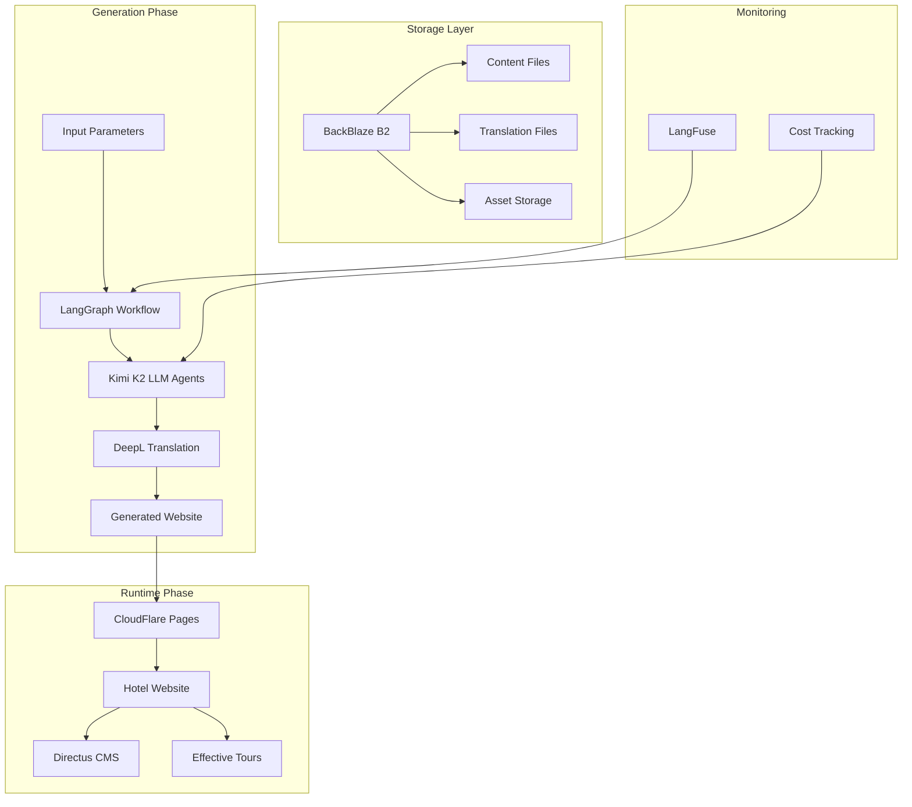

# Technical Architecture: LLM-Driven Hotel Website Generator

> **Status:** Draft v1.0  
> **Last Updated:** 2025-01-19  
> **Based on:** [Component Library PRD](./component-library.md), [LLM Integration PRD](./llm-integration.md), [Backend Integration PRD](./backend-integration.md)

## PROJECT SCOPE BOUNDARIES

### IN SCOPE:
- Complete technical architecture for website generation
- Multi-service integration patterns
- Deployment and delivery infrastructure
- Security and performance frameworks
- Cost management and monitoring systems

### OUT OF SCOPE:
- Post-delivery infrastructure maintenance
- Long-term performance monitoring
- Custom infrastructure modifications
- Third-party service administration
- Client-specific hosting requirements

## System Overview

### High-Level Architecture



### Core Components

#### 1. Generation Engine
- **Technology:** LangGraph + Kimi K2 Model
- **Purpose:** Orchestrate multi-agent website generation
- **Cost Target:** <$5 per generation
- **Performance:** <60 minutes end-to-end

#### 2. Content Layer
- **Storage:** BackBlaze B2 (content + translations)
- **CMS:** Directus (read-only access for runtime)
- **Translation:** DeepL API integration
- **Security:** Token-based access control

#### 3. Deployment Infrastructure
- **Hosting:** CloudFlare Pages (static sites)
- **CDN:** CloudFlare global network
- **Domain:** Custom domain per hotel
- **SSL:** Automatic certificate management

#### 4. Integration Services
- **Booking:** Redirect-based flow to Effective Tours
- **Analytics:** Optional integration (client-configured)
- **Monitoring:** Generation-phase only

## Detailed Technical Specifications

### LangGraph Workflow Architecture

```typescript
interface WorkflowState {
  // Input phase
  generationId: string;
  hotelParameters: GenerationInput;
  
  // Processing state
  currentAgent: AgentType;
  agentOutputs: Record<AgentType, any>;
  errors: WorkflowError[];
  retryCount: number;
  
  // Cost management
  budgetTracker: BudgetTracker;
  totalCost: number;
  
  // Output phase
  generatedFiles: GeneratedFile[];
  deploymentConfig: DeploymentConfig;
}

enum AgentType {
  INPUT_ANALYZER = 'input_analyzer',
  COMPONENT_SELECTOR = 'component_selector', 
  STYLING_AGENT = 'styling_agent',
  TRANSLATION_AGENT = 'translation_agent',
  ASSEMBLY_AGENT = 'assembly_agent',
  QUALITY_VALIDATOR = 'quality_validator',
  DEPLOYMENT_AGENT = 'deployment_agent'
}
```

### Agent Communication Pattern

```typescript
// Agent base interface
interface LLMAgent {
  execute(state: WorkflowState): Promise<AgentResult>;
  validateInput(input: any): boolean;
  estimateCost(input: any): number;
  getRequiredServices(): ServiceDependency[];
}

// Service dependency management
interface ServiceDependency {
  name: string;
  type: 'llm' | 'api' | 'storage';
  required: boolean;
  fallback?: string;
}

// Agent execution result
interface AgentResult {
  success: boolean;
  output: any;
  cost: number;
  duration: number;
  errors?: string[];
  nextAgent?: AgentType;
}
```

### Responsive Design Framework

#### Breakpoint Strategy
```typescript
// Tailwind CSS Configuration
const responsiveConfig = {
  breakpoints: {
    mobile: 'default',        // <768px (mobile-first)
    desktop: 'md',           // ≥768px (tablets, laptops, desktops)
  },
  
  // Device detection
  deviceDetection: {
    method: 'css-media-queries',
    serverSideDetection: false,  // Client-side only for simplicity
    breakpointThreshold: 768,
  },
  
  // Component strategies
  componentStrategies: {
    'BookingWidget': {
      strategy: 'separate-variants',
      mobile: 'collapsible-sections',
      desktop: 'single-form'
    },
    'Navigation': {
      strategy: 'separate-variants', 
      mobile: 'hamburger-menu',
      desktop: 'horizontal-bar'
    },
    'HeroSection': {
      strategy: 'separate-variants',
      mobile: 'stacked-layout',
      desktop: 'split-layout'  
    },
    'RoomCard': {
      strategy: 'responsive-utilities',
      classes: 'flex-col md:flex-row p-4 md:p-6'
    }
  }
};
```

#### Responsive Image Implementation
```typescript
// Image optimization strategy
const imageStrategy = {
  formats: ['webp', 'avif'],  // Modern formats first
  
  // Mobile-specific versions
  mobileVariants: {
    suffix: '.m.webp',
    maxWidth: 800,
    quality: 80,
    applicableTypes: ['hero', 'rooms', 'gallery']
  },
  
  // Desktop versions
  desktopVariants: {
    suffix: '.webp', 
    maxWidth: 1920,
    quality: 85,
    applicableTypes: ['hero', 'rooms', 'gallery']
  },
  
  // Implementation pattern
  responsiveImageComponent: `
    <picture>
      <source 
        media="(max-width: 767px)" 
        srcSet="/images/hero.m.webp" 
        type="image/webp" 
      />
      <source 
        media="(min-width: 768px)" 
        srcSet="/images/hero.webp" 
        type="image/webp" 
      />
      
    </picture>
  `
};
```

#### Component Variant System
```typescript
// Conditional rendering for separate variants
const ComponentVariantSystem = {
  detection: {
    method: 'useMediaQuery',
    hook: 'const isMobile = useMediaQuery("(max-width: 767px)");'
  },
  
  implementation: {
    BookingWidget: `
      {isMobile ? (
        <MobileBookingWidget sections={collapsibleSections} />
      ) : (
        <DesktopBookingWidget layout="single-form" />
      )}
    `,
    
    Navigation: `
      {isMobile ? (
        <HamburgerNavigation items={navItems} />
      ) : (
        <HorizontalNavigation items={navItems} />
      )}
    `
  }
};
```

### Multi-Language Implementation

#### Next.js i18n Configuration

```typescript
// next.config.js
const nextConfig = {
  i18n: {
    locales: ['en', 'es', 'fr', 'de'], // Generated dynamically
    defaultLocale: 'en',
    domains: [
      {
        domain: 'hotel-example.com',
        defaultLocale: 'en',
      },
    ],
  },
  
  // Static generation for all language routes
  trailingSlash: true,
  generateStaticParams: true,
  
  // Performance optimization
  images: {
    domains: ['backblaze.b2-cdn.com'],
    formats: ['image/webp', 'image/avif'],
  },
};
```

#### Translation Loading Strategy

```typescript
// Translation service
class TranslationService {
  private cache = new Map<string, Record<string, string>>();
  private fallbackTexts: Record<string, string>;
  
  constructor(
    private backblazeConfig: BackblazeConfig,
    private fallbackTexts: Record<string, string>
  ) {}
  
  async loadTranslations(locale: string): Promise<Record<string, string>> {
    // 1. Check cache
    if (this.cache.has(locale)) {
      return this.cache.get(locale)!;
    }
    
    try {
      // 2. Fetch from BackBlaze
      const translationUrl = `${this.backblazeConfig.baseUrl}/translations-${locale}.json`;
      const response = await fetch(translationUrl);
      const translations = await response.json();
      
      // 3. Cache and return
      this.cache.set(locale, translations);
      return translations;
      
    } catch (error) {
      // 4. Fallback to hardcoded English
      console.warn(`Translation loading failed for ${locale}, using fallback`);
      return this.fallbackTexts;
    }
  }
  
  translate(key: string, locale: string): string {
    const translations = this.cache.get(locale) || this.fallbackTexts;
    return translations[key] || this.fallbackTexts[key] || key;
  }
}
```

### Content Management Architecture

#### BackBlaze B2 Storage Structure

```
bucket: hotel-generator-content/
├── input-data/
│   ├── {hotel-id}/
│   │   ├── rooms-data.json
│   │   ├── amenities.json
│   │   ├── testimonials.json
│   │   ├── gallery-manifest.json
│   │   └── assets/
│   │       ├── logo.png
│   │       ├── hero-1.jpg
│   │       └── room-images/
├── generated-translations/
│   ├── {generation-id}/
│   │   ├── translations-en.json
│   │   ├── translations-es.json
│   │   └── translations-fr.json
└── generated-sites/
    ├── {generation-id}/
    │   ├── build/
    │   ├── static/
    │   └── deployment-config.json
```

#### Directus Schema Implementation

```sql
-- Hotels collection
CREATE TABLE hotels (
  id UUID PRIMARY KEY DEFAULT gen_random_uuid(),
  name VARCHAR(255) NOT NULL,
  slug VARCHAR(255) UNIQUE NOT NULL,
  type hotel_type_enum NOT NULL,
  status site_status_enum DEFAULT 'active',
  brand_colors JSONB,
  contact_info JSONB,
  location JSONB,
  created_at TIMESTAMP DEFAULT NOW(),
  updated_at TIMESTAMP DEFAULT NOW()
);

-- Rooms collection  
CREATE TABLE rooms (
  id UUID PRIMARY KEY DEFAULT gen_random_uuid(),
  hotel_id UUID REFERENCES hotels(id) ON DELETE CASCADE,
  name VARCHAR(255) NOT NULL,
  type room_type_enum NOT NULL,
  max_guests INTEGER NOT NULL,
  pricing JSONB,
  amenities TEXT[],
  images TEXT[],
  status room_status_enum DEFAULT 'available',
  created_at TIMESTAMP DEFAULT NOW()
);

-- Testimonials collection
CREATE TABLE testimonials (
  id UUID PRIMARY KEY DEFAULT gen_random_uuid(),
  hotel_id UUID REFERENCES hotels(id) ON DELETE CASCADE,
  guest_name VARCHAR(255) NOT NULL,
  rating INTEGER CHECK (rating >= 1 AND rating <= 5),
  review TEXT NOT NULL,
  stay_date DATE,
  is_verified BOOLEAN DEFAULT FALSE,
  is_featured BOOLEAN DEFAULT FALSE,
  status approval_status_enum DEFAULT 'pending',
  created_at TIMESTAMP DEFAULT NOW()
);
```

### Security Architecture

#### API Security

```typescript
// Token-based authentication
interface SecurityConfig {
  directus: {
    readOnlyToken: string;    // Generated per hotel
    allowedOperations: ['read'];
    rateLimits: {
      requestsPerMinute: 100;
      requestsPerHour: 1000;
    };
  };
  
  backblaze: {
    applicationKeyId: string;
    applicationKey: string;
    bucketId: string;
    allowedOperations: ['read'];
  };
  
  effectiveTours: {
    redirectBaseUrl: string;
    allowedParams: string[];
    signatureValidation: boolean;
  };
}

// CORS configuration for generated sites
const corsConfig = {
  allowedOrigins: ['*.cloudflare.com', 'custom-domain.com'],
  allowedMethods: ['GET', 'POST', 'OPTIONS'],
  allowedHeaders: ['Content-Type', 'Authorization'],
  credentials: false
};
```

#### GDPR Compliance Implementation

```typescript
// Cookie consent management
interface CookieConsentConfig {
  categories: {
    necessary: {
      name: 'Necessary Cookies';
      description: 'Required for website functionality';
      required: true;
      cookies: ['session', 'language_preference'];
    };
    functional: {
      name: 'Functional Cookies';
      description: 'Enhanced website features';
      required: false;
      cookies: ['user_preferences', 'form_data'];
    };
    analytics: {
      name: 'Analytics Cookies';
      description: 'Website usage analytics';
      required: false;
      cookies: ['google_analytics', 'performance_monitoring'];
    };
  };
  
  legalFramework: {
    jurisdiction: string;        // EU, US, Global
    privacyPolicyUrl: string;
    termsOfServiceUrl: string;
    dataControllerInfo: {
      name: string;
      contact: string;
      address: string;
    };
  };
}
```

### Performance Architecture

#### CloudFlare Pages Optimization

```typescript
// Build configuration
const buildConfig = {
  // Static generation settings
  output: 'export',
  trailingSlash: true,
  images: {
    unoptimized: false,
    domains: ['backblaze.b2-cdn.com'],
  },
  
  // Performance optimizations
  experimental: {
    optimizeCss: true,
    optimizePackageImports: ['lucide-react', '@radix-ui/react-*'],
  },
  
  // Bundle optimization
  webpack: (config) => {
    config.optimization.splitChunks = {
      chunks: 'all',
      cacheGroups: {
        vendor: {
          test: /[\\/]node_modules[\\/]/,
          name: 'vendors',
          chunks: 'all',
        },
      },
    };
    return config;
  },
};

// Performance targets (responsive-aware)
const performanceTargets = {
  mobile: {
    lighthouse: {
      performance: 85,     // Slightly lower due to network constraints
      accessibility: 95,
      bestPractices: 90,
      seo: 95,
    },
    coreWebVitals: {
      LCP: 3000,    // ms (3G network consideration)
      FID: 100,     // ms (touch interaction)
      CLS: 0.1,     // score
    },
    bundleSize: {
      maxInitialJS: 150,   // KB (reduced for mobile)
      maxInitialCSS: 40,   // KB
      maxImages: 300,      // KB per image (.m.webp variants)
    },
    touchTargets: {
      minSize: 44,         // px (minimum touch target)
      spacing: 8,          // px (minimum spacing)
    }
  },
  
  desktop: {
    lighthouse: {
      performance: 95,     // Higher expectations for desktop
      accessibility: 95,
      bestPractices: 95,
      seo: 95,
    },
    coreWebVitals: {
      LCP: 2000,    // ms (faster networks)
      FID: 50,      // ms (mouse interactions)
      CLS: 0.05,    // score (tighter layout control)
    },
    bundleSize: {
      maxInitialJS: 250,   // KB (can handle larger bundles)
      maxInitialCSS: 60,   // KB
      maxImages: 800,      // KB per image (full resolution)
    },
    interactions: {
      hoverEffects: true,  // Enable hover animations
      keyboardNav: true,   // Full keyboard navigation
    }
  },
  
  // Cross-device requirements
  responsive: {
    breakpointTransitions: 'smooth',  // No jarring layout shifts
    imageOptimization: 'automatic',   // Auto-switch image variants
    touchCompatibility: 'universal'   // Works on both touch and mouse
  }
};
```

### Deployment Pipeline

#### Generation to Deployment Flow

```typescript
interface DeploymentPipeline {
  phases: {
    // Phase 1: Site Generation
    generation: {
      trigger: GenerationInput;
      workflow: LangGraphWorkflow;
      output: GeneratedSiteFiles;
      duration: '45-60 minutes';
    };
    
    // Phase 2: Build Process
    build: {
      trigger: GeneratedSiteFiles;
      process: NextJSBuild;
      optimizations: ['bundle', 'images', 'css'];
      output: StaticSiteBundle;
      duration: '3-5 minutes';
    };
    
    // Phase 3: Deployment
    deployment: {
      trigger: StaticSiteBundle;
      target: CloudFlarePages;
      customDomain: string;
      output: DeployedSite;
      duration: '1-2 minutes';
    };
    
    // Phase 4: Handoff
    handoff: {
      deliverables: {
        siteUrl: string;
        credentials: SecurityCredentials;
        documentation: HandoffDocumentation;
      };
      duration: 'immediate';
    };
  };
}
```

#### Monitoring and Observability

```typescript
// LangFuse integration for generation monitoring
interface MonitoringConfig {
  langfuse: {
    tracing: {
      generation: true;
      agents: true;
      costs: true;
      performance: true;
    };
    alerts: {
      budgetExceeded: true;
      generationFailed: true;
      qualityBelowThreshold: true;
    };
  };
  
  // Post-deployment monitoring (optional)
  runtime: {
    errorTracking: 'sentry' | 'cloudflare-analytics';
    performanceMonitoring: 'lighthouse-ci';
    uptime: 'cloudflare-health-checks';
  };
}
```

### Cost Management Framework

#### Budget Breakdown

```typescript
interface CostAllocation {
  total: 5.00; // USD per generation
  
  breakdown: {
    llm: {
      kimiK2Model: 0.0021;        // All 6 agents
      buffer: 0.0079;         // 4x retry capacity
      subtotal: 0.01;         // 0.2%
    };
    
    translation: {
      deepL: 0.02;            // Per language
      multiLanguage: 0.08;    // 4 languages max
      subtotal: 0.10;         // 2%
    };
    
    storage: {
      backblaze: 0.001;       // Per generation
      bandwidth: 0.004;       // Content delivery
      subtotal: 0.005;        // 0.1%
    };
    
    deployment: {
      cloudflare: 0.00;       // Free tier
      customDomain: 0.00;     // Client responsibility
      subtotal: 0.00;         // 0%
    };
    
    buffer: 4.885;            // 97.7% safety margin
  };
  
  alerts: {
    warningThreshold: 4.00;   // 80% of budget
    stopThreshold: 4.90;      // 98% of budget
  };
}
```

## Implementation Roadmap

### Phase 1: Core Infrastructure (Weeks 1-2)
1. **LangGraph Workflow Setup**
   - Agent orchestration framework
   - State management and error handling
   - Cost tracking integration

2. **Service Integrations**
   - Kimi K2 model configuration
   - DeepL API integration
   - BackBlaze B2 setup

3. **Component Library Foundation**
   - Shadcn/ui base setup
   - Hotel-specific components
   - i18n architecture

### Phase 2: Generation Engine (Weeks 2-3)
1. **LLM Agent Implementation**
   - All 7 agents with Kimi K2 integration
   - Translation workflow
   - Quality validation

2. **Content Management**
   - Directus schema implementation
   - BackBlaze file structure
   - Content flow optimization

3. **Testing Framework**
   - Unit tests for all agents
   - Integration testing pipeline
   - Performance benchmarking

### Phase 3: Deployment & Security (Weeks 3-4)
1. **CloudFlare Pages Integration**
   - Automated deployment pipeline
   - Custom domain configuration
   - SSL certificate management

2. **Security Implementation**
   - GDPR compliance components
   - API security hardening
   - Token management system

3. **Monitoring Setup**
   - LangFuse integration
   - Cost tracking dashboard
   - Error reporting system

### Phase 4: Production Readiness (Week 4)
1. **Performance Optimization**
   - Bundle size optimization
   - Image optimization
   - CDN configuration

2. **Documentation & Handoff**
   - Client documentation
   - API documentation
   - Troubleshooting guides

3. **Quality Assurance**
   - End-to-end testing
   - Performance validation
   - Security audit

## Risk Mitigation

### Technical Risks

| Risk | Probability | Impact | Mitigation |
|------|-------------|---------|------------|
| Kimi K2 model quality issues | Low | High | Fallback to GPT-3.5-turbo |
| DeepL API rate limits | Medium | Medium | Batch optimization, caching |
| CloudFlare service outages | Low | High | Multi-region deployment |
| Cost overruns | Medium | High | Hard budget stops, monitoring |

### Operational Risks

| Risk | Probability | Impact | Mitigation |
|------|-------------|---------|------------|
| Client expectation mismatch | High | Medium | Clear scope documentation |
| Third-party API changes | Medium | High | Version pinning, contracts |
| Performance degradation | Medium | Medium | Comprehensive monitoring |
| Security vulnerabilities | Low | High | Regular security audits |

## Success Metrics

### Generation Phase
- **Success Rate:** >95% successful generations
- **Cost Efficiency:** <$2 average cost per generation
- **Performance:** <45 minutes average generation time
- **Quality:** >90 average Lighthouse score

### Runtime Phase
- **Performance:** All Core Web Vitals in green
- **Availability:** >99.9% uptime
- **Security:** Zero security incidents
- **User Experience:** <3 second page load times

---

*This Technical Architecture document provides the comprehensive framework for implementing the LLM-driven hotel website generator. All development should follow these specifications to ensure system reliability, performance, and maintainability.*