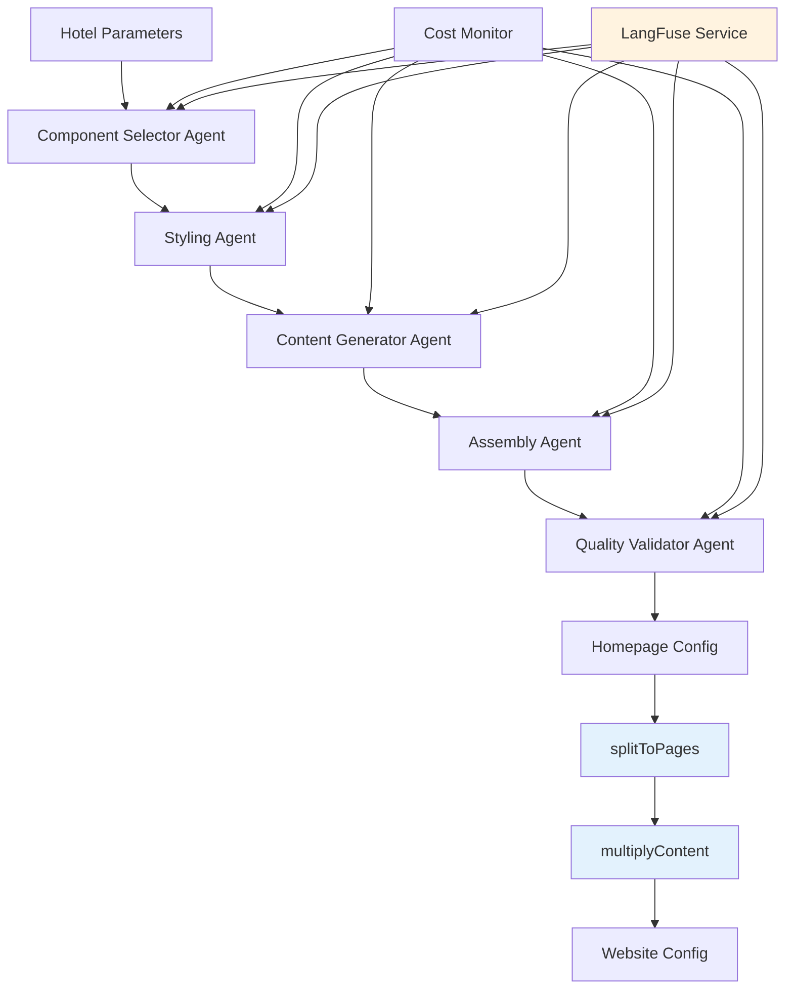

# Epic 3: LLM Orchestration Engine - Architecture Documentation

> **Version:** 2.4
> **Date:** 2025-06-21
> **Updated:** 2026-03-25 (Epic 25: Multi-Page Generation Pipeline)
> **Status:** Synchronized with Codebase
> **Budget Target:** $2.00 per website generation
>
> **🆕 Latest Updates:**
> - ✅ Synchronized architecture with actual LangGraph implementation
> - ✅ Updated agent list and budget allocations
> - ✅ Verified component paths and responsibilities
> - ✅ Epic 25: Added multi-page generation pipeline (splitToPages, multiplyContent, seed bank)
> - ✅ Epic 25: Updated final output from HomepageConfig to WebsiteConfig

## Overview

Epic 3 delivers the core LLM orchestration system that transforms hotel parameters into complete website configurations. The system uses OpenRouter API with intelligent model selection, comprehensive cost tracking, and robust error handling to stay within the $2.00/website budget constraint.

## Architecture Summary

### System Components



### 🆕 Enhanced Observability Architecture

The system now includes comprehensive LangFuse integration for real-time monitoring and debugging:

- **Trace-Level Visibility**: Complete workflow observability
- **Generation Tracking**: Individual LLM call monitoring  
- **Cost Attribution**: Per-agent cost breakdown
- **Performance Metrics**: Response times and token usage
- **Error Tracking**: Comprehensive error logging and recovery

### Budget Allocation ($2.00 Total)

Budget allocations are defined in `CostMonitor.ts` and enforced via `BudgetCheckpoint.ts`:

- **Component Selection:** $0.40 (20%)
- **Styling Agent:** $0.40 (20%)
- **Content Generation:** $0.80 (40%)
- **Assembly Agent:** $0.20 (10%)
- **Quality Validation:** $0.20 (10%)

## Multi-Page Generation Pipeline (Epic 25)

### Overview

The LangGraph agents produce a `HomepageConfig` — a flat list of 5–12 components. Epic 25 adds three $0-cost post-processing functions that transform this into a `WebsiteConfig` covering all pages.

### Pipeline Flow

```
HomepageConfig (LLM Output)
    ↓
splitToPages() → Distributes components to pages
    ↓
WebsiteConfig (with empty page arrays)
    ↓
multiplyContent() → Expands content to realistic volumes
    ↓
WebsiteConfig (final, with full content)
```

### Post-Processing Functions

#### 1. splitToPages() (`web-app/lib/generation/split-to-pages.ts`)

**Purpose:** Pure function that distributes `HomepageConfig` components across 9 page types.

**Input:** `HomepageConfig` (5-12 components)
**Output:** `WebsiteConfig` with pages structure

**Page Types:**
- `homepage` — Hero, teasers (limited to 3 rooms, 6 gallery, 8 amenities)
- `rooms` — Full rooms listing
- `roomDetail` — Individual room pages (map keyed by slug)
- `gallery` — Full gallery
- `amenities` — Full amenities
- `reviews` — Full testimonials
- `contact` — Contact form/info
- `about` — About page
- `faq` — FAQ page

**Behavior:**
- Navigation and footer components added to all pages
- Homepage gets teaser versions of rooms/gallery/amenities
- Each content type gets its dedicated page
- Empty pages created for missing component types

#### 2. multiplyContent() (`web-app/lib/generation/multiply-content.ts`)

**Purpose:** Deterministic cloner that expands LLM template content to target volumes.

**Input:** `WebsiteConfig` (with minimal LLM-generated items)
**Output:** `WebsiteConfig` (with realistic content volumes)

**Volume Ranges by Hotel Type:**
| Hotel Type | Rooms | Gallery | Amenities | Testimonials | FAQ |
|------------|-------|--------|-----------|--------------|-----|
| luxury | 8-15 | 25-50 | 12-25 | 8-15 | 6-12 |
| boutique | 6-12 | 20-40 | 10-20 | 6-12 | 5-10 |
| resort | 10-20 | 40-50 | 15-30 | 10-20 | 8-15 |
| business | 8-15 | 15-30 | 10-20 | 6-12 | 5-10 |
| budget | 3-8 | 10-20 | 5-12 | 3-8 | 3-6 |

**Determinism:**
- Uses seeded PRNG (Mulberry32) with `generationId` as seed
- Same seed always produces identical output
- Seed bank provides 50+ fragments per content type

#### 3. Seed Bank (`web-app/lib/generation/seed-bank.ts`)

**Purpose:** Static content fragments for deterministic multiplication.

**Contents:**
- 107 room name fragments (adjectives, nouns)
- Price ranges per hotel type
- 52 amenity entries with categories
- 30 guest names
- 30 testimonial quote templates
- 20 gallery placeholder entries
- 30 FAQ templates (6 per hotel type)

### WebsiteConfig Structure

```typescript
interface WebsiteConfig {
  source: HomepageConfig;  // Original LLM output
  pages: {
    homepage: { components: ComponentConfig[] };
    rooms: { components: ComponentConfig[] };
    roomDetail: Record<string, { components: ComponentConfig[] }>;
    gallery: { components: ComponentConfig[] };
    amenities: { components: ComponentConfig[] };
    reviews: { components: ComponentConfig[] };
    contact: { components: ComponentConfig[] };
    about: { components: ComponentConfig[] };
    faq: { components: ComponentConfig[] };
  };
}
```

### Cost Impact

The post-processing functions are **pure JavaScript with $0 LLM cost**:
- `splitToPages()` — O(n) complexity, no side effects
- `multiplyContent()` — O(n × volume) with deterministic PRNG
- Seed bank — Static constants, no runtime computation

---

## Core Components

### 1. Cost Monitor (`web-app/app/langgraph/services/CostMonitor.ts`)

**Purpose:** Real-time cost tracking and budget enforcement

**Key Features:**
- Per-step budget allocation
- Model pricing tracking (per 1K tokens)
- Emergency stop mechanism
- Detailed cost reporting
- Model fallback recommendations

**Epic 3 Enhancements:**
- Website-specific budget tracking ($2.00 limit)
- Step-wise budget allocation
- Emergency stop on budget overrun
- **BudgetCheckpoint Utility:** (`web-app/app/langgraph/utils/BudgetCheckpoint.ts`) enforces checkpoints after each stage.

### 2. LLM Service (via `LLMProviderFactory`)

**Purpose:** Unified interface for LLM operations with OpenRouter/Anthropic

**Key Features:**
- Retry mechanism with exponential backoff
- Model fallback on failure
- Structured response parsing
- Budget-aware model selection
- Cost tracking integration

### 3. Component Selector Agent (`web-app/app/langgraph/agents/ComponentSelector.ts`)

**Purpose:** Selects optimal components and layout structure based on hotel parameters.

**Output:**
```typescript
interface ComponentSelectorOutput {
  // Enum: "hero", "navigation", "rooms", "gallery", "testimonials", "amenities", "booking", "contact", "about", "faq", "features", "footer"
  selectedComponents: ("hero" | "navigation" | "rooms" | "gallery" | "testimonials" | "amenities" | "booking" | "contact" | "about" | "faq" | "features" | "footer")[]; // min(5).max(12)
  layoutStructure: "single-column" | "grid" | "mixed";
  emphasisComponents: string[]; // max(3)
  reasoning: string; // min(50).max(3000)
}
```

### 4. Styling Agent (`web-app/app/langgraph/agents/StylingAgent.ts`)

**Purpose:** Generates custom Tailwind CSS configuration and component variants.

**Output:**
```typescript
interface StylingAgentOutput {
  // Note: variant keys are NOT arbitrary — they are validated against
  // VALID_VARIANTS in cva-validator.ts. CVA is effectively static across
  // 3 enforcement layers (cva-variants.ts, schemas.ts, cva-validator.ts).
  componentVariants: Record<string, { [key: string]: any }>;
  reasoning: string;
}
```

### 5. Content Generator Agent (`web-app/app/langgraph/agents/ContentGenerator.ts`)

**Purpose:** Generates brand-aligned textual content and JSON outputs.

**Output:**
```typescript
interface ContentGeneratorOutput {
  componentContent: Record<string, any>;
  homepageContentJson?: HomepageContent;
  mediaManifestJson?: MediaManifest;
  reasoning: string;
}
```

### 6. Assembly Agent (`web-app/app/langgraph/agents/AssemblyAgent.ts`)

**Purpose:** Composes all agent outputs into a complete, validated HomepageConfig.

**Output:**
```typescript
interface HomepageConfig {
  generationId: string;
  timestamp: string;
  hotelParameters: HotelParameters;
  components: {
    type: "hero" | "navigation" | "rooms" | "gallery" | "testimonials" | "amenities" | "booking" | "contact" | "about" | "faq" | "features" | "footer";
    variant: Record<string, string | number | boolean>;
    props: Record<string, any>;
    order: number;
    wrapper?: SectionWrapperContract;
  }[]; // min(5).max(12)
  layoutStructure: "single-column" | "grid" | "mixed";
  emphasisComponents: string[]; // max(3)
  validationStatus: "PASS" | "WARNING" | "FAIL";
}
```

### 7. Quality Validator Agent (`web-app/app/langgraph/agents/QualityValidator.ts`)

**Purpose:** Validates generated output against quality standards and budget.

**Output:**
```typescript
interface QualityMetrics {
  validationStatus: 'pass' | 'fail';
  qualityScore: number;
  validationErrors: string[];
  budgetExceeded: boolean;
}
```

### 8. Generation Workflow (`web-app/app/langgraph/workflows/HomepageGenerationWorkflow.ts`)

**Purpose:** Orchestrates the complete generation process

**Workflow Steps:**
1. **Component Selection**
2. **Styling Generation**
3. **Content Generation**
4. **Assembly**
5. **Quality Validation**

## Technical Implementation

### OpenRouter/LLM Integration

**Request Configuration:**
- **Temperature:** 0.2-0.4 (deterministic outputs)
- **Max Tokens:** 1000-4000 (varies by task complexity)

### Cost Tracking Implementation

**Budget Enforcement:**
The workflow enforces budget checks **after each node execution**. If a budget threshold is exceeded, the workflow terminates early to prevent cost overruns.

```typescript
// Check budget after node execution
const budgetUpdate = this.checkBudgetAfterNode(nodeName, { ...state, ...result });
if (budgetUpdate.budgetExceeded) {
  return 'end_budget'; // Terminates workflow
}
```

### Error Handling Strategy

**Strategies:**

1. **Retry Logic (Quality Validator Loop):**
   - The workflow attempts up to **3 retries** if the `QualityValidator` fails.
   - It employs **exponential backoff** between retries (e.g., 5s, 10s, 20s).
   - If max retries are reached, it terminates with failure.

2. **Graceful Degradation (Agent Fallbacks):**
   - **Component Selector:** Falls back to `BASE_COMPONENTS` (Hero, Rooms, Amenities, Testimonials, Contact).
   - **Styling Agent:** Falls back to `DEFAULT_STYLING` (Standard layout, default theme colors).
   - **Content Generator:** Falls back to `CONTENT_DEFAULTS` (Generic, hotel-agnostic text).
   - **Assembly Agent:** Returns partial assembly if composition fails.

3. **Timeout Protection:**
   - The workflow enforces a strict **30-minute hard timeout** via `AbortController`.
   - If execution exceeds this limit, the process is aborted to free up resources.

## Performance Characteristics

### Target Performance

- **Generation Time:** <30 minutes per website (enforced via timeout)
- **Cost Per Website:** <$2.00 (LLM costs only)
- **Success Rate:** >95% for valid inputs

## Monitoring & Observability

### LangFuse Integration

**Key Integration Points:**
```typescript
const result = await langfuseService.executeGeneration(
  this.agentName,
  observabilityInput,
  initialModelParams,
  async () => { /* ... */ }
);
```

**Observability Features:**
- **Real-time Traces**: All LLM calls visible in LangFuse dashboard
- **Cost Attribution**: Per-agent and per-step cost breakdown
- **Performance Metrics**: Response times, token usage, error rates
- **Quality Scoring**: Confidence scores and validation results

## Testing Strategy

### Unit Tests
Prototype-based mocking for LangGraph agents.

### Integration Tests
End-to-end workflow execution with mock or live LLM calls.

## Related Documentation

- [Schema-Guided Reasoning (SGR) Architecture](../architecture/SGR-ARCHITECTURE.md) - Advanced validation architecture (Anthropic provider only)
- [Cost Tracking](./cost-tracking.md) - Budget monitoring and cost details
- [API Reference](./api-reference.md) - Agent interface definitions
- [LLM Integration](./llm-integration.md) - Provider setup and configuration

---

*This architecture documentation reflects the current state of the codebase.*
