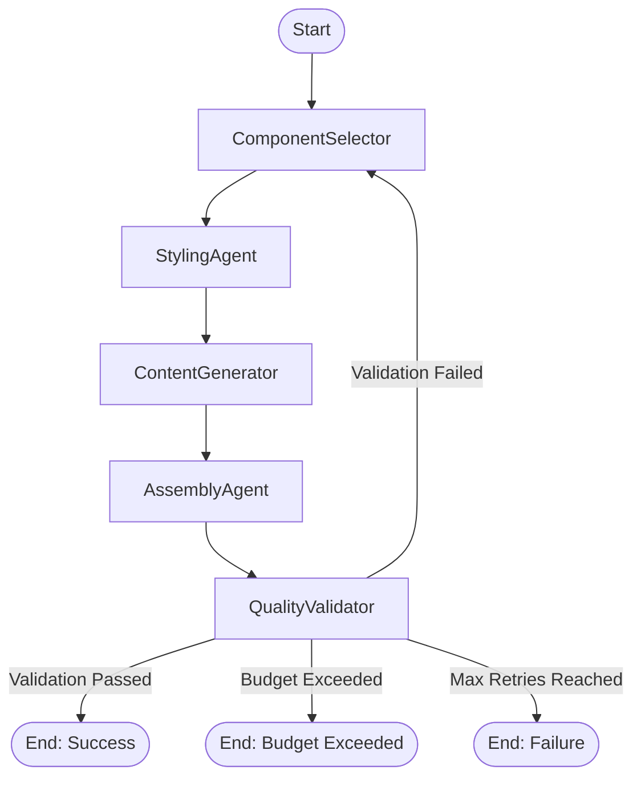

# LLM Integration PRD: LangGraph Workflow System

> **Status:** Synchronized with Codebase
> **Last Updated:** 2026-03-25 (Epic 25: Multi-Page Config Generation)
> **Based on:** [Project Brief](./project-brief.md) and [Component Library PRD](./component-library.md)

## PROJECT SCOPE BOUNDARIES

### IN SCOPE:
- LLM-driven website generation workflow
- Multi-agent orchestration with LangGraph
- Cost management within $2.00 budget constraint
- Content generation and JSON output
- Quality validation and budget enforcement

### OUT OF SCOPE:
- Post-generation LLM monitoring
- Content updates after delivery
- Ongoing model performance optimization
- Custom model training or fine-tuning
- User behavior analytics
- Deployment automation (currently handled separately)
- Real-time translation (planned for Epic 13)

## Overview

This document defines the detailed requirements for the LLM integration system using LangGraph workflows, LangFuse monitoring, and K2 model for cost-effective generation. The system orchestrates autonomous hotel website generation within a $2.00 budget constraint.

## System Architecture

### LangGraph Multi-Agent Workflow



**Conditional Logic:**
- **Budget Check:** Performed after every node. If `$2.00` budget is exceeded, workflow terminates immediately (`End: Budget Exceeded`).
- **Validation Loop:** If validation fails, workflow retries from `ComponentSelector`.
- **Max Retries:** Limited to 3 retries. If exceeded, terminates with failure (`End: Failure`).

#### Agent Communication Protocol
```typescript
interface WorkflowState {
  // Input data
  generationId: string;
  hotelParameters: HotelParameters;

  // Agent outputs
  componentSelection?: ComponentSelectorOutput;
  stylingSelection?: StylingAgentOutput;
  contentGeneration?: ContentGeneratorOutput;
  assembledConfig?: HomepageConfig;

  // Epic 25: Multi-page generation output
  websiteConfig?: WebsiteConfig;  // Post-processing: splitToPages + multiplyContent

  // Validation state
  // Note: 'validationStatus' in WorkflowState is lowercase ('pass' | 'fail' | 'pending'),
  // while HomepageConfig (assembledConfig) uses uppercase ("PASS" | "WARNING" | "FAIL").
  validationStatus: 'pending' | 'pass' | 'fail';
  validationErrors: string[];
  qualityScore?: number;

  // Workflow control
  retryCount: number;
  errors: string[];

  // Cost management
  totalCost: number;
  stepCosts: Record<string, number>;
  budgetRemaining: number;
  budgetExceeded: boolean;

  // Fallback tracking
  usedFallback?: Record<string, boolean>;
  partialAssembly?: boolean;

  // Content JSON for file output
  contentJson?: any;
}
```

## Agent Specifications

### 1. Component Selector Agent (P0 - Critical)

#### Purpose
Select optimal Shadcn/ui components and layout structure based on hotel parameters.

#### Input Requirements
- `hotelParameters`: Hotel type, target audience, brand personality, name, location.

#### Output Requirements
```typescript
interface ComponentSelectorOutput {
  // Must be between 5 and 8 components
  selectedComponents: ("hero" | "navigation" | "rooms" | "gallery" | "testimonials" | "amenities" | "booking" | "contact")[];
  layoutStructure: "single-column" | "grid" | "mixed";
  emphasisComponents: string[];
  reasoning: string;
}
```

#### LLM Configuration
- **Model:** OpenRouter (Intelligent Routing)
- **Budget Allocation:** $0.40 (20%)
- **Validation:** Zod Schema `ComponentSelectorOutputSchema`

### 2. Styling Agent (P0 - Critical)

#### Purpose
Generate custom Tailwind CSS configuration and component variants based on selection.

#### Input Requirements
- `hotelParameters`
- `componentSelection`

#### Output Requirements
```typescript
interface StylingAgentOutput {
  componentVariants: Record<string, {
    // Hero variants
    style?: "modern" | "classic" | "minimal" | "bold" | "elegant";
    layout?: "centered" | "split" | "minimal";
    overlay?: "none" | "light" | "dark" | "gradient";
    height?: "small" | "medium" | "large" | "fullscreen";

    // Gallery variants
    galleryLayout?: "grid" | "masonry" | "carousel";
    gallerySpacing?: "tight" | "normal" | "loose";
    aspectRatio?: "square" | "landscape" | "portrait";
    columns?: 2 | 3 | 4;

    // Testimonials variants
    testimonialsLayout?: "carousel" | "grid" | "featured";
    testimonialsColumns?: 2 | 3;

    // Amenities variants
    amenitiesLayout?: "grid" | "list" | "featured";
    amenitiesColumns?: 2 | 3 | 4;
    iconSize?: "small" | "medium" | "large";
    iconStyle?: "default" | "muted" | "colored";

    // Navigation variants
    navStyle?: "transparent" | "solid" | "glass";
    navLayout?: "default" | "compact" | "tall";

    // Room Card variants
    roomCardStyle?: "detailed" | "compact" | "grid";
    imageHeight?: "default" | "tall" | "wide";

    // Booking Widget variants
    bookingStyle?: "desktop" | "mobile";
    bookingTheme?: "light" | "dark" | "glass";

    // Contact Form variants
    contactStyle?: "default" | "minimal" | "floating";
    contactBackground?: "none" | "brand" | "muted";

    // Shared variants
    cardStyle?: "default" | "minimal" | "flat" | "elevated";

    // Note: CVA variants are statically defined across 3 enforcement layers
    // (cva-variants.ts, schemas.ts, cva-validator.ts). This index signature
    // exists for TypeScript flexibility but all variant keys are validated
    // against VALID_VARIANTS at runtime. New variants require build-time
    // code generation updating all 3 files in lockstep.
    [key: string]: string | number | boolean | undefined;
  }>;
  reasoning: string;
}
```

#### LLM Configuration
- **Model:** OpenRouter (Intelligent Routing)
- **Budget Allocation:** $0.40 (20%)
- **Validation:** Zod Schema `StylingAgentOutputSchema`, CVA Validator

### 3. Content Generator Agent (P0 - Critical)

#### Purpose
Generate brand-aligned textual content and JSON outputs for selected components.

#### Input Requirements
- `hotelParameters`
- `componentSelection`
- `stylingSelection`

#### Output Requirements
```typescript
interface ContentGeneratorOutput {
  componentContent: Record<string, {
    // Component specific content fields
    title?: string;
    description?: string;
    // ... other fields
  }>;

  // JSON content files
  homepageContentJson?: HomepageContent; // English content
  mediaManifestJson?: MediaManifest;     // Media assets

  // Epic 25 Story 25.4: SEO metadata for each page type
  // Optional field - adds ~$0.01 to generation cost
  pageMetadata?: Record<PageType, {
    title: string;        // Hotel-specific page title
    description: string;  // SEO description (100-160 chars)
  }>;
  // Page types: rooms, gallery, amenities, reviews, contact, about, faq

  // Note: Multi-locale support planned for Epic 13 via translation API

  reasoning: string;
}
```

#### LLM Configuration
- **Model:** OpenRouter (Intelligent Routing)
- **Budget Allocation:** $0.80 (40%)
- **Validation:** Zod Schema `ContentGeneratorOutputSchema`, Content Constraints

### 4. Assembly Agent (P1 - High)

#### Purpose
Compose all agent outputs into a complete, validated HomepageConfig, handling ordering and placeholders.

#### Input Requirements
- `hotelParameters`
- `componentSelection`
- `stylingSelection`
- `contentGeneration`

#### Output Requirements
```typescript
interface HomepageConfig {
  generationId: string;
  timestamp: string;
  hotelParameters: HotelParameters;
  components: {
    type: "hero" | "navigation" | "rooms" | "gallery" | "testimonials" | "amenities" | "booking" | "contact";
    variant: Record<string, string | number | boolean>;
    props: Record<string, any>;
    order: number;
  }[];
  layoutStructure: "single-column" | "grid" | "mixed";
  emphasisComponents: string[];
  validationStatus: "PASS" | "WARNING" | "FAIL"; // Uppercase per ZOD schema
}
```

#### LLM Configuration
- **Model:** OpenRouter (Intelligent Routing)
- **Budget Allocation:** $0.20 (10%)
- **Validation:** Zod Schema `HomepageConfigSchema`

### 5. Quality Validator Agent (P1 - High)

#### Purpose
Validate generated output against quality standards, Zod schemas, and budget constraints.

#### Input Requirements
- `assembledConfig`
- `totalCost`

#### Output Requirements
- `validationStatus`: 'pass' | 'fail' // Lowercase per WorkflowState
- `qualityScore`: number (0-100)
- `validationErrors`: string[]
- `budgetExceeded`: boolean

#### Validation Criteria
- **Zod Compliance:** 100% strict adherence
- **Component Coverage:** 5-8 components
- **Variant Validity:** CVA validation pass
- **Content Completeness:** Field population check
- **Budget Compliance:** Total cost <= $2.00

#### LLM Configuration
- **Model:** Minimal usage (Logic-based validation mostly)
- **Budget Allocation:** $0.20 (10%)

---

## Multi-Page Generation Pipeline (Epic 25)

### Overview

The LangGraph agents produce a `HomepageConfig` — a flat list of 5–12 components. Epic 25 adds three $0-cost post-processing functions that transform this into a `WebsiteConfig` covering all pages.

### Pipeline Flow

```
LLM Agents → HomepageConfig (flat list)
    ↓
splitToPages() → WebsiteConfig (page distribution)
    ↓
multiplyContent() → WebsiteConfig (realistic volumes)
    ↓
Final Output: WebsiteConfig (ready for preview/CMS)
```

### Post-Processing Functions

#### 1. splitToPages() — Component Distribution

**Location:** `web-app/lib/generation/split-to-pages.ts`

**Purpose:** Pure function distributing `HomepageConfig` components across 9 page types.

**No LLM Cost:** O(n) complexity, pure function

**Page Distribution:**
| Page Type | Content |
|-----------|---------|
| `homepage` | Hero + teasers (limited: 3 rooms, 6 gallery, 8 amenities) |
| `rooms` | Full rooms component |
| `roomDetail` | Individual room pages (map by slug) |
| `gallery` | Full gallery |
| `amenities` | Full amenities |
| `reviews` | Full testimonials |
| `contact` | Contact form/info |
| `about` | About page |
| `faq` | FAQ page |

**Key Behaviors:**
- Navigation and footer added to all pages
- Homepage gets teaser versions of content types
- Empty pages created for missing components
- Room slugs derived from names (kebab-case)

#### 2. multiplyContent() — Deterministic Content Cloning

**Location:** `web-app/lib/generation/multiply-content.ts`

**Purpose:** Expands 1–3 LLM-generated templates to target content volumes.

**No LLM Cost:** Deterministic PRNG (Mulberry32) with seeded randomness

**Volume Expansion by Hotel Type:**
| Hotel Type | Rooms | Gallery | Amenities | Testimonials |
|------------|-------|--------|-----------|--------------|
| luxury | 8–15 | 25–50 | 12–25 | 8–15 |
| boutique | 6–12 | 20–40 | 10–20 | 6–12 |
| resort | 10–20 | 40–50 | 15–30 | 10–20 |
| business | 8–15 | 15–30 | 10–20 | 6–12 |
| budget | 3–8 | 10–20 | 5–12 | 3–8 |

**Key Behaviors:**
- Uses LLM template (first item) as prototype
- Seed bank provides 50+ fragments per type for variation
- Room slug collision handling with numeric suffixes
- Same `generationId` seed always produces identical output

#### 3. Seed Bank — Static Content Fragments

**Location:** `web-app/lib/generation/seed-bank.ts`

**Purpose:** Provides deterministic content for multiplication.

**Contents:**
- 107 room name fragments
- Price ranges per hotel type
- 52 amenity entries
- 30 guest names
- 30 testimonial quote templates
- 20 gallery placeholders
- 30 FAQ templates (6 per hotel type)

### WebsiteConfig Structure

```typescript
interface WebsiteConfig {
  source: HomepageConfig;  // Original LLM output (preserved)
  pages: {
    homepage: { components: ComponentConfig[] };
    rooms: { components: ComponentConfig[] };
    roomDetail: Record<string, { components: ComponentConfig[] }>;
    gallery: { components: ComponentConfig[] };
    amenities: { components: ComponentConfig[] };
    reviews: { components: ComponentConfig[] };
    contact: { components: ComponentConfig[] };
    about: { components: ComponentConfig[] };
    faq: { components: ComponentConfig[] };
  };
}
```

### Generation Scripts Output

Both generation scripts now output two files:
1. `homepage-config-{hotel}-v{timestamp}.json` — Original `HomepageConfig`
2. `website-config-{hotel}-v{timestamp}.json` — Full `WebsiteConfig` with all pages

The preview route loads `WebsiteConfig` fixtures directly, skipping post-processing for pre-generated configs.

---

## Cost Management with LangFuse

### Budget Enforcement System

#### CostMonitor Service
```typescript
class CostMonitor {
  public static TOTAL_BUDGET = 2.00; // $2.00 per generation

  // Budget allocations (approximate based on multipliers)
  private static STEP_BUDGETS = {
    'ComponentSelector': 0.40, // 20%
    'StylingAgent': 0.40,      // 20%
    'ContentGenerator': 0.80,  // 40%
    'AssemblyAgent': 0.20,     // 10%
    'QualityValidator': 0.20,  // 10%
  };
  
  // ... checkBudget(), trackStepCost() methods
}
```

### LangFuse Integration

#### Monitoring Metrics
- **Cost per generation:** Real-time tracking
- **Success rate:** Percentage of successful generations
- **Quality scores:** Zod compliance, CVA validity
- **Generation time:** End-to-end timing
- **Error rates:** Failures by agent type

## Error Handling & Recovery

### Strategies
- **Timeout Protection:** 30-minute hard timeout implemented via `AbortController` in the `invoke()` method to prevent runaway processes.
- **Retry Logic:** Exponential backoff for transient failures (Validation status = 'fail'). max 3 retries.
- **Graceful Degradation:**
    - `ComponentSelector`: Fallback to base component set.
    - `StylingAgent`: Fallback to default styling.
    - `ContentGenerator`: Fallback to generic content defaults.
    - `AssemblyAgent`: Deterministic assembly fallback.

## Testing Strategy

### Agent Unit Testing
```typescript
describe('ComponentSelector', () => {
  it('should select luxury components', async () => {
    const result = await componentSelector.performGeneration(luxuryState);
    expect(result.componentSelection.selectedComponents).toContain('gallery');
  });
});
```

### Integration Testing
- **Workflow End-to-End:** Complete generation cycles
- **Cost Validation:** Budget enforcement testing
- **Quality Assurance:** Generated config validation

---

*This PRD defines the complete LLM integration system for autonomous hotel website generation. All agents must adhere to these specifications for successful workflow orchestration.*
