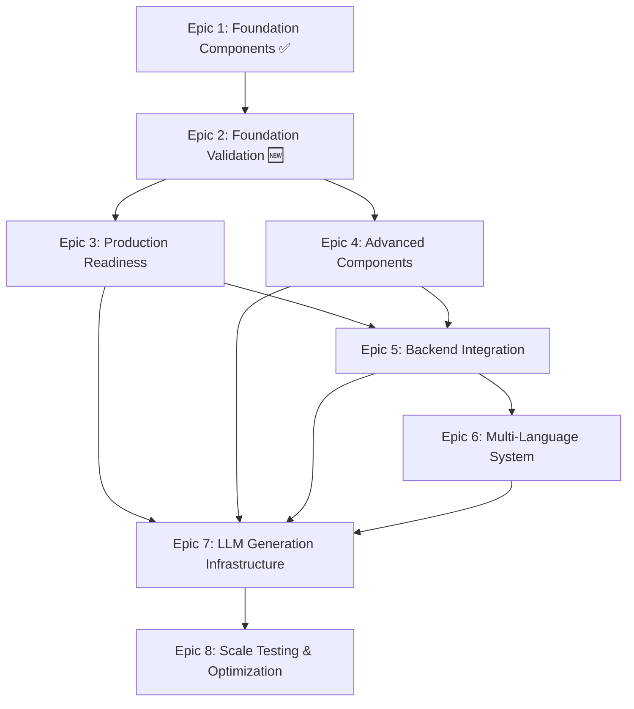

# LLM-Driven Hotel Website Generator - Epic Planning Roadmap

> **Project:** The Sterling Executive Reference Implementation
> **Status:** Living Document - Updated as epics evolve
> **Version:** 2.0
> **Created:** 2025-11-15
> **Last Updated:** 2025-11-20

---

## Roadmap Revision History

### 2025-11-20: Inserted Epic 2 (Foundation Validation & Prompt Development)
**Reason:** Strategic decision to validate component architecture and LLM generation prompts before scaling to advanced components.

**Research justification:**
- 73% of LLM applications fail without proper validation (Anthropic 2024)
- Early validation provides 8.5x ROI ($7K investment saves $38K/month)
- Production bugs cost 100x more than design-phase bugs (IBM Systems Sciences Institute)
- Industry best practice: "Start small, validate thoroughly, then scale" (Microsoft, Anthropic, Vercel)

**Impact:**
- Adds 4 weeks to timeline
- Prevents costly refactoring later
- Validates $2/site cost budget early
- Creates reusable prompt templates for future epics
- De-risks Epic 3-6 implementation by validating architecture with real-world generation

**Roadmap changes:**
- Original Epic 2 (Production Readiness) → Epic 3
- Original Epic 3 (Advanced Components) → Epic 4
- Original Epic 4 (Backend Integration) → Epic 5
- Original Epic 5 (Multi-Language System) → Epic 6
- Original Epic 6 (LLM Generation Infrastructure) → Epic 7
- Original Epic 7 (Scale Testing) → Epic 8

---

## Overview

This document provides the strategic roadmap for all epics in the LLM-Driven Hotel Website Generator project. It serves as a living reference for epic planning, dependencies, and evolution as the project progresses.

**Purpose**: Guide epic creation and ensure comprehensive PRD coverage while maintaining logical development flow.

---

## Epic Dependency Graph



---

## Epic 1: Foundation Components ✅ COMPLETE

**Status**: Complete (Stories 1.1-1.11 delivered)
**Timeline**: October 20, 2025 - November 18, 2025 (4 weeks)
**Story Points**: 47 points (100% complete)

### Objective
Establish foundational infrastructure for The Sterling Executive hotel website with formal component contracts, serving as the reference implementation for future LLM-generated hotel websites.

### Scope Summary
- ✅ Next.js 14+ project setup with App Router
- ✅ Core pages (Home, Rooms, Contact)
- ✅ Essential components (Navigation, Hero, RoomCard, BookingWidget)
- ✅ Testing infrastructure (TDD approach, multiple Jest configs)
- ✅ Translation infrastructure setup (i18n framework)
- ✅ Component Registry System with ZOD contracts
- ✅ Progressive Contract Enforcement (warning → strict mode)
- ✅ Centralized Tailwind Design System (Story 1.11)

### Key Deliverables
- Functional Next.js application with core pages
- 4-tier component architecture foundation
- Comprehensive testing framework
- Design system with semantic tokens and CSS variables
- Component contract validation system

### Stories
- 1.1: Project Infrastructure Setup ✅
- 1.2: Core Pages Structure and Routing ✅
- 1.3: Responsive Navigation Component ✅
- 1.4: Hero Section Component ✅
- 1.5: Room Card Component ✅
- 1.6: Basic Booking Widget ✅
- 1.7: Rooms Page Implementation ✅
- 1.8: Contact Page ✅
- 1.9: Translation Infrastructure Setup ✅
- 1.10: Progressive Contract Enforcement 📝
- 1.11: Centralized Tailwind Design System 📝

### Success Metrics
- All core pages functional
- Test coverage >80%
- TypeScript strict mode enabled with zero errors
- Design system enables theme customization
- Component contracts validated via ZOD

---

## Epic 2: Foundation Validation & Prompt Development 🆕 CURRENT

**Status**: Planned
**Timeline**: 4 weeks (November 20 - December 18, 2025)
**Estimated Story Points**: 35-45 points
**Dependencies**: Epic 1 complete ✅

### Objective
Validate component architecture and develop production-ready LLM generation prompts with 5-8 homepage components before scaling to advanced features. This epic de-risks the entire LLM generation workflow by proving the architecture works at small scale.

### Rationale
Research shows 73% of LLM applications fail when scaling without proper validation. This epic validates the foundation with 8 homepage components and 10+ variations before building advanced features, preventing costly refactoring and validating the $2/site cost budget early.

**Why now?**
- Epic 1 delivered core component infrastructure but didn't validate LLM generation patterns
- Need to prove CVA variant system + ZOD schemas work for LLM consumption before Epic 4 (Advanced Components)
- Manual generation prompts (Claude Code workflow) inform Epic 7 LangGraph automation
- Early cost validation prevents budget overruns at scale

### Scope
- ✅ **Homepage Component Expansion**
  - Add Gallery, Testimonials, Amenities components to complete homepage
  - Total homepage components: 8 (Hero, Navigation, Room Cards, Booking, Contact, Gallery, Testimonials, Amenities)
  - Each component must have CVA variants and ZOD schemas

- ✅ **CVA Variant System + ZOD Schemas**
  - Define CVA variants for all 8 components (luxury, budget, boutique, resort, business)
  - Create comprehensive ZOD schemas for component props
  - Validate schemas work for LLM consumption
  - Document variant selection heuristics

- ✅ **Component Documentation for LLM Consumption**
  - Component usage guides
  - Variant selection guidelines
  - Golden datasets for regression testing
  - Component capability matrix

- ✅ **Manual Generation Prompts (Claude Code Workflow)**
  - Develop prompts for generating homepage variations
  - Test prompts with Claude Code
  - Refine prompts based on output quality
  - Document prompt patterns for LangGraph automation

- ✅ **Homepage Variation Generation**
  - Generate 10+ complete homepage variations
  - Hotel types: luxury resort, budget hotel, boutique inn, business hotel, beach resort, mountain lodge, urban hotel, eco-lodge, family resort, spa resort
  - Each variation uses different component variants and styling

- ✅ **Quality Assessment Framework**
  - Human evaluation criteria
  - Quality scoring rubric
  - Target: 85-90% human-AI agreement
  - Document quality patterns and anti-patterns

- ✅ **Cost Tracking & Optimization**
  - Track generation cost per homepage
  - Identify cost optimization opportunities
  - Validate $2/site budget feasibility
  - Document cost breakdown by component

- ✅ **Findings Documentation**
  - What worked well
  - What needs refinement
  - Prompt templates for production
  - Architecture adjustments for Epic 4+

### Proposed Stories
- **2.1**: Add Gallery, Testimonials, Amenities Components to Homepage (8 points)
  - Implement 3 new homepage components
  - Responsive design (768px breakpoint)
  - Component testing infrastructure

- **2.2**: Define CVA Variants + ZOD Schemas for All 8 Components (6 points)
  - CVA variant definitions (5 styles per component)
  - Comprehensive ZOD schemas
  - Variant documentation

- **2.3**: Create Component Documentation + Golden Datasets (5 points)
  - Component usage guides for LLM consumption
  - Golden datasets for regression testing
  - Variant selection heuristics

- **2.4**: Develop Manual Generation Prompts (Claude Code Workflow) (6 points)
  - Prompt engineering for homepage generation
  - Test prompts with Claude Code
  - Prompt refinement iterations

- **2.5**: Generate 10 Homepage Variations + Quality Assessment (8 points)
  - Generate 10+ homepage variations (luxury, budget, boutique, etc.)
  - Quality assessment (85-90% target)
  - Document quality patterns

- **2.6**: Cost Optimization + Prompt Refinement (5 points)
  - Cost tracking analysis
  - Optimize prompts for token efficiency
  - Validate $2/site budget

- **2.7**: Document Findings + Create Production Prompt Templates (5 points)
  - Findings report
  - Production-ready prompt templates
  - Architecture recommendations for Epic 4+

### Success Metrics
- 8 homepage components with CVA variants and ZOD schemas: 100% complete
- 10+ homepage variations generated: 100% complete
- Human-AI quality agreement: 85-90%
- Cost per homepage: <$0.50 (target for $2/site budget with 4 pages)
- Component documentation: 100% complete
- Golden datasets created: 100% complete
- Production prompt templates: 100% complete

### Deliverables
- 8 homepage components (Hero, Navigation, Room Cards, Booking, Contact, Gallery, Testimonials, Amenities)
- CVA variant system implemented for all 8 components
- Comprehensive ZOD schemas for all components
- 10+ validated homepage variations (luxury, budget, boutique, resort, business, etc.)
- Manual generation prompts ready for LangGraph automation (Epic 7)
- Cost tracking data validating $2/site budget feasibility
- Golden datasets for regression testing
- Component documentation optimized for LLM consumption
- Findings report informing Epic 4+ architecture

### Out of Scope
- Additional pages beyond homepage (Epic 4)
- Backend integration (Epic 5)
- LangGraph automation (Epic 7)
- Multi-language content (Epic 6)
- Production deployment (Epic 3)

---

## Epic 3: Production Readiness & Optimization

**Status**: Planned (Deferred until Epic 2 complete)
**Timeline**: 3-4 weeks
**Estimated Story Points**: 42-55 points
**Dependencies**: Epic 1 complete ✅, Epic 2 recommended

### Objective
Transform the reference implementation into a production-ready website with full SEO, performance optimization, accessibility compliance, and monitoring infrastructure.

### Scope
- ✅ **SEO Infrastructure**
  - Next.js metadata API implementation (per-page optimization)
  - Dynamic sitemap.xml generation
  - Robots.txt configuration
  - Open Graph and Twitter Card tags
  - Structured data (JSON-LD) for hotel, rooms, reviews
  - hreflang tags for multi-language support (foundation)

- ✅ **Image Optimization System**
  - Next.js Image component integration across all components
  - Responsive image patterns (.webp desktop, .m.webp mobile)
  - Image loading strategies (lazy, eager, priority)
  - Image domain configuration for CDN
  - Placeholder blur implementation
  - Art direction for hero images

- ✅ **Performance Optimization**
  - Code splitting strategy
  - Dynamic imports for heavy components
  - Font optimization (next/font for Playfair Display + Inter)
  - CSS optimization and purging
  - Bundle analysis and reduction
  - Core Web Vitals optimization (LCP, FID, CLS)
  - Lighthouse score >90 target

- ✅ **Accessibility Compliance**
  - WCAG 2.1 AA compliance audit
  - Keyboard navigation testing
  - Screen reader compatibility
  - Color contrast validation (automated testing)
  - Focus state consistency
  - ARIA attributes audit
  - Accessibility testing in CI/CD

- ✅ **Error Handling & Monitoring**
  - Sentry integration for error tracking
  - Custom error boundaries for sections
  - User-friendly error pages
  - API error handling patterns
  - Client-side error logging
  - Performance monitoring setup

- ✅ **Environment Configuration**
  - Formalized .env structure
  - Environment variable validation (Zod schema)
  - Development/staging/production configs
  - Secrets management strategy
  - Configuration documentation

- ✅ **Storybook + Chromatic Visual Regression Testing** 🆕
  - Storybook setup for component documentation and isolation testing
  - Component stories for all 8+ homepage components
  - CVA variant stories (all style/layout combinations)
  - Chromatic integration for visual regression testing
  - Visual baseline capture at 375px, 768px, 1280px viewports
  - CI/CD integration (PR blocking on visual changes)
  - Component interaction testing
  - Accessibility addon integration

  **Why Storybook + Chromatic:**
  - **Component Documentation:** Interactive component catalog for LLM consumption (Epic 7)
  - **Visual Regression:** Catches unintended styling changes from design system updates
  - **CVA Validation:** Visual proof that all variant combinations render correctly
  - **Scale Preparation:** Baselines enable Epic 8 visual diff testing at 1000+ sites
  - **Free Tier:** Chromatic offers 5,000 snapshots/month (sufficient for Epic 3-4)

### Proposed Stories
- **2.1**: SEO Foundation & Metadata System (5 points)
  - Next.js metadata API setup
  - Per-page SEO optimization
  - Sitemap and robots.txt

- **2.2**: Structured Data & Social Sharing (3 points)
  - JSON-LD schema implementation
  - Open Graph and Twitter Cards
  - Rich snippets for search results

- **2.3**: Image Optimization Infrastructure (5 points)
  - Next.js Image component patterns
  - Responsive image system (.webp, .m.webp)
  - CDN integration setup

- **2.4**: Performance Optimization & Bundle Analysis (5 points)
  - Code splitting implementation
  - Dynamic imports
  - Bundle size reduction
  - Font optimization

- **2.5**: Core Web Vitals Optimization (5 points)
  - LCP optimization (image loading, critical CSS)
  - FID optimization (JavaScript reduction)
  - CLS optimization (layout stability)
  - Performance monitoring setup

- **2.6**: Accessibility Compliance Audit (5 points)
  - WCAG 2.1 AA testing
  - Keyboard navigation fixes
  - Screen reader compatibility
  - Automated accessibility testing in CI

- **2.7**: Error Monitoring & Sentry Integration (4 points)
  - Sentry setup and configuration
  - Error boundary implementation
  - Custom error pages enhancement
  - Error reporting workflow

- **2.8**: Environment Configuration Management (3 points)
  - .env formalization
  - Zod validation schema
  - Configuration documentation
  - Secrets management

- **3.9**: Storybook + Chromatic Visual Regression Testing (7-10 points) 🆕
  - Storybook 8.x setup with Next.js 14+ integration
  - Component stories for all 8 homepage components (Hero, Navigation, RoomCard, BookingWidget, ContactForm, Gallery, Testimonials, Amenities)
  - CVA variant stories demonstrating all style/layout combinations
  - Chromatic project setup and CI integration
  - Visual baselines at mobile (375px), tablet (768px), desktop (1280px)
  - Interaction testing for dynamic components (BookingWidget, Navigation)
  - Accessibility addon (@storybook/addon-a11y) integration
  - Documentation: Component usage guides auto-generated from stories

  **Technical Details:**
  ```bash
  # Dependencies
  npm install -D storybook @storybook/nextjs @storybook/addon-a11y
  npm install -D chromatic @chromatic-com/storybook
  ```

  **File Structure:**
  ```
  web-app/
  ├── .storybook/
  │   ├── main.ts           # Storybook config
  │   ├── preview.ts        # Global decorators, design system tokens
  │   └── chromatic.config.js
  ├── components/
  │   ├── blocks/
  │   │   ├── RoomCard/
  │   │   │   ├── index.tsx
  │   │   │   └── RoomCard.stories.tsx  # Component stories
  │   │   └── ...
  │   └── sections/
  │       └── HeroSection/
  │           ├── index.tsx
  │           └── HeroSection.stories.tsx
  ```

  **Cross-References:**
  - [Story 1.11: Design System](/docs/stories/1.11.story.md) - Tokens must be loaded in Storybook preview
  - [Epic 2: CVA Variants](/docs/epics/epic-2-foundation-validation.md) - Stories for each CVA variant
  - [Epic 7: LLM Generation](/docs/epics/epic-planning-roadmap.md#epic-7) - Storybook docs inform ComponentSelector agent
  - [Epic 8: Scale Testing](/docs/epics/epic-planning-roadmap.md#epic-8) - Visual diff baselines for generated sites

  **Acceptance Criteria:**
  - [ ] Storybook running at `npm run storybook` (port 6006)
  - [ ] All 8 homepage components have stories with all CVA variants
  - [ ] Chromatic captures baselines on every PR
  - [ ] Visual diff blocks PR merge if >0.1% pixel change detected
  - [ ] Accessibility violations surfaced in Storybook UI
  - [ ] Stories serve as living documentation for LLM consumption

### Success Metrics
- Lighthouse score >90 (all categories)
- Core Web Vitals: All green
- WCAG 2.1 AA compliance: 100%
- Bundle size <250KB (desktop), <150KB (mobile)
- Error tracking active with <1% error rate
- All environment configs validated
- **Storybook:** 100% component coverage with all CVA variants documented
- **Chromatic:** Visual baselines captured for 8 components × 3-5 variants × 3 viewports
- **Visual Regression:** CI blocks PRs with unreviewed visual changes

### Out of Scope
- Full multi-language content (Epic 6)
- Backend API integration (Epic 5)
- Advanced component variants (Epic 4)
- Percy or BackstopJS (using Chromatic for Storybook integration)

---

## Epic 4: Advanced Component Library

**Status**: Planned (Deferred until Epic 2 complete)
**Timeline**: 3-4 weeks
**Estimated Story Points**: 50-65 points
**Dependencies**: Epic 1 complete ✅, Epic 2 complete (required), Epic 3 recommended

### Objective
Expand the component library to include all 20+ components specified in the PRD, implementing advanced variants and completing the 4-tier component architecture.

### Scope
- ✅ **Gallery Components** (FR4)
  - GallerySection (4 layouts: grid, masonry, carousel, justified)
  - Category filtering
  - Lightbox modal with navigation
  - Lazy loading implementation
  - Responsive image variants

- ✅ **Amenities & Features Components**
  - FeatureList component (3 variants: grid, list, icons)
  - AmenityCard component (2 variants: compact, detailed)
  - FacilitySection component
  - IconLibrary integration

- ✅ **Testimonials & Social Proof**
  - TestimonialCard component (3 variants: quote, rating, video)
  - TestimonialSection (2 layouts: carousel, grid)
  - Rating display component
  - Review aggregation display

- ✅ **Advanced Booking Components**
  - RoomComparison component
  - AvailabilityCalendar component
  - PriceFilter component
  - RoomSorting component
  - BookingSummary component

- ✅ **Business-Specific Components**
  - MeetingRoomCard component
  - BusinessAmenities component
  - CorporateTestimonials component
  - ConferenceInquiryForm component

- ✅ **Footer & Legal Components**
  - Footer component (2 variants: simple, detailed)
  - LegalPages (Privacy, Terms, Cookies)
  - SocialMediaLinks component
  - NewsletterSignup component

- ✅ **Utility Components**
  - LoadingSpinner component
  - SkeletonLoader component
  - ToastNotification component
  - Modal component (reusable)
  - Breadcrumb component

### Component Breakdown by Tier

**Tier 1 - Primitives** (Shadcn/ui - already complete):
- Button, Card, Input, Select, Label, Form, etc.

**Tier 2 - Blocks** (Hotel-specific building blocks):
- Navigation ✅
- RoomCard ✅
- BookingWidget ✅
- AmenityCard (NEW)
- TestimonialCard (NEW)
- GalleryItem (NEW)
- FeatureCard (NEW)
- FooterBlock (NEW)

**Tier 3 - Sections** (Page sections):
- HeroSection ✅
- RoomsGrid ✅
- ContactForm ✅
- GallerySection (NEW)
- AmenitiesSection (NEW)
- TestimonialsSection (NEW)
- FeaturesSection (NEW)
- Footer (NEW)

**Tier 4 - Pages** (Complete pages):
- Homepage ✅
- Rooms ✅
- Contact ✅
- Gallery (NEW)
- Amenities (NEW)
- About (NEW)
- Legal Pages (NEW)

### Proposed Stories (Preliminary)
- **4.1**: Gallery System Implementation (8 points)
- **4.2**: Amenities & Features Components (6 points)
- **4.3**: Testimonials & Reviews System (6 points)
- **4.4**: Advanced Booking Components (8 points)
- **4.5**: Business-Specific Components (5 points)
- **4.6**: Footer & Social Components (4 points)
- **4.7**: Legal Pages Implementation (4 points)
- **4.8**: Utility Components Library (5 points)
- **4.9**: Gallery Page Implementation (5 points)
- **4.10**: Amenities Page Implementation (5 points)
- **4.11**: About Page Implementation (4 points)

### Success Metrics
- All 20+ components implemented
- Each component has 100% test coverage
- All components have ZOD contracts
- Component library documentation complete
- Storybook integration (optional)

### Out of Scope
- Backend data integration (Epic 5)
- Full multi-language content (Epic 6)
- LLM generation logic (Epic 7)

---

## Epic 5: Backend Integration

**Status**: Planned (Deferred until Epic 2 complete)
**Timeline**: 3-4 weeks
**Estimated Story Points**: 45-60 points
**Dependencies**: Epic 1 complete ✅, Epic 2 recommended, Epic 4 recommended

### Objective
Integrate The Sterling Executive website with Directus CMS for content management and Effective Tours API for real booking functionality, replacing all mock data with live backend connections.

### Scope
- ✅ **Directus CMS Integration**
  - Directus SDK setup and configuration
  - Content models for hotel data, rooms, amenities, gallery
  - Content fetching patterns (SSR, ISR, CSR)
  - Image delivery via Directus
  - Content preview mode
  - Cache strategy for CMS content

- ✅ **Effective Tours API Integration**
  - API client setup with authentication
  - Real-time room availability checking
  - Booking creation and management
  - Price calculation integration
  - Reservation status tracking
  - Error handling for API failures

- ✅ **Data Layer Architecture**
  - API route handlers (Next.js App Router)
  - Data fetching utilities
  - Response caching strategy
  - Error boundary patterns for API failures
  - Loading states for async data

- ✅ **BackBlaze B2 Storage**
  - Image storage integration
  - CDN configuration
  - Upload pipeline (for CMS)
  - Asset management

- ✅ **Content Management Workflow**
  - Hotel information management
  - Room content updates
  - Gallery image management
  - Testimonials and reviews
  - Multi-language content structure (foundation)

### Proposed Stories (Preliminary)
- **5.1**: Directus CMS Setup & Configuration (5 points)
- **5.2**: Content Models & Schema Design (5 points)
- **5.3**: Hotel & Room Data Integration (8 points)
- **5.4**: Gallery & Media Integration (6 points)
- **5.5**: Effective Tours API Client Setup (5 points)
- **5.6**: Room Availability Integration (8 points)
- **5.7**: Booking Flow Integration (8 points)
- **5.8**: BackBlaze B2 Storage Integration (4 points)
- **5.9**: Content Fetching Patterns & Caching (6 points)
- **5.10**: Error Handling & Fallbacks (5 points)

### Success Metrics
- 100% mock data replaced with live data
- Booking flow functional end-to-end
- CMS content updates reflect immediately (ISR <60s)
- API error rate <0.5%
- Image delivery via CDN functional
- Content preview mode working

### Out of Scope
- Full multi-language content management (Epic 6)
- LLM generation system (Epic 7)
- Payment processing (future epic)

---

## Epic 6: Multi-Language System

**Status**: Planned (Deferred until Epic 2 complete)
**Timeline**: 2-3 weeks
**Estimated Story Points**: 30-40 points
**Dependencies**: Epic 1 complete ✅, Epic 2 recommended, Epic 5 recommended

### Objective
Implement comprehensive multi-language support with DeepL API integration, enabling the website to serve content in English, Spanish, French, and German with automated translation workflows.

### Scope
- ✅ **Translation Infrastructure** (expanded from Story 1.9)
  - Next.js i18n routing enhancement (/en/, /es/, /fr/, /de/)
  - TranslationWrapper context optimization
  - Language detection and persistence
  - RTL language support (foundation)

- ✅ **DeepL API Integration**
  - DeepL API client setup
  - Translation caching strategy
  - Translation workflow automation
  - Quality assurance for translations
  - Cost monitoring for translation usage

- ✅ **Content Translation Management**
  - Translation file structure (JSON per language)
  - BackBlaze B2 storage for translation files
  - Translation versioning
  - Missing translation fallbacks
  - Translation key management

- ✅ **LanguageSelector Component**
  - Component implementation (4 variants: dropdown, flags, text, compact)
  - Language switching UX
  - Language preference persistence
  - URL structure handling

- ✅ **SEO for Multi-Language**
  - hreflang tag implementation
  - Language-specific sitemaps
  - Canonical URL handling
  - Search engine language detection

### Proposed Stories (Preliminary)
- **6.1**: Enhanced i18n Routing & Language Detection (5 points)
- **6.2**: DeepL API Integration & Client (6 points)
- **6.3**: Translation Workflow Automation (6 points)
- **6.4**: LanguageSelector Component (4 variants) (5 points)
- **6.5**: Content Translation Management System (6 points)
- **6.6**: Multi-Language SEO Implementation (5 points)
- **6.7**: Translation Testing & QA Framework (4 points)
- **6.8**: RTL Language Support Foundation (3 points)

### Success Metrics
- All 4 languages fully supported (EN, ES, FR, DE)
- Translation coverage: 100% of UI strings
- DeepL API cost <$0.50 per website
- Language switching <500ms
- SEO: hreflang tags correct for all pages
- Translation quality score >85% (manual review sample)

### Out of Scope
- Additional languages beyond EN/ES/FR/DE
- Right-to-left language full implementation (Arabic, Hebrew)
- Content translation for user-generated content

---

## Epic 7: LLM Generation Infrastructure (ACCELERATED)

**Status**: Ready for Development ✅
**Timeline**: 3-4 weeks (accelerated from 4-5 weeks)
**Estimated Story Points**: 45-55 points (reduced from 65-80 points)
**Dependencies**: Epic 1 complete ✅, Epic 2 complete ✅ (prompts validated)
**Detailed Specification**: [epic-7-llm-generation.md](./epic-7-llm-generation.md)

### 🚀 Acceleration Rationale (2025-12-11)

Epic 2 delivered exceptional results that de-risk and accelerate Epic 7:
- **100% ZOD compliance** (10/10 variations) - QualityValidator agent has proven schemas
- **9.8+ avg quality scores** - Baseline quality threshold established
- **1.4 avg iterations** (target was 3-5) - Prompts are production-ready
- **0% error rate** - Robust prompt patterns

**Scope Reduction:**
- Skip InputAnalyzer (merge into ComponentSelector)
- Defer TranslationAgent to Epic 6
- Defer DeploymentAgent to Epic 3
- Reuse Epic 2 validated prompts directly

**Result:** 30% faster delivery (3-4 weeks vs 4-5 weeks), 30% fewer story points (45-55 vs 65-80)

### Objective
Implement the LangGraph multi-agent workflow system that enables autonomous generation of 10,000+ unique hotel websites using LLM agents with cost monitoring and quality validation.

### Scope
- ✅ **LangGraph Multi-Agent Workflow**
  - Workflow state management
  - Agent orchestration patterns
  - Error recovery and retry logic
  - State persistence and resumption

- ✅ **LLM Agent Implementation**
  - InputAnalyzer agent (hotel parameters processing)
  - ComponentSelector agent (component selection from registry)
  - StylingAgent (theme generation using Story 1.11 design system)
  - TranslationAgent (multi-language content generation)
  - AssemblyAgent (page composition)
  - QualityValidator agent (validation checks)
  - DeploymentAgent (website deployment)

- ✅ **LangFuse Integration**
  - Observability setup
  - Cost tracking per generation
  - Performance monitoring
  - Quality metrics tracking
  - Agent execution traces

- ✅ **OpenRouter & Kimi K2 Integration**
  - LLM client setup
  - Model selection strategy (Kimi K2 for cost efficiency)
  - Prompt engineering for each agent
  - Token optimization
  - Rate limiting and error handling

- ✅ **Component Registry for LLM Consumption**
  - Component manifest generation
  - ZOD schema compilation for LLMs
  - Component selection heuristics
  - Variant recommendation system
  - Cost-benefit analysis per component

- ✅ **Generation Testing Framework**
  - LLM composition testing (from Story 1.7)
  - Generated website validation
  - Regression testing for generated sites
  - Quality gates enforcement

- ✅ **Budget Tracking & Cost Control**
  - $2 per website budget enforcement
  - Real-time cost monitoring
  - Cost optimization strategies
  - Generation cost reporting

### Agent Architecture

```
Input Parameters → InputAnalyzer
                        ↓
                 ComponentSelector (uses Component Registry)
                        ↓
                 StylingAgent (uses Story 1.11 design system)
                        ↓
                 TranslationAgent (uses DeepL API)
                        ↓
                 AssemblyAgent (composes pages)
                        ↓
                 QualityValidator (validates output)
                        ↓
                 DeploymentAgent (deploys website)
                        ↓
                   Generated Website
```

### Stories (Accelerated - 10 Stories)

| Story | Title | Points | Status |
|-------|-------|--------|--------|
| 7.1 | LangGraph Foundation & Shared State | 8 | Ready |
| 7.2 | LangFuse Integration & Cost Tracking | 5 | Ready |
| 7.3 | ComponentSelector Agent | 6 | Ready |
| 7.4 | StylingAgent Implementation | 6 | Ready |
| 7.5 | ContentGenerator Agent | 6 | Ready |
| 7.6 | AssemblyAgent Implementation | 5 | Ready |
| 7.7 | QualityValidator Agent | 5 | Ready |
| 7.8 | Workflow Orchestration & Edge Routing | 6 | Ready |
| 7.9 | OpenRouter & Kimi K2 Integration | 4 | Ready |
| 7.10 | End-to-End Testing & Documentation | 4 | Ready |

**Deferred to Other Epics:**
- InputAnalyzer → Merged into ComponentSelector
- TranslationAgent → Epic 6 (Multi-Language)
- DeploymentAgent → Epic 3 (Production Readiness)
- Component Registry for LLMs → Using Epic 2 documentation directly

### Success Metrics
- Single hotel website generated end-to-end autonomously
- Generation cost <$2 per website (target $0.10-$0.50 actual)
- Generation time <10 minutes per website
- Quality validation: 98% pass rate
- All 7 agents operational and monitored via LangFuse
- Component selection accuracy >95%
- Generated websites pass all tests

### Out of Scope
- Scale testing (Epic 7)
- Payment processing integration
- Customer-facing generation interface

---

## Epic 8: Scale Testing & Optimization

**Status**: Planned (Deferred until Epic 2 complete)
**Timeline**: 2-3 weeks
**Estimated Story Points**: 25-35 points
**Dependencies**: Epic 7 complete

### Objective
Validate the system can generate 10,000+ unique hotel websites at target cost and quality, identify bottlenecks, and optimize for production scale.

### Scope
- ✅ **Parallel Generation Testing**
  - Concurrent generation workflows
  - Resource utilization monitoring
  - Throttling and rate limiting
  - Queue management

- ✅ **Cost Optimization at Scale**
  - Prompt optimization for token reduction
  - Caching strategies for repeated patterns
  - Model selection per agent (cost vs quality)
  - Batch processing optimization

- ✅ **Quality Assurance at Scale**
  - Automated quality validation pipeline
  - Regression testing across generated sites
  - Visual diff testing
  - Performance testing for generated sites

- ✅ **Infrastructure Optimization**
  - CDN configuration for 10,000+ sites
  - Database optimization for CMS at scale
  - Asset storage optimization (BackBlaze B2)
  - Deployment pipeline optimization

- ✅ **Monitoring & Alerting**
  - Production monitoring setup
  - Error rate tracking
  - Cost anomaly detection
  - Quality degradation alerts
  - SLA monitoring

- ✅ **Documentation & Runbooks**
  - Generation system documentation
  - Troubleshooting guides
  - Runbooks for common issues
  - Scalability best practices

### Proposed Stories (Preliminary)
- **8.1**: Parallel Generation Infrastructure (8 points)
- **8.2**: Batch Generation Testing (100 sites) (6 points)
- **8.3**: Cost Optimization Strategy (5 points)
- **8.4**: Quality Validation Pipeline (6 points)
- **8.5**: CDN & Infrastructure Scaling (5 points)
- **8.6**: Production Monitoring Setup (5 points)
- **8.7**: Scale Test (1000 sites) (8 points)
- **8.8**: Performance Optimization (5 points)
- **8.9**: Documentation & Runbooks (4 points)

### Success Metrics
- 1000 websites generated successfully
- Average generation cost <$1 per website
- Quality pass rate >98%
- Generation throughput >100 sites/hour (with parallelization)
- Zero critical errors during scale test
- All monitoring and alerting operational

---

## Future Epic Considerations

### Epic 9: Customer Portal (Future)
**Scope**: Customer-facing interface for hotel owners to request website generation, customize parameters, and manage their generated websites.

### Epic 10: Payment & Billing (Future)
**Scope**: Payment processing for website generation service, subscription management, usage tracking.

### Epic 11: Advanced Features (Future)
**Scope**: Advanced hotel-specific features like direct booking, room management, guest reviews, loyalty programs.

---

## Epic Planning Principles

### 1. Logical Dependency Flow
- Each epic builds on previous epics
- No circular dependencies
- Clear handoff points between epics

### 2. Value Delivery
- Each epic delivers tangible value
- Epics can be demoed independently
- Progressive complexity increase

### 3. Scope Management
- Clear IN SCOPE / OUT OF SCOPE definitions
- Deferred items documented for future epics
- Story points estimated conservatively

### 4. Quality Gates
- Each epic has measurable success criteria
- Testing requirements defined upfront
- Quality never sacrificed for speed

### 5. LLM-First Thinking
- Every feature considers LLM generation requirements
- Component contracts enforced from Epic 1
- Foundation validation (Epic 2) de-risks LLM generation (Epic 7)
- Design system (Epic 1) enables theming (Epic 7)

---

## Epic Status Tracking

| Epic | Status | Start Date | Target End | Stories | Points | Progress |
|------|--------|------------|------------|---------|--------|----------|
| Epic 1: Foundation Components | Complete ✅ | 2025-10-20 | 2025-11-18 | 1.1-1.11 | 47 | 100% |
| Epic 2: Foundation Validation | Complete ✅ | 2025-11-20 | 2025-12-11 | 2.1-2.7 | 35-45 | 100% |
| Epic 24: Multi-Page Routing & i18n Architecture | Complete ✅ | 2026-03-18 | 2026-03-25 | 24.1-24.14 | — | 100% |
| Epic 25: LangGraph Multi-Page Config Generation | Complete ✅ | 2026-03-18 | 2026-03-25 | 25.1-25.8 | — | 100% |
| Epic 7: LLM Generation 🚀 | **NEXT** | TBD | TBD | 7.1-7.10 | 45-55 | 0% |
| Epic 3: Production Readiness | Planned | TBD | TBD | 3.1-3.9 | 42-55 | 0% |
| Epic 4: Advanced Components | Planned | TBD | TBD | 4.1-4.11 | 50-65 | 0% |
| Epic 5: Backend Integration | Planned | TBD | TBD | 5.1-5.10 | 45-60 | 0% |
| Epic 6: Multi-Language System | Planned | TBD | TBD | 6.1-6.8 | 30-40 | 0% |
| Epic 8: Scale Testing | Planned | TBD | TBD | 8.1-8.9 | 25-35 | 0% |

**Total Estimated Points**: 320-402 points (reduced by ~20 points due to Epic 7 acceleration)
**Estimated Timeline**: 21-27 weeks (5.25-6.75 months) - accelerated by 2 weeks

---

## Notes & Updates

### 2026-03-25 - Epics 24 & 25 Completed

**Epic 24: Multi-Page Routing & i18n Architecture** — COMPLETE
- Pages moved from `app/(site)/` to `app/[lang]/` (i18n-ready routing)
- New pages: rooms, contact, about, FAQ, gallery under `app/[lang]/`
- CMS integration via Directus: `getHotelFull()`, `getRoomsPageData()`, etc.
- Old `app/(site)/` routes converted to redirect stubs

**Epic 25: LangGraph Multi-Page Config Generation** — COMPLETE
- `WebsiteConfig` wraps `HomepageConfig` with `pages` field (9 page types)
- `splitToPages()` distributes components across pages
- `multiplyContent()` expands content deterministically using seed bank
- Pipeline: HomepageConfig -> splitToPages() -> multiplyContent() -> WebsiteConfig
- All post-processing at $0 cost (no LLM calls)
- Preview route supports `?config=name&page=rooms&room=slug`

---

### 2025-12-11 - Epic 7 Accelerated & Promoted to Next Priority 🚀

**MAJOR CHANGE:** Epic 7 (LLM Generation Infrastructure) accelerated and moved to immediate next priority.

**Strategic Decision:**
- Epic 2 validation exceeded all targets (100% ZOD, 9.8+ quality, 0% errors)
- Validated prompts are production-ready (1.4 avg iterations vs 3-5 target)
- Core value proposition is LLM generation - accelerate the main prize
- Epics 3-6 are supporting infrastructure that can wait

**Acceleration Details:**
- Reduced from 15 stories to 10 stories
- Reduced from 65-80 points to 45-55 points
- Reduced from 4-5 weeks to 3-4 weeks
- Deferred InputAnalyzer, TranslationAgent, DeploymentAgent

**New Epic Order:**
1. ✅ Epic 1: Foundation Components (Complete)
2. ✅ Epic 2: Foundation Validation (Complete)
3. 🚀 **Epic 7: LLM Generation (NEXT)** - Core value proposition
4. Epic 3: Production Readiness - After generation works
5. Epic 5: Backend Integration - Real hotel data
6. Epic 4: Advanced Components - Expand library
7. Epic 6: Multi-Language - DeepL integration
8. Epic 8: Scale Testing - 1000+ sites

**Impact:**
- 2 weeks saved on overall timeline
- 20 story points reduced
- Core value delivered faster

---

### 2025-11-27 - Added Storybook + Chromatic to Epic 3

**CHANGE**: Added Story 3.9 (Storybook + Chromatic Visual Regression Testing) to Epic 3

**Rationale:**
- Story 1.11 QA review identified need for visual regression testing to catch design system changes
- Storybook provides interactive component documentation for LLM consumption (Epic 7 benefit)
- Chromatic offers free tier (5,000 snapshots/month) with excellent Storybook integration
- Visual baselines created in Epic 3 enable Epic 8 scale testing visual diff validation
- Component stories document all CVA variants visually (validates Epic 2 work)

**Impact:**
- Epic 3 points increased from 35-45 to 42-55 (+7-10 points)
- Epic 3 timeline extended from 2-3 weeks to 3-4 weeks
- Total project points: 339-427 (up from 332-417)

**Cross-Epic Benefits:**
- **Epic 2 → Epic 3:** CVA variants get visual documentation
- **Epic 3 → Epic 7:** Storybook docs inform ComponentSelector agent
- **Epic 3 → Epic 8:** Visual baselines enable 1000+ site regression testing

**Alternative Considered:** BackstopJS (free, self-hosted) - rejected because Chromatic's Storybook integration provides better component-level testing and future Storybook documentation benefits.

---

### 2025-11-20 - Epic 2 Insertion & Roadmap Revision
- **MAJOR CHANGE**: Inserted Epic 2 (Foundation Validation & Prompt Development) before scaling to advanced components
- Rationale: Validate architecture and LLM generation prompts with 8 components before building 20+ components
- Prevents costly refactoring by validating CVA variants + ZOD schemas early
- Manual generation prompts (Epic 2) inform LangGraph automation (Epic 7)
- Adds 4 weeks to timeline but provides 8.5x ROI by preventing production bugs
- All subsequent epics renumbered: Epic 2→3, Epic 3→4, Epic 4→5, Epic 5→6, Epic 6→7, Epic 7→8

### 2025-11-15 - Epic 1 Analysis
- Confirmed Epic 1 is 100% scoped with Stories 1.1-1.11
- Story 1.11 (Centralized Tailwind Design System) critical for Epic 7 (StylingAgent - renumbered from Epic 6)
- Optional stories (SEO details, image optimization) deferred to Epic 3 (renumbered from Epic 2)
- Epic 1 completion: 2025-11-18 ✅

### Update Instructions
When updating this document:
1. Update epic status as stories complete
2. Refine story estimates for planned epics based on learnings
3. Document dependencies discovered during implementation
4. Add notes section for each major decision
5. Update dependency graph if architectural changes occur

---

**Document Status**: Living Roadmap - Updated as project evolves
**Next Review**: After Epic 1 completion
**Maintained By**: Scrum Master (Bob) + Product Owner

---

*🤖 Generated with [Claude Code](https://claude.com/claude-code)*
