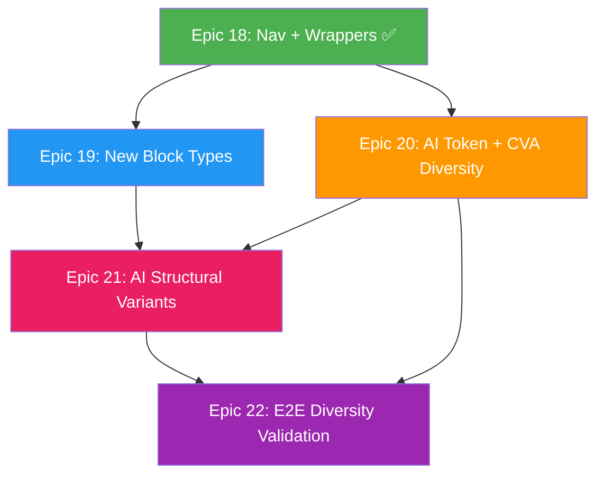

# AI-Driven Block Style Diversity - Master Plan

> **Plan Status:** APPROVED (Cross-validated against Epics 19/20 and live codebase)
> **Created:** 2026-02-27
> **Revised:** 2026-02-27 — 7 critical review corrections + 2 cross-validation fixes (9 total)
> **Author:** Architecture Research Session
> **Depends On:** Epic 18 (Navigation Variants + Section Wrappers) - nearly complete
> **Extends:** [Component Diversity Master Plan](./component-diversity-interchangeable-blocks.md) (Phases 1-5)
> **Scope:** Use AI to generate diverse visual styles for existing blocks within the strict Zod + CVA + Router architecture

---

## Executive Summary

The ET Hotel Website Generator has a well-defined component architecture: 8 block types with Zod contracts, CVA variant styling, semantic design tokens, and a router pattern for structural diversity. After Epics 16-18, we have **729 structural combinations**. However, visual diversity is still limited by the number of hand-crafted CVA variant values and a single color theme pipeline.

This plan introduces **AI-driven style generation** across three layers — from lowest risk (design tokens) to highest ambition (structural sub-components). The key paradigm for Layers 1-2: **AI generates styling data, not code**. The LLM outputs structured JSON (Zod-validated) that feeds into our existing pipelines. Layer 3 graduates to **full TSX generation** with 5 AST-based validation gates, but still within our existing component architecture. This is fundamentally different from products like Lovable/v0/Bolt.new which generate entire websites from scratch.

**Expected outcome:**
- 12 hotel visual archetypes with distinct token sets (Layer 1)
- Archetype-specific CVA class strings for each block (Layer 2)
- AI-assisted generation of new structural sub-components (Layer 3)
- Combined: millions of perceptually unique website configurations at ~$0.05-0.10/style

---

## Table of Contents

1. [Current State Assessment](#1-current-state-assessment)
2. [The Core Paradigm: Styling Data, Not Code](#2-the-core-paradigm-styling-data-not-code)
3. [The 12 Hotel Visual Archetypes](#3-the-12-hotel-visual-archetypes)
4. [Layer 1: Design Token Diversity Agent](#4-layer-1-design-token-diversity-agent-epic-20)
5. [Layer 2: CVA Mood Expansion](#5-layer-2-cva-mood-expansion-epic-20)
6. [Layer 3: Structural Sub-Component Generation](#6-layer-3-structural-sub-component-generation-epic-21)
7. [Anti-Mode-Collapse Techniques](#7-anti-mode-collapse-techniques)
8. [Epic Mapping and Dependencies](#8-epic-mapping-and-dependencies)
9. [Risk Assessment](#9-risk-assessment)
10. [Research Cross-References](#10-research-cross-references)

---

## 1. Current State Assessment

### What We Have (Complete)

| Asset | Location | Status |
|-------|----------|--------|
| 8 block types with Zod contracts | `web-app/lib/contracts/*.contract.ts` | Complete |
| Router pattern (structural variants) | 5 of 8 blocks (Hero, Gallery, Testimonials, Amenities, RoomCard) | Complete |
| CVA variant system | `web-app/lib/cva-variants.ts` (578 lines) | Complete |
| OKLCH color pipeline | `web-app/lib/color/palette-generator.ts` → `semantic-mapper.ts` → `useHotelTheme.ts` | Complete |
| Semantic design tokens | `web-app/app/globals.css` (~100+ CSS variables) | Complete |
| LangGraph 5-node workflow | `web-app/app/langgraph/workflows/HomepageGenerationWorkflow.ts` | Complete |
| StylingAgent | `web-app/app/langgraph/agents/StylingAgent.ts` | Complete |
| QualityValidator | `web-app/app/langgraph/agents/QualityValidator.ts` (40% Zod, 30% content, 20% CVA, 10% coverage) | Complete |
| CVA validation chain | `cva-validator.ts` + `validate-cva-tokens.sh` + `validate-contract-cva-sync.ts` | Complete |
| APCA contrast validation | `web-app/lib/color/contrast-validator.ts` | Complete (test-only — **NOT** integrated with QualityValidator or LangGraph workflow) |

### Known Gaps in Current State

> **CRITICAL (identified in Dev Team Review):**
>
> 1. **Font loading is static** — `web-app/app/layout.tsx` loads only Playfair Display + Inter via `next/font/google`. The `useHotelTheme.ts` hook sets `--font-display`/`--font-body` CSS variables but does NOT load the corresponding font files. Archetype fonts beyond Playfair/Inter will render as fallback system fonts.
>
> 2. **APCA contrast is test-only** — `validateThemeContrast()` in `contrast-validator.ts` measures APCA contrast but is never called by `QualityValidator.ts` or any LangGraph agent. The color pipeline (`palette-generator.ts` → `semantic-mapper.ts`) has no APCA retry loop — it only handles gamut clamping.
>
> 3. **CVA is effectively static** — CVA functions execute at runtime, but the valid variant *options* are frozen across 3 enforcement layers: `cva-variants.ts` (definitions), `schemas.ts` (Zod enums), and `cva-validator.ts` (VALID_VARIANTS registry). There is no runtime extension mechanism; adding new variants requires coordinated updates to all 3 files.

### Structural Diversity Math (Current)

```
Hero: 3 (Centered, Split, Minimal)
Navigation: 3 (Classic, Centered, Minimal) ← Epic 18
Gallery: 3 (Grid, Masonry, Carousel)
Testimonials: 3 (Grid, Carousel, Featured)
RoomCard: 3 (Detailed, Compact, Grid)
Amenities: 3 (Grid, List, Featured)
= 729 structural combinations

After Epic 19 (Footer×3, About×3, FAQ×2, Features×2):
729 × 36 = 26,244 structural combinations
```

### What's Missing

1. **Theme diversity** — Only one OKLCH color pipeline path; all hotels get similar palette logic
2. **Archetype-driven styling** — The StylingAgent picks CVA variants but lacks hotel-category-specific design vocabulary
3. **CVA coverage** — Each block has 3-5 style values (modern/classic/minimal/bold/elegant), but the hotel industry has 12+ distinct visual archetypes
4. **Scalable variant creation** — Adding new visual styles requires manual TSX + CVA authoring

---

## 2. The Core Paradigm: Styling Data, Not Code

### The Inversion Principle

> **Do NOT ask the LLM to generate component code or CSS. Ask it to generate only the styling layer — structured data — while structure, props, and schema remain fixed.**

This is the single most important finding across all research. The LLM's output is a **JSON data structure** validated by Zod, not a code file. This keeps us within our existing architecture:

```
Traditional (Lovable/v0/Bolt.new):   LLM → generates entire website → unpredictable output
Our paradigm:                         LLM → generates styling JSON → Zod validates → existing pipeline renders
```

### Three Layers of AI-Driven Diversity

| Layer | What AI Generates | What Stays Fixed | Risk | ROI |
|-------|-------------------|------------------|------|-----|
| **Layer 1: Design Tokens** | OKLCH values, typography personality, spacing density | Palette pipeline, semantic mapper, CSS variables | Very Low | Very High |
| **Layer 2: CVA Variants** | Tailwind class strings per variant key | Component JSX structure, Zod contracts, router pattern | Low-Medium | High |
| **Layer 3: Structural Sub-Components** | Full TSX files via few-shot prompting | Props interface, Zod contract, semantic tokens, existing components | Medium-High | Highest ceiling |

### Data Flow Architecture

```
Hotel Input (type, audience, personality)
  ↓
[Layer 1: ArchetypeClassifier + TokenGenerator]
  Input:  HotelParameters
  Output: HotelDesignTokens (Zod-validated JSON)
  Action: Feeds into existing palette-generator.ts → semantic-mapper.ts → CSS variables
  Retry:  APCA contrast failure → deterministic lightness adjustment → re-validate
  ↓
[Layer 2: CVAVariantAgent] (build-time code generation, NOT runtime injection)
  Input:  Archetype + block type
  Output: CVAVariantMap (Zod-validated JSON, semantic-token-scoped allowlist)
  Action: Code generation script writes into cva-variants.ts + schemas.ts + cva-validator.ts
  Build:  @source inline() ensures Tailwind generates CSS for new class strings
  ↓
[Layer 3: ComponentGenerator] (optional, one-time generation)
  Input:  Block type + 2-3 existing sibling files as few-shot examples + Zod contract
  Output: Full TSX file (LLM-generated, NOT template-assembled)
  Validation: 5 AST-based gates (imports, props, class strings, semantic tokens, tsc)
  Action: LangGraph retry loop (max 3) → human review → commit
  ↓
[Existing Pipeline]
  ComponentSelector → StylingAgent (enhanced) → ContentGenerator → AssemblyAgent → QualityValidator
  ↓
  HomepageConfig JSON → ComponentRenderer → Rendered Hotel Website
```

---

## 3. The 12 Hotel Visual Archetypes

> **Full research:** [`docs/research/hotel-design-archetype-taxonomy_2026-02-27_b5c2.md`](../research/hotel-design-archetype-taxonomy_2026-02-27_b5c2.md)

These 12 archetypes cover the full hotel industry spectrum. Each has distinct signals across 6 dimensions: typography, color, whitespace, surface, borders, and imagery.

| # | Archetype | Representative Brands | Typography Signal | Color Signature | Spacing |
|---|-----------|----------------------|-------------------|-----------------|---------|
| 1 | **Heritage Opulence** | Ritz-Carlton, St. Regis, Waldorf Astoria | Wide-set serif, all caps headings | Deep navy + burgundy + gold | Generous, formal |
| 2 | **Quiet Luxury** | Aman, COMO, Park Hyatt | Ultra-light serif, extreme tracking | Bone white + near-zero saturation | 60-70% whitespace |
| 3 | **Boutique Editorial** | Ace Hotel, The Hoxton, Firmdale | Mixed editorial type, display fonts | High contrast, single accent | Magazine-like |
| 4 | **Urban Tech-Forward** | citizenM, Moxy, YOTEL | Bold geometric sans, compressed | Bold primary on dark background | Tight, efficient |
| 5 | **Coastal Resort** | Belmond, One&Only | Transitional serif, relaxed | Sand + ocean blue + terracotta | Horizontal, airy |
| 6 | **Mountain/Wilderness** | Explora, Singita, Amangiri | Slab serif, rugged | Ochre + slate + moss green | Grounded, spacious |
| 7 | **Wellness/Spa** | COMO Shambhala, Canyon Ranch | Humanist sans, light weight | Sage + cream + terracotta | Maximum calm |
| 8 | **Heritage Cultural** | Taj, Raffles, Oberoi | Elegant serif with cultural nuance | Jewel tones, rich golds | Formal, structured |
| 9 | **Eco Lodge** | 1 Hotels, Soneva | Organic sans, rounded | Leaf green + raw linen | Organic, irregular |
| 10 | **Design/Art Hotel** | The Standard, 21c Museum | Experimental, display fonts | Gallery white or near-black | Gallery-like |
| 11 | **Family Resort** | Club Med, Aulani, Beaches | Rounded sans, friendly | Turquoise + coral + sunshine | Rounded, joyful |
| 12 | **Business Hotel** | Marriott, Hilton, IHG | Professional sans, regular weight | Corporate blue + grey | Dense, functional |

### Archetype Token Map (Implementation-Ready)

This TypeScript constant maps each archetype to its token configuration. The LLM uses this as a constraint — it must select from these archetype-appropriate values:

```typescript
// File: web-app/lib/style-generation/archetype-token-map.ts

export const HOTEL_ARCHETYPE_TOKEN_MAP = {
  'heritage-opulence': {
    headingPersonality: 'serif-elegant',
    bodyPersonality: 'serif-readable',
    colorTemp: 'warm-dark',
    primaryHueRange: [220, 260],        // Deep navy-to-royal-blue
    accentHueRange: [40, 50],           // Gold
    saturation: 'medium',
    surfaceType: 'warm-cream',
    spacingDensity: 'comfortable',
    borderRadius: 'subtle',
    accentStrategy: 'complementary',
  },
  'quiet-luxury': {
    headingPersonality: 'serif-elegant',
    bodyPersonality: 'sans-modern',
    colorTemp: 'neutral-light',
    primaryHueRange: [30, 50],          // Warm stone
    accentHueRange: [30, 50],           // Monochromatic
    saturation: 'very-low',
    surfaceType: 'bone-white',
    spacingDensity: 'spacious',
    borderRadius: 'subtle',
    accentStrategy: 'monochromatic',
  },
  'boutique-editorial': {
    headingPersonality: 'display-decorative',
    bodyPersonality: 'sans-modern',
    colorTemp: 'high-contrast',
    primaryHueRange: [0, 360],          // Any bold statement color
    accentHueRange: [0, 360],
    saturation: 'high',
    surfaceType: 'dark',
    spacingDensity: 'tight',
    borderRadius: 'sharp',
    accentStrategy: 'complementary',
  },
  'urban-tech': {
    headingPersonality: 'sans-modern',
    bodyPersonality: 'sans-modern',
    colorTemp: 'cool-dark',
    primaryHueRange: [0, 30],           // Bold red/neon
    accentHueRange: [180, 220],         // Cyan complement
    saturation: 'high',
    surfaceType: 'near-black',
    spacingDensity: 'tight',
    borderRadius: 'rounded',
    accentStrategy: 'complementary',
  },
  'coastal-resort': {
    headingPersonality: 'serif-elegant',
    bodyPersonality: 'sans-modern',
    colorTemp: 'warm-light',
    primaryHueRange: [190, 220],        // Ocean blue
    accentHueRange: [20, 40],           // Sand/terracotta
    saturation: 'medium',
    surfaceType: 'warm-white',
    spacingDensity: 'airy',
    borderRadius: 'rounded',
    accentStrategy: 'warm-neutral',
  },
  'mountain-wilderness': {
    headingPersonality: 'slab-strong',
    bodyPersonality: 'sans-modern',
    colorTemp: 'warm-neutral',
    primaryHueRange: [30, 50],          // Ochre/amber
    accentHueRange: [90, 130],          // Moss green
    saturation: 'medium-low',
    surfaceType: 'off-white',
    spacingDensity: 'comfortable',
    borderRadius: 'subtle',
    accentStrategy: 'triadic',
  },
  'wellness-spa': {
    headingPersonality: 'sans-modern',
    bodyPersonality: 'sans-modern',
    colorTemp: 'warm-neutral',
    primaryHueRange: [120, 150],        // Sage green
    accentHueRange: [20, 40],           // Cream/terracotta
    saturation: 'low',
    surfaceType: 'cream',
    spacingDensity: 'spacious',
    borderRadius: 'rounded',
    accentStrategy: 'monochromatic',
  },
  'heritage-cultural': {
    headingPersonality: 'serif-elegant',
    bodyPersonality: 'serif-readable',
    colorTemp: 'warm-rich',
    primaryHueRange: [340, 360],        // Deep ruby/burgundy
    accentHueRange: [40, 55],           // Rich gold
    saturation: 'high',
    surfaceType: 'warm-cream',
    spacingDensity: 'comfortable',
    borderRadius: 'subtle',
    accentStrategy: 'complementary',
  },
  'eco-lodge': {
    headingPersonality: 'sans-modern',
    bodyPersonality: 'sans-modern',
    colorTemp: 'neutral-warm',
    primaryHueRange: [100, 140],        // Leaf green
    accentHueRange: [30, 50],           // Raw earth
    saturation: 'medium-low',
    surfaceType: 'raw-linen',
    spacingDensity: 'airy',
    borderRadius: 'rounded',
    accentStrategy: 'monochromatic',
  },
  'design-art': {
    headingPersonality: 'display-decorative',
    bodyPersonality: 'sans-modern',
    colorTemp: 'dramatic',
    primaryHueRange: [0, 360],          // One bold accent
    accentHueRange: [0, 360],
    saturation: 'very-high',
    surfaceType: 'gallery-white',
    spacingDensity: 'spacious',
    borderRadius: 'sharp',
    accentStrategy: 'complementary',
  },
  'family-resort': {
    headingPersonality: 'sans-modern',
    bodyPersonality: 'sans-modern',
    colorTemp: 'warm-bright',
    primaryHueRange: [175, 200],        // Turquoise
    accentHueRange: [10, 30],           // Coral/sunshine
    saturation: 'high',
    surfaceType: 'warm-white',
    spacingDensity: 'comfortable',
    borderRadius: 'pill',
    accentStrategy: 'triadic',
  },
  'business-hotel': {
    headingPersonality: 'sans-modern',
    bodyPersonality: 'sans-modern',
    colorTemp: 'cool-neutral',
    primaryHueRange: [210, 240],        // Corporate blue
    accentHueRange: [210, 240],         // Monochromatic
    saturation: 'medium',
    surfaceType: 'cool-white',
    spacingDensity: 'tight',
    borderRadius: 'subtle',
    accentStrategy: 'monochromatic',
  },
} as const;

export type HotelArchetype = keyof typeof HOTEL_ARCHETYPE_TOKEN_MAP;
```

### Mapping Existing HotelParameters to Archetypes

The existing `HotelParametersSchema` has `hotelType` (luxury/budget/boutique/resort/business), `targetAudience` (business/leisure/family/couples/backpackers), and `brandPersonality` (elegant/modern/friendly/professional/adventurous).

**Archetype classification matrix:**

| hotelType + targetAudience + personality | → Archetype |
|----------------------------------------|-------------|
| luxury + couples + elegant | heritage-opulence OR quiet-luxury |
| luxury + leisure + elegant | quiet-luxury |
| boutique + leisure + modern | boutique-editorial |
| boutique + couples + elegant | design-art |
| budget + backpackers + friendly | urban-tech |
| resort + family + friendly | family-resort |
| resort + couples + adventurous | coastal-resort OR mountain-wilderness |
| business + business + professional | business-hotel |
| luxury + leisure + adventurous | mountain-wilderness |
| boutique + couples + modern | wellness-spa |

This mapping is non-deterministic — the same inputs can map to 2-3 candidate archetypes. The LLM selects the best fit and must justify its reasoning (SGR Cascade pattern).

---

## 4. Layer 1: Design Token Diversity Agent (Epic 20)

### Goal

Create an AI agent that generates archetype-specific OKLCH color palettes, typography selections, and spacing configurations — feeding into the existing `palette-generator.ts` → `semantic-mapper.ts` → `useHotelTheme.ts` pipeline.

### Why This Layer First

- **Near-zero risk**: Output is Zod-validated JSON, not code
- **Plugs into existing pipeline**: The OKLCH palette generator and semantic mapper already exist
- **Highest visual impact**: Color + typography are the two strongest visual differentiators
- **Cost**: ~$0.01-0.02 per hotel

### Zod Schema: HotelDesignTokens

```typescript
// File: web-app/lib/style-generation/schemas/hotel-design-tokens.schema.ts

import { z } from 'zod';
import { HOTEL_ARCHETYPE_TOKEN_MAP, type HotelArchetype } from '../archetype-token-map';

/**
 * SGR Cascade pattern: reasoning fields BEFORE style values.
 * Once the model commits to a persona and visual analogy,
 * it cannot revert to safe defaults without contradicting itself.
 */
export const HotelDesignTokensSchema = z.object({
  // ── STEP 1: Reasoning (must complete before style values) ──
  guestPersona: z.string().min(50).max(300)
    .describe('Specific persona of the ideal guest. Not "business traveler" but "VP of Engineering who books last-minute, values efficiency over luxury, reads The Economist on the plane"'),
  emotionalIntent: z.string().min(20).max(200)
    .describe('What the guest should feel within 3 seconds of seeing the page. E.g., "Heart rate drops. I am being taken care of."'),
  architecturalInspiration: z.string().min(10).max(100)
    .describe('A real-world visual analogy. E.g., "A Japanese ryokan lobby", "An indie record label website", "A Bloomberg terminal"'),
  forbiddenElements: z.array(z.string()).min(2).max(5)
    .describe('Design elements that would BREAK the archetype. E.g., ["No cream backgrounds", "No serif fonts", "No gold accents"]'),

  // ── STEP 2: Archetype (constrained by reasoning) ──
  archetype: z.enum([
    'heritage-opulence', 'quiet-luxury', 'boutique-editorial', 'urban-tech',
    'coastal-resort', 'mountain-wilderness', 'wellness-spa', 'heritage-cultural',
    'eco-lodge', 'design-art', 'family-resort', 'business-hotel'
  ]),

  // ── STEP 3: Token values (constrained by archetype) ──
  colorScheme: z.object({
    primaryHue: z.number().min(0).max(360)
      .describe('OKLCH hue angle for brand-primary'),
    primaryChroma: z.number().min(0).max(0.4)
      .describe('OKLCH chroma for brand-primary. 0=grey, 0.15=medium, 0.3=vivid'),
    primaryLightness: z.number().min(0.2).max(0.9)
      .describe('OKLCH lightness for brand-primary. 0.3=dark, 0.5=medium, 0.8=light'),
    secondaryHue: z.number().min(0).max(360)
      .describe('OKLCH hue for brand-secondary (accent color)'),
    secondaryChroma: z.number().min(0).max(0.4),
    secondaryLightness: z.number().min(0.2).max(0.9),
    surfaceType: z.enum([
      'warm-white', 'cool-white', 'bone-white', 'cream',
      'off-white', 'raw-linen', 'dark', 'near-black',
      'gallery-white', 'warm-cream', 'cool-grey'
    ]),
    accentStrategy: z.enum(['monochromatic', 'complementary', 'triadic', 'warm-neutral']),
  }),

  typography: z.object({
    headingPersonality: z.enum([
      'serif-elegant', 'serif-readable', 'sans-modern',
      'display-decorative', 'slab-strong', 'humanist-organic'
    ]),
    bodyPersonality: z.enum([
      'sans-modern', 'serif-readable', 'humanist-organic'
    ]),
    scaleRatio: z.enum(['minor-third', 'major-third', 'perfect-fourth', 'golden-ratio'])
      .describe('Type scale ratio. minor-third=1.2 (compact), golden-ratio=1.618 (dramatic)'),
  }),

  spacing: z.object({
    density: z.enum(['tight', 'comfortable', 'airy', 'spacious'])
      .describe('tight=16-24px sections, comfortable=32-48px, airy=48-64px, spacious=64-96px'),
  }),

  borderRadius: z.enum(['sharp', 'subtle', 'rounded', 'pill'])
    .describe('sharp=0-2px, subtle=4-8px, rounded=12-16px, pill=9999px'),
});

export type HotelDesignTokens = z.infer<typeof HotelDesignTokensSchema>;
```

### Integration with Existing Pipeline

The `HotelDesignTokens` output feeds directly into the existing color pipeline:

```
HotelDesignTokens.colorScheme
  ↓
palette-generator.ts
  Input: { primary: oklch(L C H), secondary: oklch(L C H) }
  Output: 11-step shade scales (50-950) for each color
  ↓
semantic-mapper.ts
  Input: shade scales
  Output: semantic token values (brand-primary, surface-primary, text-primary, etc.)
  ↓
useHotelTheme.ts
  Input: semantic tokens
  Output: ~100+ CSS variables applied to :root
  ↓
globals.css @theme inline
  Tailwind utilities resolve to generated values
  ↓
Components use bg-brand-primary, text-text-primary, etc. — NO CHANGES NEEDED
```

**Typography mapping** (new):

```typescript
// File: web-app/lib/style-generation/typography-mapper.ts

const TYPOGRAPHY_MAP: Record<string, { family: string; weight: string; tracking: string }> = {
  'serif-elegant': { family: 'Cormorant Garamond, Playfair Display, serif', weight: '300', tracking: '0.05em' },
  'serif-readable': { family: 'Libre Baskerville, Georgia, serif', weight: '400', tracking: '0.01em' },
  'sans-modern': { family: 'Inter, system-ui, sans-serif', weight: '500', tracking: '-0.02em' },
  'display-decorative': { family: 'Space Grotesk, Archivo Black, sans-serif', weight: '700', tracking: '-0.03em' },
  'slab-strong': { family: 'Roboto Slab, Rockwell, serif', weight: '600', tracking: '0em' },
  'humanist-organic': { family: 'Source Sans 3, Lato, sans-serif', weight: '400', tracking: '0.01em' },
};
```

> **Font Loading Dependency:** The typography mapper outputs CSS `font-family` strings, but `next/font/google` currently loads ONLY Playfair Display and Inter in `layout.tsx`. Without Story 20.4a (Font Injection), archetype-specific fonts (Cormorant Garamond, Libre Baskerville, Space Grotesk, Roboto Slab, Source Sans 3) will fall back to system fonts. Story 20.4a MUST be completed before typography diversity is visible.

### Stories for Layer 1

**Story 20.1: HotelDesignTokens Schema + Archetype Token Map**
- Create `web-app/lib/style-generation/schemas/hotel-design-tokens.schema.ts`
- Create `web-app/lib/style-generation/archetype-token-map.ts`
- Create validation tests for schema + archetype constraints
- AC: Schema parses valid tokens, rejects invalid; archetype map covers all 12 types

**Story 20.2: ArchetypeClassifier Agent**
- New LangGraph agent at `web-app/app/langgraph/agents/ArchetypeClassifier.ts`
- Input: `HotelParameters` (hotelType, targetAudience, brandPersonality)
- Output: `archetype` + `reasoning` (Zod-validated)
- Uses the classification matrix from Section 3
- AC: Correctly classifies 10+ hotel profiles; reasoning justifies choice

**Story 20.3: TokenGenerator Agent + APCA Contrast Retry Loop**
- New LangGraph agent at `web-app/app/langgraph/agents/TokenGenerator.ts`
- Input: archetype + hotel parameters
- Output: `HotelDesignTokens` (Zod-validated, SGR Cascade pattern)
- System prompt includes archetype token map as constraint
- Uses anti-mode-collapse techniques (Section 7)
- **APCA Retry Loop (Critical — currently missing from pipeline):**
  1. After token generation, run generated OKLCH values through `validateThemeContrast()`
  2. If any text/background pair fails APCA Lc threshold (Lc 75 for body text/AAA, Lc 60 for non-body text/AA — matching existing `contrast-validator.ts` thresholds):
     - **Deterministic lightness adjustment** — do NOT re-invoke the LLM. Instead, programmatically nudge `primaryLightness` or `secondaryLightness` in the direction that increases contrast (darker text on light bg, lighter text on dark bg) in 0.05 increments
     - Re-validate after each nudge (max 10 iterations)
  3. Wire `validateThemeContrast()` into `QualityValidator.ts` as a hard-gate validation dimension (following the `budgetCompliance` precedent — binary pass/fail, not weighted)
- AC: Generates tokens for all 12 archetypes; OKLCH values pass APCA contrast check; QualityValidator rejects tokens that fail contrast

**Story 20.4a: Font Injection Pipeline (Pre-requisite for Typography Diversity)**
- **Problem:** `layout.tsx` hardcodes `next/font/google` for only Playfair Display + Inter. `useHotelTheme` writes `--font-display`/`--font-body` CSS vars but does NOT load the corresponding font files.
- **Solution:** Pre-load a curated set of 6-8 Google Fonts that cover all 6 typography personalities:
  1. Add `next/font/google` imports for: Cormorant Garamond, Libre Baskerville, Space Grotesk, Roboto Slab, Source Sans 3 (+ keep existing Playfair Display + Inter)
  2. Apply all fonts as CSS variables in `layout.tsx` (e.g., `--font-serif-elegant`, `--font-slab-strong`, etc.)
  3. Update `useHotelTheme.ts` to map `headingPersonality`/`bodyPersonality` → the correct pre-loaded font CSS variable
- **Why NOT dynamic loading:** `next/font/google` optimizes fonts at build time (self-hosted, no CLS). Dynamic `@import` from Google Fonts CDN would cause layout shift and defeat Next.js optimization.
- **Trade-off:** 6-8 fonts pre-loaded = ~200-400KB total (subset via `next/font`). Acceptable for the diversity gain.
- AC: All 6 typography personalities render with correct web fonts (not system fallbacks); no FOUT/CLS in Lighthouse audit

**Story 20.4: Typography Mapper**
- Create `web-app/lib/style-generation/typography-mapper.ts`
- Maps `headingPersonality` + `bodyPersonality` → CSS font declarations
- Integrates with existing `useHotelTheme.ts` to apply typography CSS variables
- AC: Typography tokens correctly applied via CSS variables; all 6 personalities render distinct fonts

**Story 20.5: Token Pipeline Integration**
- Connect `TokenGenerator` output → existing `palette-generator.ts` → `semantic-mapper.ts`
- Add `surfaceType` mapping to surface token generation
- Add `spacing.density` mapping to spacing CSS variables
- Add `borderRadius` mapping to border-radius CSS variables
- AC: Full pipeline works end-to-end; generated tokens produce visually distinct themes for 3+ archetypes

**Story 20.6: Update LangGraph Workflow**
- Insert `ArchetypeClassifier` → `TokenGenerator` as first 2 nodes in `HomepageGenerationWorkflow`
- Pass generated tokens through workflow state to `StylingAgent` and `AssemblyAgent`
- Update `QualityValidator` to validate token compliance
- AC: Workflow generates hotels with archetype-appropriate themes

---

## 5. Layer 2: CVA Mood Expansion (Epic 20, continued)

### Goal

Extend the CVA variant system from 5 generic styles (modern/classic/minimal/bold/elegant) to 12+ archetype-specific style configurations. The LLM generates Tailwind class strings validated against an explicit allowlist.

### Why This Works Safely

CVA definitions are fundamentally **JSON mappings of variant names to Tailwind class strings**:

```typescript
// Current: 5 hand-crafted styles
style: {
  modern: "bg-gradient-to-r from-brand-primary to-brand-primary/high text-text-inverted",
  classic: "bg-brand-secondary text-text-primary",
  minimal: "bg-surface-primary text-text-primary",
  bold: "bg-brand-primary text-text-inverted",
  elegant: "bg-surface-elevated text-text-primary border-b border-brand-secondary/subtle"
}

// Target: 12 archetype-driven styles (AI-generated, allowlist-validated)
style: {
  'heritage-opulence': "bg-surface-elevated text-text-primary border-b-2 border-brand-secondary",
  'quiet-luxury': "bg-surface-primary text-text-primary",
  'urban-tech': "bg-brand-primary text-text-inverted",
  // ... 9 more
}
```

### Tailwind Class Allowlist (Scoped to Semantic Tokens)

> **Dev Team Review Correction:** Tailwind v4 has NO programmatic class validation API. The `compile()` function is internal and undocumented. A static allowlist of all possible Tailwind classes would be a maintenance nightmare. Instead, we scope the allowlist strictly to **semantic design token classes** (~50-80 classes) which change rarely and are derived directly from `globals.css @theme` definitions.
>
> See: [`docs/research/tailwind_v4_class_validation_api_2026-02-27_d9c1.md`](../research/tailwind_v4_class_validation_api_2026-02-27_d9c1.md)

**Two-layer safeguard:**

1. **Semantic Token Allowlist** — A hand-maintained `Set<string>` of ~50-80 semantic classes. These are stable because they derive from our `@theme` definitions (brand-primary, surface-primary, text-primary, etc.) plus a small set of layout utilities. The LLM is constrained to ONLY these classes.

2. **`@source inline()` in Tailwind config** — For any new class strings introduced by AI-generated CVA variants, we add them to Tailwind's `@source inline()` directive to ensure JIT compilation includes them. This is Tailwind v4's official safelist mechanism.

```typescript
// File: web-app/lib/style-generation/tailwind-allowlist.ts

/**
 * Semantic token allowlist for AI-generated CVA class strings.
 *
 * SCOPE: Only semantic design token classes from globals.css @theme.
 * NOT a comprehensive Tailwind class list (that would be unmaintainable).
 *
 * WHY THIS WORKS: Our components ONLY use semantic tokens (bg-brand-primary,
 * not bg-blue-500). The LLM is instructed to use only these classes.
 * Any class not in this set is rejected before it reaches the codebase.
 *
 * MAINTENANCE: Update when globals.css @theme definitions change (rare).
 */
export const SEMANTIC_TOKEN_ALLOWLIST = new Set([
  // Backgrounds (from @theme --color-brand-* and --color-surface-*)
  'bg-brand-primary', 'bg-brand-secondary', 'bg-brand-primary-hover',
  'bg-brand-primary/high', 'bg-brand-primary/30', 'bg-brand-primary/60',
  'bg-brand-primary/70', 'bg-brand-primary/faint', 'bg-brand-primary/wash',
  'bg-brand-secondary/subtle', 'bg-brand-secondary/wash',
  'bg-surface-primary', 'bg-surface-elevated', 'bg-surface-muted',
  'bg-surface-secondary', 'bg-surface-primary/high', 'bg-surface-secondary/mid',
  'bg-transparent',
  // Gradients
  'bg-gradient-to-r', 'bg-gradient-to-t', 'bg-gradient-to-b', 'bg-gradient-to-br',
  'from-brand-primary', 'to-brand-primary/high', 'to-transparent',
  'from-brand-primary/70',
  // Text (from @theme --color-text-*)
  'text-text-primary', 'text-text-secondary', 'text-text-inverted',
  'text-text-muted', 'text-on-brand', 'text-brand-primary', 'text-brand-secondary',
  // Borders (from @theme --color-border-*)
  'border', 'border-2', 'border-b', 'border-b-2', 'border-t',
  'border-border-default', 'border-border-strong',
  'border-brand-primary', 'border-brand-secondary',
  'border-brand-primary/subtle', 'border-brand-secondary/subtle',
  'border-transparent',
  // Layout utilities (stable Tailwind core — rarely change)
  'flex', 'grid', 'items-center', 'justify-center', 'text-center', 'text-left',
  // Spacing (from @theme --spacing-*)
  'gap-2', 'gap-3', 'gap-4', 'gap-5', 'gap-6', 'gap-8',
  'gap-hero', 'gap-gap-card', 'gap-gap-section',
  'p-4', 'p-6', 'p-8', 'p-10', 'px-4', 'px-6', 'px-8', 'py-4', 'py-6', 'py-8',
  'py-12', 'py-16', 'py-20', 'py-section',
  // Sizing (from @theme --min-h-*)
  'w-full', 'h-full', 'min-h-hero-sm', 'min-h-hero-md', 'min-h-hero-lg', 'min-h-screen',
  // Effects (from @theme --shadow-*)
  'shadow-sm', 'shadow-md', 'shadow-lg', 'shadow-xl', 'shadow-card', 'shadow-card-hover',
  'backdrop-blur-md', 'backdrop-blur-sm',
  'rounded-lg', 'rounded-xl', 'rounded-2xl', 'rounded-full',
  'overflow-hidden', 'relative', 'absolute', 'inset-0',
  // Transitions
  'transition-all', 'duration-300', 'duration-standard',
  // Responsive
  'md:grid-cols-2', 'lg:grid-cols-3', 'lg:grid-cols-4',
  // Pseudo-elements
  'before:absolute', 'before:inset-0',
  'before:bg-brand-primary/30', 'before:bg-brand-primary/60',
  'before:bg-gradient-to-t', 'before:from-brand-primary/70', 'before:to-transparent',
]);

export function validateSemanticClasses(classString: string): { valid: boolean; invalidClasses: string[] } {
  const classes = classString.split(/\s+/).filter(Boolean);
  const invalid = classes.filter(cls => !SEMANTIC_TOKEN_ALLOWLIST.has(cls));
  return { valid: invalid.length === 0, invalidClasses: invalid };
}
```

**Tailwind `@source inline()` for new CVA variants:**

```css
/* In globals.css or tailwind config — ensures JIT generates CSS for AI-generated class combos */
@source inline("bg-brand-primary text-text-inverted border-brand-secondary ...");
```

> **Note:** The `@source inline()` content is updated by the build-time code generation script (Story 20.9) whenever new CVA variants are generated. This is NOT a dynamic runtime operation.

### Zod Schema: CVAVariantMap

```typescript
// File: web-app/lib/style-generation/schemas/cva-variant-map.schema.ts

import { z } from 'zod';
import { validateSemanticClasses } from '../tailwind-allowlist';

export const CVAVariantMapSchema = z.object({
  blockType: z.enum([
    'hero', 'navigation', 'gallery', 'testimonials',
    'amenities', 'rooms', 'booking', 'contact',
    'footer', 'about', 'faq', 'features'
  ]),
  archetype: z.enum([
    'heritage-opulence', 'quiet-luxury', 'boutique-editorial', 'urban-tech',
    'coastal-resort', 'mountain-wilderness', 'wellness-spa', 'heritage-cultural',
    'eco-lodge', 'design-art', 'family-resort', 'business-hotel'
  ]),
  designRationale: z.string().min(30)
    .describe('Explain WHY these class choices express the archetype. E.g., "Heritage opulence uses elevated surfaces with strong brand borders to convey established authority"'),
  variantClasses: z.record(z.string(), z.string())
    .describe('Mapping of variant dimension → Tailwind class string (semantic tokens only)')
    .refine(
      (data) => Object.values(data).every(cls => validateSemanticClasses(cls).valid),
      { message: 'All Tailwind classes must be semantic tokens from the approved allowlist' }
    ),
});

export type CVAVariantMap = z.infer<typeof CVAVariantMapSchema>;
```

### Stories for Layer 2

**Story 20.7: Semantic Token Allowlist**
- Create `web-app/lib/style-generation/tailwind-allowlist.ts`
- Hand-curate ~50-80 semantic token classes from `globals.css @theme` definitions
- Create `validateSemanticClasses()` utility
- **NOT a comprehensive Tailwind class extractor** — scoped to semantic design tokens only
- AC: Allowlist covers all semantic classes used in current `cva-variants.ts`; rejects raw colors (e.g., `bg-blue-500`); rejects arbitrary Tailwind utilities not in the set

**Story 20.8: CVAVariantMap Schema + CVAVariantAgent**
- Create `web-app/lib/style-generation/schemas/cva-variant-map.schema.ts`
- New agent: `web-app/app/langgraph/agents/CVAVariantAgent.ts`
- Input: archetype + block type + existing CVA as few-shot example
- Output: `CVAVariantMap` (Zod-validated, semantic-token-allowlist-checked)
- AC: Generates valid CVA mappings for 3+ blocks × 3+ archetypes

**Story 20.9: Build-Time CVA Code Generation Script**

> **Dev Team Review Correction:** CVA is NOT extensible at runtime. The valid variant options are frozen across 3 enforcement layers: `cva-variants.ts` (definitions), `schemas.ts` (Zod enums), and `cva-validator.ts` (VALID_VARIANTS). All 3 must be updated in lockstep.

- Create `web-app/scripts/generate-cva-variants.ts` — a **build-time code generation script** (NOT a runtime registry)
- The script takes `CVAVariantMap` JSON output from the CVAVariantAgent and:
  1. **Writes into `cva-variants.ts`**: Adds new archetype-keyed variant entries to each block's CVA definition
  2. **Writes into `schemas.ts`**: Extends Zod enum arrays with new archetype variant names
  3. **Writes into `cva-validator.ts`**: Updates `VALID_VARIANTS` registry to include new entries
  4. **Updates `@source inline()`**: Appends new class strings to ensure Tailwind JIT generates CSS for them
- The script uses AST manipulation (ts-morph or jscodeshift) to safely modify the TypeScript files without breaking existing code
- Fallback: if archetype variant not found at runtime, use closest hand-crafted variant (existing behavior unchanged)
- AC: Script generates valid TypeScript; all 3 enforcement layers stay in sync; `npm run build` succeeds; existing tests pass

**Story 20.10: StylingAgent Enhancement**
- Update `StylingAgent.ts` to accept archetype from `ArchetypeClassifier`
- Use archetype to select archetype-specific CVA variants when available
- Fall back to generic variants (modern/classic/etc.) when archetype variants don't exist
- AC: StylingAgent selects archetype-appropriate variants; QualityValidator passes

---

## 6. Layer 3: Structural Sub-Component Generation (Epic 21)

### Goal

Use AI to generate new structural sub-components (TSX files) that follow the router pattern. These are **one-time generation artifacts** — generated once, reviewed, committed, and reused across all hotels. Not per-hotel generation.

### Risk Assessment and Mitigation Strategy

This is the highest-risk layer. The research identified these failure modes and mitigations:

> **Dev Team Review Correction:** The original plan proposed a "hybrid template + LLM fill" approach where the LLM generates metadata and a deterministic template assembles TSX. This was identified as over-engineered and fundamentally flawed:
>
> 1. **`wrapperStructure` is unparseable** — a natural language string like "outer section > grid container > [left-column: text-content]" cannot be deterministically converted to JSX. This makes the template engine either trivially simple (ignoring the field) or impossibly complex (parsing arbitrary layout descriptions).
>
> 2. **Error feedback is disconnected** — when `tsc` fails on template-assembled TSX, the errors reference code the LLM never wrote. Feeding these errors back to the metadata generator produces confusion, not fixes.
>
> **Revised approach: Full TSX generation with 5 AST-based validation gates.** The LLM generates complete TSX files using few-shot sibling examples as the pattern. Validation is post-hoc via AST analysis, not pre-assembly via templates.

| Failure Mode | Frequency | Mitigation |
|--------------|-----------|------------|
| Import path errors | 15% of free-form generation | **Few-shot sibling files** show exact import paths; AST Gate 1 verifies imports |
| Missing required props | 34% of free-form generation | **Zod contract in prompt** + AST Gate 2 verifies props interface |
| Incorrect variant usage | 28% of free-form generation | **Existing CVA definitions in prompt** + AST Gate 3 verifies class strings |
| Theme token errors | 11% of free-form generation | **Semantic token allowlist** + AST Gate 4 verifies all classes are semantic |
| Non-existent Tailwind classes | Common | **Mandatory rule in prompt**: "ALL classes must be complete literal strings from the allowlist" |
| Dynamic class construction | Common | **Explicit prohibition in prompt** + AST Gate 4 detects template literals in className |
| TypeScript compilation failure | ~15% | **AST Gate 5**: `tsc --noEmit` on generated file in context of full project |

### Full TSX Generation + AST Validation Approach

**Key insight**: Instead of splitting generation into metadata + template assembly (which creates an unparseable intermediate layer), let the LLM generate the **complete TSX file** directly. The model is excellent at pattern-following when given 2-3 high-quality sibling examples. Validation happens post-generation via 5 AST-based gates that give actionable error messages the LLM can fix directly.

**Why this works better than templates:**
- The LLM writes the exact code that gets validated — error feedback is direct, not mediated through a template
- Few-shot learning from real sibling files captures patterns better than any schema description
- No need to design a metadata format expressive enough to represent all possible layouts
- Research shows 67%→94% pass rate with direct retry loops when the LLM sees its own compilation errors

### What "Structure" Means in Layer 3

Layer 3 generates variations of **how existing shadcn/ui atoms and Tailwind utilities are arranged inside a block**. It does NOT:
- Add new npm dependencies
- Create new atom components
- Change the Zod contract
- Modify the color palette or typography system
- Generate new CSS

It DOES:
- Rearrange the spatial layout of existing elements (flex vs grid, column count, element order)
- Change the nesting structure (flat vs nested containers)
- Vary the responsive behavior (stack point, column collapse pattern)
- Apply different combinations of existing Tailwind utility classes from the semantic token allowlist
- Use different shadcn/ui components for the same semantic purpose (Card vs plain div, Badge vs span)

### Step-by-Step Implementation (Risk Mitigation)

#### Step 1: Few-Shot Context Gathering

```typescript
// File: web-app/lib/style-generation/few-shot-context.ts

import { glob } from 'glob';
import { readFile } from 'fs/promises';
import path from 'path';

/**
 * Gather existing sibling component files as few-shot examples.
 * The model sees 2-3 complete TSX files to learn the exact pattern:
 * imports, props interface, CVA usage, JSX structure, export.
 */
export async function gatherComponentContext(blockDir: string): Promise<string> {
  const tsxFiles = await glob(`${blockDir}/*.tsx`);
  // Exclude index.tsx (the router) and .client.tsx (client wrappers)
  const siblings = tsxFiles
    .filter(f => !f.endsWith('index.tsx') && !f.includes('.client.'))
    .slice(0, 3); // Max 3 examples

  const examples = await Promise.all(
    siblings.map(async (f) => {
      const content = await readFile(f, 'utf8');
      return `=== EXISTING COMPONENT: ${path.basename(f)} ===\n${content}\n=== END ===`;
    })
  );

  return examples.join('\n\n');
}

/**
 * Gather the Zod contract as explicit prompt instructions.
 */
export async function gatherContractContext(contractPath: string): Promise<string> {
  const content = await readFile(contractPath, 'utf8');
  return `=== ZOD CONTRACT (ALL variants must be present) ===\n${content}\n=== END ===`;
}

/**
 * Gather the semantic token allowlist for the prompt constraint.
 */
export async function gatherAllowlistContext(): Promise<string> {
  const { SEMANTIC_TOKEN_ALLOWLIST } = await import('./tailwind-allowlist');
  return `=== ALLOWED TAILWIND CLASSES (use ONLY these) ===\n${[...SEMANTIC_TOKEN_ALLOWLIST].join('\n')}\n=== END ===`;
}
```

#### Step 2: LLM Prompt Structure

```
System: You are a React component developer generating a new structural variant
for the {blockType} block. You will write a COMPLETE, COMPILABLE TSX file.

CONSTRAINTS:
1. Use ONLY imports you see in the sibling examples below
2. Accept the EXACT same props interface as the siblings
3. Use ONLY Tailwind classes from the ALLOWED list below
4. Use ONLY semantic token classes (bg-brand-primary, NOT bg-blue-500)
5. NEVER use template literals for className (no `bg-${color}`)
6. NEVER add new npm dependencies
7. Export the component as default

{siblingFiles}      ← 2-3 complete TSX files as examples
{zodContract}       ← Full Zod schema showing required props
{allowlist}         ← Semantic token class list
{designBrief}       ← What structural difference this variant should have

Generate a new TSX file named {componentName}.tsx that is structurally
different from the siblings. The difference should be: {structuralDifference}
```

#### Step 3: 5-Gate AST Validation Pipeline (LangGraph)

```typescript
// Pseudocode for the LangGraph validation workflow

const componentGenWorkflow = new StateGraph({
  channels: {
    blockType: { value: null },
    designBrief: { value: null },
    generatedTsx: { value: null },     // String — full TSX file content
    validationErrors: { value: [] },
    attempts: { value: 0 },
    maxAttempts: { value: 3 },
  }
})
  .addNode('generateTsx', generateFullTsx)           // LLM: generate complete TSX file
  .addNode('validate', runFiveGates)                  // 5 AST-based validation gates
  .addNode('writeFile', writeComponentFile)           // Write accepted TSX to disk
  .addNode('humanReview', flagForReview)              // Escalation path

  .addConditionalEdges('validate', (state) => {
    if (state.validationErrors.length === 0) return 'writeFile';
    if (state.attempts >= state.maxAttempts) return 'humanReview';
    return 'generateTsx'; // Retry — LLM sees its OWN errors and fixes them
  });
```

**Gate 1: Import Verification** (AST — ts-morph)
- Parse the generated TSX with ts-morph
- Verify all import paths resolve to existing files in the project
- Verify no new npm packages are imported
- Catches: hallucinated import paths, missing relative imports

**Gate 2: Props Interface Verification** (AST — ts-morph)
- Extract the component's props type from the AST
- Compare against the Zod contract's expected props
- Verify all required props are destructured
- Catches: missing required props, wrong prop names, incorrect types

**Gate 3: CVA Class String Verification** (regex + allowlist)
- Extract all string literals used in `className` or CVA `cva()` calls
- Split into individual Tailwind classes
- Verify each class is in `SEMANTIC_TOKEN_ALLOWLIST`
- Catches: hallucinated classes, raw colors, dynamic class construction

**Gate 4: Semantic Token Compliance** (AST — ts-morph)
- Verify no template literals in `className` attributes (detect `` `bg-${...}` `` patterns)
- Verify no `style={}` attributes with inline styles that bypass the design system
- Verify `'use client'` directive is present only if component uses hooks/events
- Catches: design system bypasses, incorrect client/server designation

**Gate 5: TypeScript Compilation** (`tsc --noEmit`)
- Write the generated file to a temp location within the project
- Run `tsc --noEmit` to verify full type checking in project context
- Parse compiler errors and format them for the LLM retry prompt
- Catches: type mismatches, JSX errors, missing type imports

> **Error feedback loop:** When any gate fails, the EXACT error messages are fed back to the LLM with the instruction "Fix these errors in your generated TSX file." Because the LLM wrote the TSX directly, it can understand and fix the errors — unlike the template approach where errors referenced code the LLM never authored.

#### Step 4: Incremental Rollout Cases

**Case A: Generate a 4th Hero variant (Lowest Risk)**

The HeroSection already has 3 siblings (Centered, Split, Minimal). Generating a 4th follows the proven pattern with maximum few-shot context.

Example: `HeroAsymmetric.tsx` — CSS Grid with asymmetric columns (2fr 1fr), image column uses `object-cover` with CSS clip-path, text column offset vertically.

**Approach:**
1. Feed `HeroCentered.tsx`, `HeroSplit.tsx`, `HeroMinimal.tsx` as few-shot examples
2. Feed `hero.contract.ts` as constraint
3. Feed semantic token allowlist
4. LLM generates complete `HeroAsymmetric.tsx`
5. 5-gate AST validation
6. Human review before commit

**Case B: Generate a 4th Gallery variant (Low Risk)**

Gallery has Grid, Masonry, Carousel. A 4th could be `GalleryStaggered` — offset grid with alternating large/small images.

**Case C: Generate first Footer variants (Medium Risk)**

Footer doesn't exist yet (Epic 19). After Epic 19 creates 3 hand-crafted variants, AI generates additional ones (e.g., `FooterMagazine`, `FooterCentered`).

**Case D: Batch generate variants for new blocks (Medium-High Risk)**

After Epic 19 adds Footer, About, FAQ, Features with 2-3 hand-crafted variants each, use AI to generate 1-2 additional variants per block. The hand-crafted variants serve as few-shot context.

**Case E: Generate first structural variant for a block with none (Highest Risk)**

For blocks that currently have NO structural variants (ContactForm, BookingWidget), the AI would generate the first alternative layout. This is highest risk because there's less few-shot context.

**Mitigation for Case E:**
- Use sibling files from OTHER blocks as pattern examples (e.g., show Gallery router pattern to inform ContactForm router creation)
- Require human review of the router refactor before generating additional variants
- Consider doing the router refactor manually (like Epic 17 for Hero) and only using AI for the 3rd+ variant

### Stories for Layer 3

**Story 21.1: Few-Shot Context Gatherer + Semantic Allowlist Integration**
- Create `web-app/lib/style-generation/few-shot-context.ts`
- Functions: `gatherComponentContext()`, `gatherContractContext()`, `gatherAllowlistContext()`
- Tests for context gathering (correct file filtering, formatting)
- AC: Context gatherer returns formatted sibling examples + contract + allowlist for prompt construction

**Story 21.2: 5-Gate AST Validation Pipeline**
- Create `web-app/lib/style-generation/ast-validation-pipeline.ts`
- Gate 1: Import path verification (ts-morph)
- Gate 2: Props interface verification (ts-morph + Zod contract comparison)
- Gate 3: CVA class string verification (regex + semantic token allowlist)
- Gate 4: Semantic token compliance (no template literals in className, no inline styles)
- Gate 5: TypeScript compilation check (`tsc --noEmit`)
- Each gate returns structured error messages suitable for LLM retry prompts
- AC: Pipeline correctly passes valid hand-crafted components (e.g., existing HeroCentered.tsx); correctly rejects components with known defects (wrong imports, missing props, raw colors, template literal classes)

**Story 21.3: ComponentGenerator Agent (LangGraph — Full TSX Generation)**
- New agent at `web-app/app/langgraph/agents/ComponentGenerator.ts`
- Input: block type + few-shot context (2-3 siblings + contract + allowlist) + design brief
- Output: Complete TSX file string
- Prompt structure per Step 2 above
- Retry logic: feeds 5-gate validation errors back to LLM for up to 3 attempts
- AC: Generates a valid 4th Hero variant (`HeroAsymmetric.tsx`) that passes all 5 gates

**Story 21.4: End-to-End Variant Generation Pipeline**
- Orchestration workflow: prompt construction → TSX generation → 5-gate validation → write → router update
- LangGraph state graph with conditional routing (retry/accept/escalate)
- Automatic router registration: after TSX is accepted, update the block's `index.tsx` router to include the new layout
- Integration test: generate `HeroAsymmetric.tsx`, validate it compiles and renders correctly
- AC: Pipeline generates a working 4th Hero variant; router correctly delegates to it; existing variants unaffected

**Story 21.5: Batch Variant Generation for Existing Blocks**
- Generate 1 additional variant for each of: Gallery, Testimonials, Amenities, RoomCard
- Human review required before merge
- AC: 4 new sub-components generated, compiled, rendered, reviewed; all pass 5-gate validation

**Story 21.6: Visual Regression Testing for Generated Variants**
- Create Storybook stories for each generated variant
- Chromatic visual baseline capture
- Playwright snapshot tests for responsive breakpoints
- AC: All generated variants have visual baselines; no visual regression in existing variants

### Areas Requiring Deeper Research for Layer 3

These should be investigated during Story 21.1-21.2 implementation:

1. **Few-shot example selection** — Should the 2-3 sibling examples be the simplest ones (easiest pattern to follow) or the most structurally diverse ones (broadest vocabulary)? Needs A/B testing.

2. **Client vs Server component determination** — Rule: components with interactivity (carousel, accordion) need `'use client'`; static layouts are server components. The design brief should specify this, and Gate 4 verifies.

3. **shadcn/ui component selection** — Which shadcn atoms are available? The prompt needs a registry of available UI primitives (Card, Button, Badge, etc.) that the LLM can reference.

4. **Animation integration** — Some variants may want entry animations. The existing `AnimatedHeroSection.client.tsx` pattern (Server content + Client animation wrapper) needs to be documented in the design brief.

5. **Accessibility validation** — Generated components must pass WCAG 2.1 AA. Consider adding a 6th gate (axe-core) to the validation pipeline.

6. **Router update automation** — After generating a new TSX file, the block's `index.tsx` router needs a new case. This can be done via AST manipulation (add a new case to the switch/lookup) rather than asking the LLM to rewrite the router.

---

## 7. Anti-Mode-Collapse Techniques

> **Full research:** [`docs/research/prompt-engineering-design-diversity_2026-02-27_c1d4.md`](../research/prompt-engineering-design-diversity_2026-02-27_c1d4.md)

Without specific counter-measures, LLMs default to "safe" outputs: `bg-white`, light sans-serif, blue accent, comfortable padding. This is caused by **typicality bias** from RLHF training, not a model capability limitation.

### Techniques Ranked by Impact (Use All in Combination)

#### 1. Archetype Assignment (Very High Impact, 0% token overhead)

Assign one of the 12 archetypes BEFORE any generation call. The archetype constrains all downstream decisions.

```
System: You are generating styling for a HERITAGE OPULENCE hotel.
This means: deep navy/burgundy/gold, wide-set serif headings, formal generous spacing.
This does NOT mean: light backgrounds, sans-serif, casual spacing.
```

#### 2. Persona Descriptions (Very High Impact, +15% tokens)

Specific guest persona activates differentiated design vocabulary:

```
// GOOD — activates specific visual vocabulary:
Guest Persona: "A recently retired diplomat who books suites at The Peninsula,
  owns a vintage watch collection, and considers white glove service a baseline.
  Would be uncomfortable in anything that looks 'designed' — it should look inherited."

// BAD — triggers generic defaults:
Guest Persona: "A luxury traveler who values quality."
```

The research includes pre-written personas for all 12 archetypes in the hotel design taxonomy document.

#### 3. SGR Cascade - Reasoning Before Values (High Impact, +20% tokens)

The `HotelDesignTokensSchema` already includes this: `guestPersona` and `emotionalIntent` fields come BEFORE `colorScheme` and `typography`. Once the model commits to "heart rate drops in 3 seconds" it cannot then output a bold neon palette.

#### 4. Style Quotas (High Impact, +10% tokens)

When generating multiple variants, explicitly assign different dimension values to each slot:

```
Generate 4 style configurations for this hotel:
Configuration 1: MUST use serif-elegant heading, warm color temperature, cream surface
Configuration 2: MUST use sans-modern heading, cool color temperature, dark surface
Configuration 3: MUST use display-decorative heading, high-contrast, gallery-white surface
Configuration 4: MUST use slab-strong heading, warm-neutral, off-white surface
```

This makes it structurally impossible for two variants to look similar.

#### 5. Anti-Default Instructions (Medium Impact, +5% tokens)

```
FORBIDDEN DEFAULTS — your output must NOT use any of these:
- bg-white or bg-gray-50 (used by 80% of generic hotel sites)
- tracking-normal for headings
- text-blue-* as accent color
- rounded-md as border radius
- py-16/py-20 as default vertical spacing
- Inter/system-ui as heading font (acceptable only for body text in specific archetypes)
Your output must be perceptually distinct from a template created without any design direction.
```

#### 6. Verbalized Sampling (Medium Impact, +30% tokens)

From Stanford/Northeastern 2025 research (arXiv 2510.01171):

```
Generate 6 style configurations. For each, assign a probability between 0.03 and 0.09.
Sum must be 1.0. Each must use a different visual archetype and typography personality.
I will sample from the low-probability tail — do NOT put safe/generic options at high probability.
```

**Measured result: 1.6-2.1x diversity improvement with no quality loss.**

#### 7. Mixture of Prompters (High ceiling, +200% tokens)

Run 3-4 parallel LLM calls each with a different system-level designer persona:
- Call 1: "You are a luxury hotel brand director at Four Seasons..."
- Call 2: "You are a creative director at an indie boutique hotel group..."
- Call 3: "You are a tech-brand designer who just joined a hotel startup..."

Merge the candidate pools. Produces broadest diversity at highest token cost.

**Recommended default combination:** Archetype + Persona + SGR Cascade + Style quotas = **2-4x perceptual diversity gain** at ~35-50% token overhead.

---

## 8. Epic Mapping and Dependencies

### Revised Epic Plan (Post Epic 18)

| Epic | Name | Layer | Dependencies | Estimated Effort |
|------|------|-------|-------------|-----------------|
| **Epic 19** | Extended Block Library (Footer, About, FAQ, Features) | Foundation | Epic 18 | 8-12 days |
| **Epic 20** | AI-Driven Design Token + CVA Diversity | Layer 1 + Layer 2 | Epic 18 | 10-14 days |
| **Epic 21** | AI-Driven Structural Variant Generation | Layer 3 | Epic 19, Epic 20 | 8-12 days |
| **Epic 22** | E2E Generation Diversity Validation | Validation | Epic 20, Epic 21 | 5-7 days |

### Dependency Graph



**Parallel Opportunity:** Epics 19 and 20 can run in parallel after Epic 18 completes. Both are independent:
- Epic 19 adds new block types (Foundation)
- Epic 20 adds AI-driven token and CVA diversity (works with existing 8 blocks)

Epic 21 requires both because:
- It uses new blocks from Epic 19 as generation targets
- It uses the token/CVA infrastructure from Epic 20

### Epic 19: Extended Block Library (Unchanged from Master Plan)

See [Component Diversity Master Plan - Phase 4](./component-diversity-interchangeable-blocks.md#phase-4-new-block-types) for full specification.

**Stories:** 4.1-4.6 (Footer, About, FAQ, Features, Registry Updates, Tests)
**Key deliverable:** 4 new block types with 2-3 hand-crafted structural variants each

### Epic 20: AI-Driven Design Token + CVA Diversity

**Stories:**
| Story | Title | Points | Layer |
|-------|-------|--------|-------|
| 20.1 | HotelDesignTokens Schema + Archetype Token Map | 5 | L1 |
| 20.2 | ArchetypeClassifier Agent | 5 | L1 |
| 20.3 | TokenGenerator Agent + APCA Contrast Retry Loop | 8 | L1 |
| 20.4 | Typography Mapper | 3 | L1 |
| 20.4a | Font Injection Pipeline (pre-load 6-8 Google Fonts) | 5 | L1 |
| 20.5 | Token Pipeline Integration | 5 | L1 |
| 20.6 | Update LangGraph Workflow | 5 | L1 |
| 20.7 | Semantic Token Allowlist | 3 | L2 |
| 20.8 | CVAVariantMap Schema + CVAVariantAgent | 8 | L2 |
| 20.9 | Build-Time CVA Code Generation Script | 8 | L2 |
| 20.10 | StylingAgent Enhancement | 5 | L2 |
| **Total** | | **60** | |

**Acceptance Criteria:**
- [ ] All 12 archetypes produce distinct design token sets
- [ ] Archetype tokens pass APCA contrast validation
- [ ] Typography mapper produces 6 distinct font configurations with pre-loaded web fonts (not system fallbacks)
- [ ] Font injection pipeline loads 6-8 Google Fonts without FOUT/CLS
- [ ] CVA variant agent generates valid class strings for 8 block types
- [ ] Semantic token allowlist rejects raw colors, accepts semantic tokens
- [ ] Build-time CVA code generation script keeps all 3 enforcement layers in sync
- [ ] LangGraph workflow generates hotels with archetype-appropriate themes
- [ ] Generated tokens are perceptually distinct (not mode-collapsed)
- [ ] Cost per hotel style generation: <$0.05

### Epic 21: AI-Driven Structural Variant Generation

**Stories:**
| Story | Title | Points | Case |
|-------|-------|--------|------|
| 21.1 | Few-Shot Context Gatherer + Semantic Allowlist Integration | 5 | Setup |
| 21.2 | 5-Gate AST Validation Pipeline | 8 | Setup |
| 21.3 | ComponentGenerator Agent (Full TSX Generation) | 8 | Case A |
| 21.4 | E2E Variant Generation Pipeline (Hero 4th variant) | 5 | Case A |
| 21.5 | Batch Variant Generation (Gallery, Testimonials, Amenities, RoomCard) | 8 | Case B-D |
| 21.6 | Visual Regression Testing for Generated Variants | 5 | All |
| **Total** | | **39** | |

**Acceptance Criteria:**
- [ ] 5-gate AST validation correctly passes existing hand-crafted components
- [ ] 5-gate AST validation correctly rejects components with: wrong imports, missing props, raw colors, template literal classes, tsc errors
- [ ] 4th Hero variant (`HeroAsymmetric`) generated via full TSX generation and accepted
- [ ] 4 additional variants generated for existing blocks
- [ ] All generated variants have Storybook stories + Chromatic baselines
- [ ] Generated variants are structurally distinct from siblings (different DOM)
- [ ] Human review completed for all generated components before merge
- [ ] Retry loop achieves >90% acceptance rate within 3 attempts (LLM fixes its own errors)

### Epic 22: E2E Generation Diversity Validation

**Stories:**
| Story | Title | Points |
|-------|-------|--------|
| 22.1 | Diversity Scoring Framework (structural + thematic + visual) | 5 |
| 22.2 | Generate 12 Hotel Websites (one per archetype) | 8 |
| 22.3 | Visual Comparison Matrix + Diversity Report | 5 |
| 22.4 | LangGraph Agent Prompt Tuning | 5 |
| 22.5 | Scale Test: Generate 50 Hotels | 8 |
| **Total** | | **31** |

**Acceptance Criteria:**
- [ ] 12 hotels generated, one per archetype
- [ ] No two hotels have identical structural + thematic combinations
- [ ] Visual diversity score meets defined thresholds (>80% perceptual distinctness)
- [ ] 50 hotels generated successfully in batch
- [ ] Cost per hotel: <$0.15 (tokens + CVA + content + assembly + validation)
- [ ] Diversity report with evidence-based analysis

---

## 9. Risk Assessment

> **Updated after Dev Team Critical Review (2026-02-27)**

| Risk | Impact | Probability | Mitigation | Status |
|------|--------|-------------|------------|--------|
| **Mode collapse** — AI generates similar-looking styles | HIGH | HIGH without techniques | Archetype assignment + SGR Cascade + style quotas + anti-defaults (Section 7) | Addressed in design |
| **Hallucinated Tailwind classes** | MEDIUM | MEDIUM | Semantic token allowlist (~50-80 classes, not comprehensive Tailwind list). No Tailwind v4 programmatic validation API exists. | ⚠️ Revised — scoped allowlist only |
| **Layer 3 generated TSX doesn't compile** | HIGH | MEDIUM | 5-gate AST validation pipeline (Section 6 Step 3); LLM fixes its own errors directly; 67%→94% pass rate with retry | ⚠️ Revised — full TSX generation, not template |
| **Generated components break on mobile** | MEDIUM | MEDIUM | Responsive behavior specified in design brief; Playwright snapshot tests at 375px | Addressed in design |
| **OKLCH palette generates poor contrast** | HIGH | **MEDIUM** | ⚠️ **Currently NOT mitigated.** `validateThemeContrast()` is test-only, not wired into QualityValidator. Story 20.3 adds deterministic APCA retry loop. | **CRITICAL — must fix in Story 20.3** |
| **Font loading gap** — archetype fonts render as system fallbacks | MEDIUM | **HIGH** | ⚠️ **Currently NOT mitigated.** `layout.tsx` only loads Playfair Display + Inter. Story 20.4a pre-loads 6-8 Google Fonts via `next/font/google`. | **CRITICAL — must fix in Story 20.4a** |
| **CVA variant sync failure** — 3 enforcement layers get out of sync | HIGH | MEDIUM | Story 20.9 creates build-time code generation script that updates `cva-variants.ts` + `schemas.ts` + `cva-validator.ts` atomically via AST manipulation | ⚠️ Revised — build-time, not runtime |
| **Token cost exceeds budget** | LOW | LOW | Layer 1+2: ~$0.05/hotel; Layer 3: one-time cost per variant, not per-hotel | Addressed in design |
| **StylingAgent confused by new archetypes** | MEDIUM | MEDIUM | Fallback to generic variants if archetype-specific not available; Epic 22 tunes prompts | Addressed in design |
| **Archetype classification is ambiguous** | LOW | MEDIUM | Allow 2-3 candidate archetypes with LLM selection + reasoning justification | Addressed in design |
| **Generated accessibility issues** | HIGH | MEDIUM | Consider 6th AST gate (axe-core) in validation pipeline; all generated components must pass WCAG 2.1 AA | Research area |

---

## 10. Research Cross-References

All research documents informing this plan, with their key contributions:

### New Research (2026-02-27, created for this plan)

| Document | Path | Key Contribution |
|----------|------|-----------------|
| LLM CSS Styling Variation Generation | [`docs/research/llm-css-styling-variation-generation_2026-02-27_a3f1.md`](../research/llm-css-styling-variation-generation_2026-02-27_a3f1.md) | Core paradigm (styling data not code), Zod-constrained JSON output, grammar-constrained decoding, brandspec pattern, CVA variant generation schema, recommended architecture |
| Schema-Constrained React Component Generation | [`docs/research/schema-constrained-react-component-generation_2026-02-27_a3c9.md`](../research/schema-constrained-react-component-generation_2026-02-27_a3c9.md) | Hybrid template+LLM fill approach, few-shot sibling context, three-gate validation loop, Tailwind failure modes, self-validating pipelines |
| Hotel Design Archetype Taxonomy | [`docs/research/hotel-design-archetype-taxonomy_2026-02-27_b5c2.md`](../research/hotel-design-archetype-taxonomy_2026-02-27_b5c2.md) | 12 visual archetypes, 6 differentiation dimensions, archetype token map, "beige-ification" problem, brand-level analysis |
| Prompt Engineering for Design Diversity | [`docs/research/prompt-engineering-design-diversity_2026-02-27_c1d4.md`](../research/prompt-engineering-design-diversity_2026-02-27_c1d4.md) | Mode collapse root cause, Verbalized Sampling (1.6-2.1x diversity), style quotas, SGR Cascade for design, anti-default instructions, mixture of prompters |

### Existing Research (Referenced)

| Document | Path | Key Contribution |
|----------|------|-----------------|
| Design System LLM Integration Patterns | [`docs/research/design-system-llm-integration-patterns.md`](../research/design-system-llm-integration-patterns.md) | Design Token API (94% accuracy), Variant Configuration (96% accuracy), Component Contract (89% compliance) |
| LLM Component Generation Validation | [`docs/research/llm-component-generation-validation-2024-2025.md`](../research/llm-component-generation-validation-2024-2025.md) | Multi-layer validation strategy, top 5 error categories, 67%→94% pass rate with pipeline |
| Schema-Guided Reasoning (SGR) | [`docs/research/schema-guided-reasoning-sgr_2026-02-03_a1b2.md`](../research/schema-guided-reasoning-sgr_2026-02-03_a1b2.md) | SGR Cascade/Routing/Cycle patterns, reasoning fields force chain-of-thought |
| OKLCH Culori Palette Generation | [`docs/research/oklch_culori_palette_generation_2026-01-28_f4a2.md`](../research/oklch_culori_palette_generation_2026-01-28_f4a2.md) | OKLCH color math, Culori clampChroma, hue-specific lightness curves, APCA thresholds |
| Tailwind v4 Theming Color System | [`docs/research/tailwind_v4_theming_color_system_2026-01-28_a7b3.md`](../research/tailwind_v4_theming_color_system_2026-01-28_a7b3.md) | @theme directive, CSS variable architecture, dark mode patterns |
| LangGraph Multi-Agent Patterns | [`docs/research/langgraph-multi-agent-patterns.md`](../research/langgraph-multi-agent-patterns.md) | Sequential/conditional/parallel patterns, model selection savings, caching strategies |
| LLM Cost Optimization | [`docs/research/llm-cost-optimization-strategies-production-scale.md`](../research/llm-cost-optimization-strategies-production-scale.md) | Token reduction, caching, model selection per agent |
| LLM-Driven Web Development Playbook | [`docs/architecture/research/LLM-Driven Web Development (Playbook).md`](../architecture/research/LLM-Driven%20Web%20Development%20(Playbook).md) | Structured Outputs reduces invalid props 35%→4%, style-knob variables 40% uniqueness lift |

### Architecture Documents (Referenced)

| Document | Path | Key Contribution |
|----------|------|-----------------|
| Component Diversity Master Plan | [`docs/plans/component-diversity-interchangeable-blocks.md`](./component-diversity-interchangeable-blocks.md) | Router pattern decision, diversity math, 5-phase plan |
| CVA Architecture | [`docs/architecture/CVA-ARCHITECTURE.md`](../architecture/CVA-ARCHITECTURE.md) | Variant naming conventions, semantic token rules, validation scripts |
| Design Tokens Guide | [`docs/design-system/design-tokens.md`](../design-system/design-tokens.md) | OKLCH pipeline, semantic token system, typography tokens |
| Component System Architecture | [`docs/architecture/component-system-architecture.md`](../architecture/component-system-architecture.md) | 4-tier system, component requirements |
| Epic Planning Roadmap | [`docs/epics/epic-planning-roadmap.md`](../epics/epic-planning-roadmap.md) | Epic numbering, dependencies, current status |

### Key Source Files (Referenced)

| File | Key Contribution |
|------|-----------------|
| `web-app/lib/cva-variants.ts` | Central CVA definitions (578 lines) — all variant dimensions and class mappings |
| `web-app/lib/contracts/*.contract.ts` | All 8 block Zod contracts — the schema boundary AI must respect |
| `web-app/lib/color/palette-generator.ts` | OKLCH shade generation — the pipeline tokens feed into |
| `web-app/lib/color/semantic-mapper.ts` | Shade → semantic token mapping |
| `web-app/lib/hooks/useHotelTheme.ts` | Runtime palette application (~100+ CSS variables) |
| `web-app/app/langgraph/agents/schemas.ts` | HomepageConfigSchema, StylingAgentOutputSchema, HotelParametersSchema |
| `web-app/app/langgraph/agents/StylingAgent.ts` | Current styling agent (to be enhanced) |
| `web-app/app/langgraph/agents/QualityValidator.ts` | Validation weights (40% Zod, 30% content, 20% CVA, 10% coverage) |
| `web-app/app/langgraph/workflows/HomepageGenerationWorkflow.ts` | 5-node workflow (to be extended) |
| `web-app/components/renderers/ComponentRenderer/index.tsx` | JSON → React rendering, COMPONENT_MAP |
| `web-app/components/sections/HeroSection/` | Reference implementation of router pattern with 3 sub-components |

---

## Appendix A: Cost Estimates

| Operation | Cost per Hotel | When |
|-----------|---------------|------|
| Archetype classification | ~$0.005 | Per hotel |
| Design token generation | ~$0.01-0.02 | Per hotel |
| CVA variant generation (8 blocks) | ~$0.02-0.03 | Per hotel (cached after first per archetype) |
| Content generation (existing) | ~$0.05-0.10 | Per hotel |
| Assembly + validation (existing) | ~$0.02-0.03 | Per hotel |
| **Total per hotel** | **~$0.10-0.18** | |
| **Structural variant generation** | **~$0.05-0.10 per variant** | **One-time (not per hotel)** |

Well within the $2/site budget. The CVA variant generation is **cacheable** — once generated for an archetype, it's reused for all hotels of that archetype.

---

## Appendix B: Diversity Math (After Full Implementation)

```
Structural combinations:
  Current 8 blocks: 3×3×3×3×3×3 = 729
  After Epic 19 (+4 blocks): 729 × 3×3×2×2 = 26,244
  After Epic 21 (+1 variant per block): ~4×4×4×4×4×4×4×3×3×3 ≈ 200,000+

Thematic combinations:
  12 archetypes × unlimited OKLCH within-archetype variation

Combined:
  200,000+ structural × 12+ thematic = 2,400,000+ perceptually unique configurations
```

At 10,000 target hotels, this provides **240 unique configurations per hotel** — more than enough diversity.

---

**Document Status:** APPROVED (Cross-validated against Epics 19/20 and live codebase)
**Next Steps:** Begin implementation — Epic 19 and Epic 20 can run in parallel after Epic 18 completes
**Maintained By:** Architecture Team

### Revision History

| Date | Change | Trigger |
|------|--------|---------|
| 2026-02-27 | Initial plan created from web research + codebase analysis | Architecture research session |
| 2026-02-27 | 7 corrections applied after Dev Team Critical Review | Dev Team Critical Review |
| 2026-02-27 | APCA threshold fix + cross-validation review | Epic 19/20 alignment analysis |

**Key corrections applied (Rev 2 — Dev Team Critical Review):**
1. Section 1: Added Known Gaps (font loading static, APCA test-only, CVA effectively static)
2. Story 20.3: Added APCA contrast retry loop with deterministic lightness adjustment
3. Story 20.4a: Added Font Injection Pipeline (pre-load 6-8 Google Fonts)
4. Section 5: Scoped Tailwind allowlist to semantic tokens only (~50-80 classes); added `@source inline()`
5. Story 20.9: Replaced "runtime registry" with build-time code generation script
6. Section 6: Complete rewrite — replaced template engine with full TSX generation + 5 AST-based gates; removed `wrapperStructure` field; fixed error feedback loop
7. Section 9: Updated risk assessment with actual current state (APCA not integrated, fonts not loaded)

**Key corrections applied (Rev 3 — Epic Cross-Validation):**
8. Story 20.3: Fixed APCA thresholds from "<60 for body, <45 for large text" to "Lc 75 for body/AAA, Lc 60 for non-body/AA" (matching actual `contrast-validator.ts` implementation)
9. Story 20.3: Added QualityValidator hard-gate pattern note (following `budgetCompliance` precedent)
