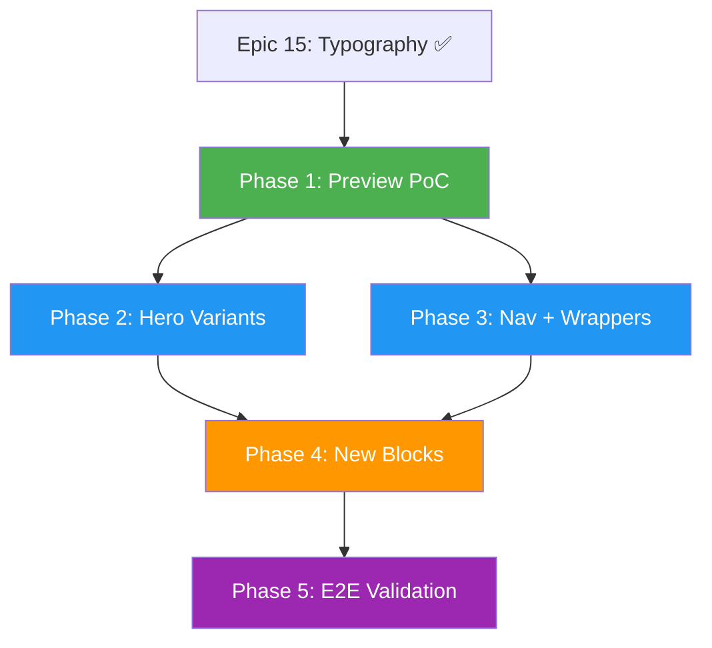

# Component Diversity & Interchangeable Blocks - Master Plan

> **Plan Status:** APPROVED
> **Created:** 2026-02-12
> **Author:** Architecture Review Session
> **Scope:** Transform the component system from single-structure blocks with CSS variants into truly interchangeable structural blocks that generate visually diverse hotel websites

---

## Executive Summary

The ET Hotel Website Generator's core promise is generating 10,000+ **unique** hotel websites from interchangeable blocks. Today, the architecture has all the right plumbing (Zod contracts, CVA variants, ComponentRenderer, LangGraph pipeline) but two critical gaps prevent realizing this promise:

1. **The homepage is hardcoded** (`app/page.tsx`) instead of using the dynamic `ComponentRenderer`
2. **Most blocks have only CSS variants** (same HTML structure, different classes) rather than **structural variants** (genuinely different layouts/DOM)

This plan closes both gaps across 5 phases, each designed as an independent epic.

---

## Problem Statement

### Current Reality: Two Disconnected Worlds

**World 1 - Hardcoded Homepage** (`web-app/app/page.tsx:17-154`):
- Manually imports components with hardcoded mock data
- Hardcoded variant choices (e.g., hero always `modern/centered/gradient/medium`)
- Section wrappers (gold accent bars, headings) baked into page JSX
- Produces exactly **1 website design**

**World 2 - Dynamic Pipeline** (exists but unused):
- `ComponentRenderer` (`web-app/components/renderers/ComponentRenderer/index.tsx`) accepts `HomepageConfig` JSON and renders dynamically
- LangGraph 5-agent pipeline generates `HomepageConfig` with component selection, variants, and content
- `HomepageConfigSchema` validates the full structure
- These two are **never connected to a real page**

### Structural vs Cosmetic Variants

| Component | Variant Type | What Changes | Visual Impact |
|-----------|-------------|--------------|---------------|
| **Gallery** | Structural | `GalleryGrid`, `GalleryMasonry`, `GalleryCarousel` (3 separate components) | HIGH - genuinely different layouts |
| **Testimonials** | Structural | `TestimonialCarousel`, `TestimonialGrid`, `TestimonialFeatured` (3 separate components) | HIGH |
| **RoomCard** | Structural | `RoomCardCompact`, `RoomCardDetailed`, `RoomCardGrid` (3 separate components) | HIGH |
| **Amenities** | Structural | `AmenitiesGrid`, `AmenitiesList`, `AmenitiesFeatured` (3 layout modes) | MEDIUM-HIGH |
| **HeroSection** | Cosmetic only | 240 CVA combinations but **same JSX structure** | LOW - padding/alignment/opacity tweaks |
| **Navigation** | Cosmetic only | 9 CVA combinations but **same JSX structure** | LOW - background/height tweaks |
| **ContactForm** | Cosmetic only | 9 CVA combinations but **same JSX structure** | LOW - shadow/border/background |
| **BookingWidget** | Responsive split | Mobile vs Desktop (2 components) | MEDIUM - layout-responsive only |

**Conclusion:** The blocks that produce real visual diversity (Gallery, Testimonials, RoomCard) all use the **router pattern with separate sub-components**. The blocks that look nearly identical across variants (Hero, Navigation, ContactForm) use **CSS-only CVA on a single component**.

---

## Strategic Architecture Decision

### Router Pattern (Option A) for All Structural Variants

**Decision:** All blocks that need visual diversity will follow the **router pattern** - a parent component that delegates to structurally different sub-components based on a `layout` or `variant` prop.

**Rationale:**

1. **Proven in codebase** - RoomCard, Gallery, Testimonials already use this pattern successfully
2. **LLM-friendly** - The StylingAgent makes a discrete categorical choice ("pick HeroCentered or HeroSplit") rather than navigating a 4-axis CVA space where most combinations look similar
3. **Open/closed** - Adding a new hero design = create new file + add case to router. Zero changes to existing variants
4. **Independent testing** - Each sub-component is tested in isolation
5. **CVA preserved** - Each sub-component still uses CVA for its own cosmetic tuning (overlay, height, color intensity)

**Pattern:**
```
BlockRouter (picks structure based on layout prop)
├── BlockVariantA/  ← own JSX, own CVA for fine-tuning
├── BlockVariantB/  ← own JSX, own CVA for fine-tuning
└── BlockVariantC/  ← own JSX, own CVA for fine-tuning
```

---

## Diversity Math

### Current (structural variants only):
```
Hero: 1 structure
Navigation: 1 structure
Gallery: 3 structures
Testimonials: 3 structures
RoomCard: 3 structures
Amenities: 3 structures
= 1 × 1 × 3 × 3 × 3 × 3 = 81 structural combinations
+ unlimited color themes
```

### After Phase 2-3 (Hero + Navigation structural variants):
```
Hero: 3 structures
Navigation: 3 structures
Gallery: 3 structures
Testimonials: 3 structures
RoomCard: 3 structures
Amenities: 3 structures
= 3 × 3 × 3 × 3 × 3 × 3 = 729 structural combinations
+ unlimited color themes
```

### After Phase 4 (new block types):
```
729 × Footer(3) × About(3) × FAQ(2) × Features(2)
= 729 × 36 = 26,244 structural combinations
+ component selection (not all sites use all blocks)
+ unlimited color themes
= effectively unlimited unique sites
```

---

## Phase Overview

| Phase | Epic Scope | Goal | Dependencies | Estimated Effort |
|-------|-----------|------|--------------|-----------------|
| **Phase 1** | Proof of Concept: Dynamic Preview | Connect ComponentRenderer to a real page, validate with sample configs | Epic 15 (typography) | 3-5 days |
| **Phase 2** | Hero Section Structural Variants | 3 genuinely different hero layouts via router pattern | Phase 1 | 5-8 days |
| **Phase 3** | Navigation Structural Variants + Section Wrappers | 3 nav layouts + extractable section wrapper system | Phase 1 | 5-7 days |
| **Phase 4** | New Block Types | Footer, About, FAQ, Features sections with 2-3 variants each | Phase 2, Phase 3 | 8-12 days |
| **Phase 5** | End-to-End Generation Validation | Generate 10+ hotel websites, visual comparison, diversity scoring | Phase 4 | 3-5 days |

**Phases 2 and 3 can run in parallel** after Phase 1 completes.

---

## Phase 1: Proof of Concept - Dynamic Preview Page

### Goal
Connect the existing `ComponentRenderer` to a real page, feed it different `HomepageConfig` JSONs, and visually verify the system produces different websites.

### Why This Phase First
- **Zero new components needed** - `ComponentRenderer` already exists and works
- **Cheapest validation** - Instantly reveals where variants create real visual difference vs where they don't
- **Unblocks all subsequent phases** - Gives a test harness for every future phase
- **Validates the full pipeline** - Config → Validation → Security → Rendering

### Scope

#### Story 1.1: Dynamic Preview Page
Create `/preview` route that accepts a `HomepageConfig` and renders via `ComponentRenderer`.

**Implementation Details:**
- Server component at `web-app/app/preview/page.tsx`
- Reads config from URL query param (`?config=luxury-paris`) or API endpoint
- Wraps `ComponentRenderer` in proper `<main>` with theme provider
- Shows config metadata (generationId, hotel name, component count) in a debug header
- Toggle to hide/show debug overlay

**Key Files:**
- Create: `web-app/app/preview/page.tsx`
- Uses: `web-app/components/renderers/ComponentRenderer/index.tsx`
- Uses: `web-app/app/langgraph/agents/schemas.ts` (HomepageConfigSchema)

#### Story 1.2: Sample HomepageConfig Fixtures
Hand-craft 3 different `HomepageConfig` JSON files representing diverse hotels.

**Fixture 1: Luxury Boutique** (Château Lumière Paris)
- Components: navigation, hero, gallery(masonry), rooms(detailed), testimonials(featured), amenities(grid), booking, contact
- Emphasis: gallery, testimonials
- Hero: fullscreen height, gradient overlay
- Gallery: masonry layout, 3 columns
- Theme: deep navy + gold

**Fixture 2: Budget Hostel** (Backpack Haven Berlin)
- Components: navigation, hero, rooms(compact), amenities(list), contact
- Fewer components (5 vs 8)
- Hero: small height, no overlay
- Rooms: compact cards
- Theme: bright orange + white

**Fixture 3: Business Hotel** (Sterling Executive)
- Components: navigation, hero, rooms(grid), amenities(featured), testimonials(grid), booking, contact
- Emphasis: rooms, booking
- Hero: medium height, dark overlay
- Rooms: grid cards
- Theme: current Sterling palette

**Key Files:**
- Create: `web-app/fixtures/configs/luxury-boutique.json`
- Create: `web-app/fixtures/configs/budget-hostel.json`
- Create: `web-app/fixtures/configs/business-hotel.json`
- Validates against: `HomepageConfigSchema`

#### Story 1.3: Visual Comparison & Gap Analysis
Render all 3 fixtures, screenshot results, document visual diversity gaps.

**Deliverables:**
- Screenshots of each rendered config
- Gap analysis table: which blocks look different vs which look the same
- Prioritized list of blocks needing structural variants (input to Phase 2/3)
- Validation that `ComponentRenderer` correctly handles all 8 component types

### Acceptance Criteria
- [ ] `/preview?config=luxury-boutique` renders a complete page via ComponentRenderer
- [ ] `/preview?config=budget-hostel` renders a visually distinct page with fewer components
- [ ] `/preview?config=business-hotel` renders the Sterling-style layout
- [ ] All 3 configs pass `HomepageConfigSchema` validation
- [ ] Gap analysis document produced with evidence-based priority ranking

### Cross-References
- **ComponentRenderer**: `web-app/components/renderers/ComponentRenderer/index.tsx`
- **HomepageConfigSchema**: `web-app/app/langgraph/agents/schemas.ts`
- **Props Transformation**: `web-app/lib/propsTransformation.ts`
- **Contract Validation**: `web-app/lib/contractValidation.ts`
- **COMPONENT_MAP**: Maps 8 types → React components (line 78-87 of ComponentRenderer)
- **Epic 7**: LangGraph pipeline that generates HomepageConfig
- **Architecture**: `docs/architecture/component-system-architecture.md`

---

## Phase 2: Hero Section Structural Variants

### Goal
Transform the HeroSection from a single component with 240 CSS combinations into a router component with 3 genuinely different sub-components, each with its own CVA fine-tuning.

### Why Option A (Router Pattern)
See [Strategic Architecture Decision](#strategic-architecture-decision) above.

### Current State
**File:** `web-app/components/sections/HeroSection/index.tsx`
**Contract:** `web-app/lib/contracts/hero.contract.ts`

Current `layout` variants (`centered`, `split`, `fullscreen`) only change CSS classes:
- `centered`: `items-center text-center`
- `split`: `items-start text-left` (not a true two-column split)
- `fullscreen`: `items-center text-center min-h-screen`

The JSX is identical for all 240 combinations: same `<section>`, same `<div>` overlay, same `<h1>`, same CTAs, same background image handling.

### Target Architecture

```
web-app/components/sections/HeroSection/
├── index.tsx              ← Router: delegates to sub-component based on layout
├── HeroCentered.tsx       ← Classic: centered text overlay on full-width image
├── HeroSplit.tsx          ← Two-column: image one side, text+CTAs other side
├── HeroMinimal.tsx        ← Text-focused: large typography, no/subtle background
├── variants.ts            ← Shared CVA definitions for per-variant fine-tuning
└── types.ts               ← Shared TypeScript types
```

### Scope

#### Story 2.1: Hero Router Refactor
Refactor `HeroSection/index.tsx` into a router that delegates to sub-components.

**Requirements:**
- Router reads `variant.layout` to select sub-component
- Backward compatible: existing `centered` layout works exactly as before
- All sub-components receive the same `HeroSectionContract` props
- Each sub-component has its own CVA for cosmetic tuning (`overlay`, `height`, `style`)
- Fallback to `HeroCentered` for unknown layout values

**Contract Update** (`hero.contract.ts`):
```typescript
layout: z.enum(['centered', 'split', 'minimal']).optional()
// Keep: style, overlay, height as CVA options within each sub-component
```

**Key Files:**
- Modify: `web-app/components/sections/HeroSection/index.tsx`
- Create: `web-app/components/sections/HeroSection/HeroCentered.tsx`
- Modify: `web-app/lib/contracts/hero.contract.ts`
- Modify: `web-app/lib/cva-variants.ts` (hero variants)

#### Story 2.2: HeroCentered Sub-Component
Extract current hero JSX into `HeroCentered.tsx` with its own CVA.

**Visual Design:**
- Full-width background image
- Centered text overlay (title, tagline, headline, description)
- Two CTAs centered below text
- Overlay options: none, light, dark, gradient
- Height options: small, medium, large, fullscreen
- Style options: modern (clean sans), classic (serif), bold (heavy weights), elegant (light weights)

**This is the current behavior** - extract, don't redesign.

#### Story 2.3: HeroSplit Sub-Component
Create a genuinely two-column hero layout.

**Visual Design:**
- CSS Grid: 2 columns on desktop, stacked on mobile
- Left column: title, tagline, headline, description, CTAs (vertically centered)
- Right column: full-height image (or reversed via `imagePosition` prop)
- No overlay on text column (solid background)
- Image column uses `object-cover` with optional subtle overlay
- Height options: medium, large
- Responsive: stacks to single column at `md` breakpoint

**New CVA Dimensions:**
- `imagePosition`: `left` | `right` (which column gets the image)
- `textAlign`: `left` | `center`
- `height`: `medium` | `large`

**Key Difference from HeroCentered:** Completely different DOM structure (CSS grid vs absolute positioning), different responsive behavior, different content arrangement.

#### Story 2.4: HeroMinimal Sub-Component
Create a text-focused hero with minimal or no imagery.

**Visual Design:**
- Large typography as the primary visual element
- Optional subtle gradient or solid background (no full-bleed image)
- Title in display font at 2-3x normal size
- Single CTA (primary only, no secondary)
- Minimal vertical height (no fullscreen option)
- Optional tagline above title in small caps
- Height options: small, medium

**Key Difference:** No background image at all. Typography IS the design. Completely different visual identity.

#### Story 2.5: Update ComponentRenderer & Preview
Verify the router works end-to-end through ComponentRenderer and update fixtures.

**Requirements:**
- ComponentRenderer renders hero via router without changes (it already passes `variant` prop)
- Update fixtures from Phase 1 to use different hero layouts
- Visual comparison of all 3 hero variants
- All existing tests pass (hero contract validation, rendering)

#### Story 2.6: Hero Variant Tests
Unit tests for router logic and each sub-component.

**Test Coverage:**
- Router correctly delegates to each sub-component based on `layout`
- Router falls back to HeroCentered for undefined/unknown layout
- Each sub-component renders required content (title, headline)
- Each sub-component applies CVA classes correctly
- Contract validation passes for all valid combinations
- Responsive behavior verified (split → stacked on mobile)

### Acceptance Criteria
- [ ] `layout: 'centered'` renders `HeroCentered` (backward compatible)
- [ ] `layout: 'split'` renders `HeroSplit` with two-column layout
- [ ] `layout: 'minimal'` renders `HeroMinimal` with typography-focused design
- [ ] All 3 produce genuinely different HTML structures (not just CSS changes)
- [ ] Existing hero tests pass without modification
- [ ] Preview page shows 3 visually distinct hero sections

### Cross-References
- **Current Hero**: `web-app/components/sections/HeroSection/index.tsx`
- **Hero Contract**: `web-app/lib/contracts/hero.contract.ts`
- **Hero CVA**: `web-app/lib/cva-variants.ts` (heroVariants)
- **Hero Mock Data**: `web-app/components/data/mockHotel.ts`
- **Component Docs**: `docs/components/hero-section.md`
- **RoomCard Router Pattern** (reference): `web-app/components/blocks/RoomCard/index.tsx`
- **Gallery Router Pattern** (reference): `web-app/components/blocks/ImageGallery/index.tsx`
- **StylingAgent** (consumes layout enum): `web-app/app/langgraph/agents/StylingAgent.ts`
- **AssemblyAgent** (variant field mapping): `web-app/app/langgraph/agents/AssemblyAgent.ts`

---

## Phase 3: Navigation Structural Variants + Section Wrappers

### Goal
1. Transform Navigation into a router with 3 structural variants
2. Extract hardcoded section wrappers from `page.tsx` into a reusable system

### Why Section Wrappers Matter
In `app/page.tsx`, every section is wrapped in identical boilerplate:
```jsx
{/* Gold Accent Bar */}
<div className="flex items-center justify-center mb-gap-card">
  <div className="h-divider w-divider-sm bg-brand-secondary"></div>
  <div className="size-1 mx-gap-card rounded-full bg-brand-secondary"></div>
  <div className="h-divider w-divider-sm bg-brand-secondary"></div>
</div>
<h2 className="text-size-display font-display text-brand-primary mb-gap-card">
  Section Title
</h2>
<div className="w-divider-lg h-divider-accent bg-brand-secondary mx-auto mb-gap-card"></div>
<p className="text-size-body text-text-secondary ...">Description</p>
```

This wrapper style is part of "The Sterling Executive" design. Different hotels should have different section header styles - the wrapper itself must be a variant.

### Scope

#### Story 3.1: Navigation Router Refactor
Transform Navigation into router pattern with 3 structural variants.

**Target Architecture:**
```
web-app/components/blocks/Navigation/
├── index.tsx              ← Router: delegates based on layout
├── NavigationClassic.tsx  ← Logo left, links center, CTA right (current design)
├── NavigationCentered.tsx ← Logo centered above links, wide horizontal
├── NavigationMinimal.tsx  ← Logo + hamburger only (no visible links until opened)
├── NavigationDesktop.tsx  ← Shared desktop rendering (if reusable)
├── NavigationMobile.tsx   ← Shared mobile rendering (if reusable)
└── variants.ts
```

**Contract Update** (`navigation.contract.ts`):
```typescript
variant: z.object({
  layout: z.enum(['classic', 'centered', 'minimal']).optional(),
  style: z.enum(['transparent', 'solid', 'glass']).optional(),
})
```

**NavigationClassic:** Current behavior - logo left, links inline, CTA button right. What exists today.

**NavigationCentered:** Logo centered at top, navigation links spread horizontally below logo. Different visual weight distribution. Common in luxury/boutique hotels.

**NavigationMinimal:** Only logo visible + hamburger menu icon. All links hidden behind hamburger on both desktop and mobile. Clean, modern aesthetic. Common in design-focused sites.

**Key Files:**
- Modify: `web-app/components/blocks/Navigation/index.tsx`
- Create: `NavigationClassic.tsx`, `NavigationCentered.tsx`, `NavigationMinimal.tsx`
- Modify: `web-app/lib/contracts/navigation.contract.ts`
- Modify: `web-app/lib/cva-variants.ts`

#### Story 3.2: Section Wrapper Component
Extract section header/wrapper patterns into a configurable component.

**Variants:**
- `accent`: Gold accent bars + display heading + underline (current Sterling style)
- `simple`: Just heading + subheading, no decorative elements
- `numbered`: Section number badge + heading + description
- `none`: No wrapper, component renders directly

**Implementation:**
- New component: `web-app/components/blocks/SectionWrapper/index.tsx`
- Props: `title`, `description`, `variant`, `children`
- Used by `ComponentRenderer` to wrap each component
- Wrapper variant is part of `HomepageConfig` (site-wide or per-section)

**Contract:**
```typescript
const SectionWrapperContract = z.object({
  variant: z.enum(['accent', 'simple', 'numbered', 'none']).optional(),
  title: z.string().max(100).optional(),
  description: z.string().max(300).optional(),
  className: z.string().optional(),
});
```

#### Story 3.3: ComponentRenderer Integration
Update ComponentRenderer to support section wrappers.

**Changes:**
- Each component in `HomepageConfig` can optionally include `wrapper` config
- ComponentRenderer wraps the component in `SectionWrapper` if configured
- Components that include their own headers (like Testimonials with heading prop) use `wrapper: 'none'`

**Schema Update** (in `HomepageConfigSchema`):
```typescript
components: z.array(z.object({
  type: componentTypeEnum,
  variant: z.record(z.string(), z.any()).optional(),
  props: z.record(z.string(), z.any()),
  order: z.number(),
  wrapper: z.object({                    // NEW
    variant: z.enum(['accent', 'simple', 'numbered', 'none']).optional(),
    title: z.string().optional(),
    description: z.string().optional(),
  }).optional(),
}))
```

#### Story 3.4: Navigation + Wrapper Tests
Tests for navigation router and section wrapper variants.

### Acceptance Criteria
- [ ] 3 navigation layouts render with genuinely different structures
- [ ] Section wrappers produce 4 visually distinct header styles
- [ ] ComponentRenderer correctly applies wrappers from config
- [ ] Existing page can be reproduced exactly using ComponentRenderer + config

### Cross-References
- **Current Navigation**: `web-app/components/blocks/Navigation/index.tsx`
- **Navigation Contract**: `web-app/lib/contracts/navigation.contract.ts`
- **Navigation Docs**: `docs/components/navigation.md`
- **Homepage Wrappers**: `web-app/app/page.tsx` (lines 44-86, 88-115, etc.)
- **ComponentRenderer**: `web-app/components/renderers/ComponentRenderer/index.tsx`
- **HomepageConfigSchema**: `web-app/app/langgraph/agents/schemas.ts`

---

## Phase 4: New Block Types

### Goal
Add missing block types that most hotel websites need, each with 2-3 structural variants.

### Why These Blocks
The current 8 component types cover the basics but miss several common hotel website sections. Each new type **multiplies** the combination count.

### Scope

#### Story 4.1: Footer Block
Currently missing entirely from the component system.

**Variants:**
- `FooterClassic`: Multi-column layout (links, contact, social, copyright)
- `FooterMinimal`: Single row (copyright + social icons)
- `FooterStacked`: Full-width sections stacked vertically (newsletter signup, links, map, copyright)

**Contract:**
```typescript
const FooterContract = z.object({
  variant: z.object({
    layout: z.enum(['classic', 'minimal', 'stacked']).optional(),
  }),
  hotelName: z.string(),
  address: z.string().optional(),
  phone: z.string().optional(),
  email: z.string().optional(),
  socialLinks: z.array(z.object({
    platform: z.enum(['facebook', 'instagram', 'twitter', 'tripadvisor', 'google', 'linkedin']),
    url: z.string().url(),
  })).optional(),
  navigationLinks: z.array(z.object({
    label: z.string(),
    href: z.string(),
  })).optional(),
  copyright: z.string().optional(),
  className: z.string().optional(),
});
```

**Key Files:**
- Create: `web-app/components/blocks/Footer/index.tsx`
- Create: `FooterClassic.tsx`, `FooterMinimal.tsx`, `FooterStacked.tsx`
- Create: `web-app/lib/contracts/footer.contract.ts`
- Update: `ComponentRenderer` COMPONENT_MAP
- Update: `HomepageConfigSchema` component type enum

#### Story 4.2: About / Hotel Story Block
Hotel introduction section for brand storytelling.

**Variants:**
- `AboutSideBySide`: Image + text side by side (alternating for multiple sections)
- `AboutTimeline`: Hotel history as vertical timeline
- `AboutFullWidth`: Full-width image with text overlay, similar to a secondary hero

**Contract:**
```typescript
const AboutContract = z.object({
  variant: z.object({
    layout: z.enum(['side-by-side', 'timeline', 'full-width']).optional(),
    imagePosition: z.enum(['left', 'right']).optional(),
  }),
  heading: z.string(),
  content: z.string(), // Supports markdown or plain text
  image: z.string().optional(),
  highlights: z.array(z.object({
    label: z.string(),
    value: z.string(),
  })).max(4).optional(), // e.g., "Founded: 1892", "Rooms: 45"
  className: z.string().optional(),
});
```

#### Story 4.3: FAQ Block
Frequently asked questions section.

**Variants:**
- `FAQAccordion`: Expandable accordion (default pattern)
- `FAQGrid`: Two-column grid with all questions visible

**Contract:**
```typescript
const FAQContract = z.object({
  variant: z.object({
    layout: z.enum(['accordion', 'grid']).optional(),
  }),
  heading: z.string().optional(),
  questions: z.array(z.object({
    question: z.string(),
    answer: z.string(),
  })).min(3).max(15),
  className: z.string().optional(),
});
```

#### Story 4.4: Features / USP Block
Key selling points / unique features section.

**Variants:**
- `FeaturesIconGrid`: Icon + title + description in a grid
- `FeaturesCards`: Large cards with image + title + description

**Contract:**
```typescript
const FeaturesContract = z.object({
  variant: z.object({
    layout: z.enum(['icon-grid', 'cards']).optional(),
    columns: z.union([z.literal(2), z.literal(3), z.literal(4)]).optional(),
  }),
  heading: z.string().optional(),
  features: z.array(z.object({
    title: z.string(),
    description: z.string(),
    icon: z.string().optional(),
    image: z.string().optional(),
  })).min(2).max(8),
  className: z.string().optional(),
});
```

#### Story 4.5: Registry & Pipeline Updates
Register all new blocks in the component system and LangGraph pipeline.

**Updates Required:**
- `ComponentRenderer` COMPONENT_MAP: Add footer, about, faq, features
- `HomepageConfigSchema`: Add new types to component type enum
- `ComponentContractRegistry`: Add new contracts
- `StylingAgent`: Add variant options for new blocks
- `ContentGenerator`: Add content generation for new blocks
- `AssemblyAgent`: Add variant field mapping for new blocks
- `ComponentSelector`: Add new blocks to selection pool with hotel-type recommendations

#### Story 4.6: New Block Tests
Tests for all new blocks: contract validation, rendering, router delegation.

### Acceptance Criteria
- [ ] Footer renders in 3 structural variants
- [ ] About renders in 3 structural variants
- [ ] FAQ renders in 2 structural variants
- [ ] Features renders in 2 structural variants
- [ ] All new blocks registered in ComponentRenderer
- [ ] All new blocks have Zod contracts
- [ ] LangGraph agents updated to support new blocks

### Cross-References
- **ComponentRenderer COMPONENT_MAP**: `web-app/components/renderers/ComponentRenderer/index.tsx:78-87`
- **Component Type Enum**: `web-app/app/langgraph/agents/schemas.ts`
- **Contract Registry**: `web-app/lib/contracts/index.ts`
- **StylingAgent**: `web-app/app/langgraph/agents/StylingAgent.ts`
- **ContentGenerator**: `web-app/app/langgraph/agents/ContentGenerator.ts`
- **AssemblyAgent**: `web-app/app/langgraph/agents/AssemblyAgent.ts`
- **ComponentSelector**: `web-app/app/langgraph/agents/ComponentSelector.ts`
- **Existing block patterns to follow**: Gallery (`web-app/components/blocks/ImageGallery/`), Testimonials (`web-app/components/blocks/Testimonials/`)

---

## Phase 5: End-to-End Generation Validation

### Goal
Generate 10+ hotel websites through the full LangGraph pipeline, render them via ComponentRenderer, and validate that the system produces genuinely diverse results.

### Scope

#### Story 5.1: Diversity Scoring Framework
Define metrics for measuring visual diversity between generated sites.

**Metrics:**
- **Component selection diversity**: Do different hotel types get different components?
- **Structural variant diversity**: Do sites use different layout variants?
- **Content uniqueness**: Is generated content hotel-specific?
- **Visual distinctness**: Can a human tell sites apart at a glance?

#### Story 5.2: Generate 10 Hotel Websites
Run the full LangGraph pipeline for 10 diverse hotel profiles.

**Hotel Profiles:**
1. Luxury boutique, Paris (couples)
2. Budget hostel, Berlin (backpackers)
3. Business hotel, London (corporate)
4. Beach resort, Maldives (families)
5. Ski lodge, Swiss Alps (adventure)
6. City boutique, Tokyo (leisure)
7. Historic mansion, Tuscany (couples)
8. Airport hotel, Dubai (business)
9. Eco lodge, Costa Rica (adventure)
10. Urban hostel, Barcelona (backpackers)

#### Story 5.3: Visual Comparison & Diversity Report
Render all 10 sites, capture screenshots, produce diversity analysis.

**Deliverables:**
- Screenshot matrix (10 sites × key sections)
- Diversity score per metric
- Identified gaps (if sites still look too similar)
- Recommendations for additional variants or blocks

#### Story 5.4: LangGraph Agent Tuning
Adjust StylingAgent and ComponentSelector prompts based on diversity findings.

### Acceptance Criteria
- [ ] 10 hotel websites generated successfully
- [ ] No two sites have identical component + variant combinations
- [ ] Visual diversity score meets defined thresholds
- [ ] Diversity report produced with evidence

### Cross-References
- **LangGraph Workflow**: `web-app/app/langgraph/workflows/HomepageGenerationWorkflow.ts`
- **All 5 Agents**: `web-app/app/langgraph/agents/`
- **Cost Tracking**: `web-app/app/langgraph/services/CostMonitor.ts` ($2/site budget)
- **Quality Validator**: `web-app/app/langgraph/agents/QualityValidator.ts`
- **Validation Docs**: `docs/validation/` (existing assessment framework)
- **Epic 7**: `docs/epics/epic-7-llm-generation.md`

---

## Dependency Graph



**Parallel Opportunity:** Phases 2 and 3 can be developed simultaneously after Phase 1 completes.

---

## Epic Mapping

Each phase maps to one independent epic:

| Phase | Suggested Epic # | Epic Name | Stories |
|-------|-----------------|-----------|---------|
| Phase 1 | Epic 16 | Dynamic Preview & Config Validation | 3 stories |
| Phase 2 | Epic 17 | Hero Section Structural Variants | 6 stories |
| Phase 3 | Epic 18 | Navigation Variants & Section Wrapper System | 4 stories |
| Phase 4 | Epic 19 | Extended Block Library (Footer, About, FAQ, Features) | 6 stories |
| Phase 5 | Epic 20 | End-to-End Generation Diversity Validation | 4 stories |

**Total:** 5 epics, 23 stories, estimated 24-37 days

---

## Risk Assessment

| Risk | Impact | Mitigation |
|------|--------|------------|
| **CVA complexity explosion** - too many variant dimensions per sub-component | CSS maintenance burden | Limit each sub-component to 2-3 CVA dimensions max |
| **LangGraph agent confusion** - agents don't pick new variants effectively | Generated sites all use same variants | Phase 5 specifically tunes agent prompts |
| **Contract breaking changes** - updating schemas breaks existing tests | Test failures block progress | Phase 2/3 maintain backward compatibility; new layouts are additive |
| **Section wrappers vs component headers** - overlap between wrapper titles and component-internal headings | Duplicate headings rendered | Clear contract: components with `wrapper: 'none'` manage their own headers |
| **Performance** - more component variants = larger bundle | Slower page load | Dynamic imports / code splitting per variant (Next.js already supports this) |

---

## Success Criteria

The plan is successful when:

1. **Phase 1 delivered:** 3 visually distinct websites rendered from config JSON via ComponentRenderer
2. **Phase 2+3 delivered:** Hero and Navigation have 3 structural variants each, producing 9 page-level layout combinations
3. **Phase 4 delivered:** 4 new block types (Footer, About, FAQ, Features) registered and functional
4. **Phase 5 delivered:** 10 generated hotel websites are demonstrably diverse in structure, not just color
5. **The hardcoded `page.tsx` is replaceable:** The Sterling Executive homepage can be fully reproduced from a `HomepageConfig` JSON without any hardcoded JSX

---

## Appendix A: Current File Reference

### Component Files
| Component | Path | Structural Variants |
|-----------|------|---------------------|
| HeroSection | `web-app/components/sections/HeroSection/index.tsx` | 1 (CSS-only) |
| Navigation | `web-app/components/blocks/Navigation/index.tsx` | 1 (CSS-only) |
| ImageGallery | `web-app/components/blocks/ImageGallery/index.tsx` | 3 (Grid, Masonry, Carousel) |
| RoomCard | `web-app/components/blocks/RoomCard/index.tsx` | 3 (Compact, Detailed, Grid) |
| Amenities | `web-app/components/blocks/Amenities/index.tsx` | 3 (Grid, List, Featured) |
| Testimonials | `web-app/components/blocks/Testimonials/index.tsx` | 3 (Carousel, Grid, Featured) |
| BookingWidget | `web-app/components/blocks/BookingWidget/index.tsx` | 2 (Mobile, Desktop) |
| ContactForm | `web-app/components/sections/ContactForm/index.tsx` | 1 (CSS-only) |

### Contract Files
| Contract | Path |
|----------|------|
| HeroSectionContract | `web-app/lib/contracts/hero.contract.ts` |
| NavigationContract | `web-app/lib/contracts/navigation.contract.ts` |
| ImageGalleryContract | `web-app/lib/contracts/gallery.contract.ts` |
| RoomCardFlatSchema | `web-app/lib/contracts/room.contract.ts` |
| AmenitiesContract | `web-app/lib/contracts/amenities.contract.ts` |
| TestimonialsContract | `web-app/lib/contracts/testimonials.contract.ts` |
| BookingWidgetContract | `web-app/lib/contracts/booking.contract.ts` |
| ContactFormContract | `web-app/lib/contracts/contact.contract.ts` |

### Pipeline Files
| File | Purpose |
|------|---------|
| `web-app/app/langgraph/workflows/HomepageGenerationWorkflow.ts` | 5-agent orchestration |
| `web-app/app/langgraph/agents/ComponentSelector.ts` | Which components |
| `web-app/app/langgraph/agents/StylingAgent.ts` | Which variants |
| `web-app/app/langgraph/agents/ContentGenerator.ts` | What content |
| `web-app/app/langgraph/agents/AssemblyAgent.ts` | Final composition |
| `web-app/app/langgraph/agents/QualityValidator.ts` | Validation |
| `web-app/app/langgraph/agents/schemas.ts` | All Zod schemas |
| `web-app/components/renderers/ComponentRenderer/index.tsx` | JSON → React rendering |

### Architecture Docs
| Document | Path |
|----------|------|
| Component System | `docs/architecture/component-system-architecture.md` |
| CVA Architecture | `docs/architecture/CVA-ARCHITECTURE.md` |
| Style System | `docs/architecture/STYLE-SYSTEM-ARCHITECTURE.md` |
| LangGraph Workflows | `docs/architecture/langgraph-workflows.md` |
| Epic Planning Roadmap | `docs/epics/epic-planning-roadmap.md` |
