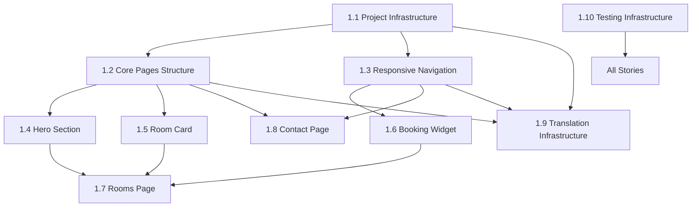

# Epic 1 Stories - Core Hotel Website Infrastructure

This directory contains comprehensive user stories for Epic 1: Core Hotel Website Infrastructure of The Sterling Executive hotel website project.

## Stories Overview

Epic 1 establishes the foundational infrastructure for The Sterling Executive hotel website, serving as the reference implementation for future LLM-generated hotel websites.

### Story List

| Story | Title                                     | Priority | Story Points | Status |
| ----- | ----------------------------------------- | -------- | ------------ | ------ |
| 1.1   | Project Infrastructure Setup              | High     | 5            | Draft  |
| 1.2   | Core Pages Structure and Routing          | High     | 3            | Draft  |
| 1.3   | Responsive Navigation Component           | High     | 5            | Draft  |
| 1.4   | Hero Section Component with Mock Data     | High     | 3            | Draft  |
| 1.5   | Room Card Component with Mock Data        | High     | 5            | Draft  |
| 1.6   | Basic Booking Widget with Mock Validation | High     | 8            | Draft  |
| 1.7   | Rooms Page Implementation with Room Grid  | High     | 3            | Draft  |
| 1.8   | Contact Page with Basic Form              | Medium   | 3            | Draft  |
| 1.9   | Translation Infrastructure Setup          | Medium   | 5            | Draft  |
| 1.10  | Comprehensive Testing Infrastructure      | High     | 5            | Draft  |
| 1.11  | Centralized Tailwind Design System        | High     | 8            | Draft  |

### Epic Summary

**Total Story Points:** 53
**Estimated Duration:** 2-3 weeks
**Primary Focus:** Core infrastructure foundation with TDD approach

## Story Dependencies

## BMAD Story Format Compliance

All stories follow the BMAD (Breakthrough Method of Agile AI-driven Development) v4 standards:

### Standard Story Structure

- **User Story**: As a [user], I want [functionality], so that [benefit]
- **Business Value**: Clear articulation of business impact
- **Acceptance Criteria**: Specific, measurable, testable requirements
- **Technical Requirements**: Detailed implementation specifications
- **Definition of Done**: Comprehensive completion criteria
- **Testing Requirements**: Specific test coverage expectations
- **Dependencies**: Clear story relationships
- **Risk Mitigation**: Proactive risk identification and mitigation strategies

### Epic 1 Specific Requirements

#### Core Deliverables

- Next.js 14+ project with TypeScript and Tailwind CSS
- Responsive navigation (mobile hamburger, desktop horizontal)
- Essential pages: Homepage, Rooms, Contact
- Core components: HeroSection, BookingWidget, RoomCard
- Translation infrastructure foundation
- Comprehensive testing suite with TDD approach

#### Technical Standards

- Mobile-first responsive design (<768px mobile, ≥768px desktop)
- TypeScript strict mode with proper typing
- Accessibility compliance (WCAG 2.1 AA)
- Component-based architecture for LLM reference
- 80%+ test coverage requirement

#### Reference Implementation Goals

While building a single hotel website, all features demonstrate patterns required for LLM-driven mass generation:

- Component variant patterns (separate mobile/desktop implementations)
- Responsive design strategies documented
- Component architecture for LLM selection reference
- Testing patterns for generated site validation

## Development Workflow

### BMAD Development Process

1. **Story Selection**: Choose next story based on dependencies and priority
2. **Test-Driven Development**: Write tests before implementation
3. **Implementation**: Build features according to acceptance criteria
4. **Validation**: Ensure all tests pass and acceptance criteria met
5. **Review**: Quality assurance and code review
6. **Integration**: Test with existing components and features

### Story Status Tracking

- **Draft**: Initial story creation, ready for review
- **Approved**: Story reviewed and ready for development
- **In Progress**: Currently being developed
- **Review**: Development complete, ready for QA review
- **Done**: All acceptance criteria met, tests passing

### Quality Gates

Each story must meet these quality gates before completion:

- ✅ All acceptance criteria fulfilled
- ✅ All tests passing (100% pass rate)
- ✅ TypeScript compilation with zero errors
- ✅ Accessibility compliance verified
- ✅ Performance standards met
- ✅ Code review completed

## Notes for Development Team

### Reference Implementation Context

Remember that this is a **reference implementation** for an LLM-driven generation platform. Features that may seem over-engineered for a single website are essential for enabling mass generation of 10,000+ unique hotel websites.

### Responsive Design Patterns

Pay special attention to demonstrating:

- Separate component variants for complex components (BookingWidget, Navigation)
- Responsive utilities for simple components (RoomCard, HeroSection)
- Consistent breakpoint usage (768px)
- Mobile-first approach patterns

### Testing Requirements

- Follow TDD principles (write tests before code)
- Use prototype mocking for any future agent testing
- Ensure 100% test pass rate before reporting completion
- Include accessibility testing with axe-core

### Component Architecture

- Use Shadcn/ui as base component library
- Follow 4-tier hierarchy (Primitives → Blocks → Sections → Pages)
- Ensure components are reusable and configurable
- Document component props and usage patterns

---

**Last Updated**: 2025-10-20
**Next Review**: After story approval process
**Contact**: Product Manager for story clarifications
